# The nodes

What every node, pin and setting does. Numbers are mostly 0..1; a 'turn' is one full circle.
Hover a node or a pin in the editor and the same text appears under the toolbar.
A node with a tutorial says why you would use it, builds a small graph round it with a picture of it running, and lists changes to try; in the studio, Try it opens that graph live.

## controls

### Check 1

The first checkbox on the WLED page. Plug it into a Select to switch between two behaviours, or into a Mask to turn a layer on and off.

**Outputs**
- **on** *(bool)*: true when the box is ticked

**Settings**
- **label** *(text)*: the name the checkbox shows
- **default** *(bool)*: ticked to start with

**Why use it**

An effect with an option - two looks, a direction, a feature on or off - needs a switch on the WLED page. Check 1 is the first checkbox there, true when ticked.

Plug it into a Select to choose between two values, or into a mask to turn a layer on and off. Its neighbours: Check 2 and Check 3 are the next two (Check 3 is taken by Flat mode on a cube); Toggle flips by itself on a trigger.

**Tutorial**

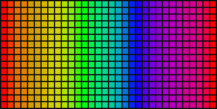

1. Check 1 has no inputs. Its `on` is true while the box is ticked.
2. **label** is Noise, its name on the WLED page; **default** is off.
3. `on` switches a **Select**: off, the **Palette**'s index is **Coords** `u` (a plain sweep); on, a drifting **Noise**.

[Try it in the studio](studio:try/check_1): the graph opens live in the Node tutorials project; your own project is saved and comes back with **Back to my project**.

**Try this**

- [Tick it](studio:try/check_1/1): In the side panel's PARAMETERS section, tick Noise (Check 1): the sweep gives way to the noise at once; untick it to go back.
- [Rename it](studio:try/check_1/2): label Clouds: the slider is called Clouds on the WLED page (and in PARAMETERS) - the effect is rebuilt with the new name.

**Used in**

Box Fire (`box_fire.json`), Candy Knot (`candy_knot.json`), Feigenbaum (`feigenbaum.json`), Fireworks (`fireworks.json`), Gyro Sand (`gyro_sand.json`), Kaleidoscope (`kaleidoscope.json`), Liquid (`liquid.json`), Liquid Tunnel (`liquid_tunnel.json`), Maelstrom (`maelstrom.json`), Mandelbrot (`mandelbrot.json`), Marquee (`marquee.json`), Moire (`moire.json`), Morph (`morph.json`), Question Block (`question_block.json`), Ring Rain (`ring_rain.json`), Slab Cut (`slab_cut.json`), Truchet Cube (`truchet_cube.json`), Watershed (`watershed.json`)

### Check 2

The second checkbox on the WLED page.

**Outputs**
- **on** *(bool)*: true when the box is ticked

**Settings**
- **label** *(text)*: the name the checkbox shows
- **default** *(bool)*: ticked to start with

**Why use it**

Check 2 is the second checkbox on the WLED page - another on-off option of your own.

A common use: a layer that can be switched on and off - sparkles, an outline, a beat flash. Its neighbours: Check 1 and Check 3; Select chooses by a switch; Layers and Blend take an amount, which a checkbox can set through a Select.

**Tutorial**

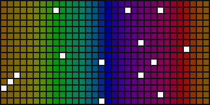

1. Check 2 has no inputs. Its `on` is true while ticked.
2. **label** is Sparkles; **default** is on.
3. `on` sets the amount of a **Blend** through a **Select** (0 off, 1 on): white sparkles (a **Sparkle** into a white **Colour**'s mask) laid over a scrolling palette when ticked, gone when not.

[Try it in the studio](studio:try/check_2): the graph opens live in the Node tutorials project; your own project is saved and comes back with **Back to my project**.

**Try this**

- [Untick it](studio:try/check_2/1): In the side panel's PARAMETERS section, untick Sparkles (Check 2): the sparkles go and the palette scrolls on its own.
- [Rename it](studio:try/check_2/2): label Glitter: the slider is called Glitter on the WLED page (and in PARAMETERS) - the effect is rebuilt with the new name.

**Used in**

Candy Knot (`candy_knot.json`), Cell Weave (`cell_weave.json`), Liquid (`liquid.json`), Liquid Tunnel (`liquid_tunnel.json`), Slab Cut (`slab_cut.json`)

### Check 3

The third checkbox on the WLED page. On a cube it is taken by 'Flat mode', so prefer the first two.

**Outputs**
- **on** *(bool)*: true when the box is ticked

**Settings**
- **label** *(text)*: the name the checkbox shows
- **default** *(bool)*: ticked to start with

**Why use it**

Check 3 is the third checkbox. On a cube, WLED uses it for Flat mode (the effect drawn on the unfolded net rather than the solid), so an effect for a cube should prefer the first two; on a strip or a matrix it is free.

Its neighbours: Check 1 and Check 2; Toggle; Select.

**Tutorial**

1. Check 3 has no inputs. Its `on` is true while ticked.
2. **label** is Reverse; **default** is off.
3. `on` switches a **Select** between 0.3 and -0.3: the rate of the clock (a **Multiply** with **Time**) that scrolls the palette - ticked, the colours run the other way.

[Try it in the studio](studio:try/check_3): the graph opens live in the Node tutorials project; your own project is saved and comes back with **Back to my project**.

**Try this**

- [Tick it](studio:try/check_3/1): In the side panel's PARAMETERS section, tick Reverse (Check 3): the colours turn round and scroll the other way.
- [Rename it](studio:try/check_3/2): label Backwards: the slider is called Backwards on the WLED page (and in PARAMETERS) - the effect is rebuilt with the new name.

### Colour 1

The primary colour picked on the WLED page.

**Outputs**
- **color** *(color)*: that colour

**Why use it**

Besides a palette, the WLED page has three colour pickers - primary, secondary and tertiary - and many people prefer to choose exact colours there. Colour 1 is the primary one, as a colour in the graph.

Effect settings can name the pickers, so the page says what each is for. Its neighbours: Colour 2 and Colour 3; Palette follows the palette instead; Colour is a fixed colour of the effect's own.

**Tutorial**

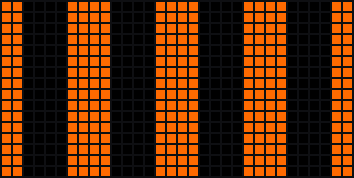

1. Colour 1 has no inputs or settings: its `color` is whatever is picked first on the WLED page (in the sim, the side panel's COLOURS).
2. It goes into a **Mask** shown by scrolling **Stripes** (count 4, duty 0.5): stripes of the picked colour.
3. **Effect settings**' colours names the pickers Stripes, Background and Accent, so the WLED page labels them.

[Try it in the studio](studio:try/colour_1): the graph opens live in the Node tutorials project; your own project is saved and comes back with **Back to my project**.

**Try this**

- [Pick another colour](studio:try/colour_1/1): In the side panel's COLOURS section, pick another colour for Stripes (Colour 1): the stripes' colour changes at once - the effect reads the picker every frame.

### Colour 2

The secondary colour picked on the WLED page.

**Outputs**
- **color** *(color)*: that colour

**Why use it**

Colour 2 is the second colour picker on the WLED page. Two picked colours make a simple two-colour effect: one for the pattern, one for what is between.

Its neighbours: Colour 1 and Colour 3; Colour pick has eight colours fixed in the effect; Palette blends a whole range.

**Tutorial**

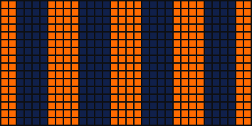

1. Colour 2 has no inputs or settings: its `color` is the second colour picked on the WLED page.
2. It is the **under** of a **Blend**; Colour 1 is the **over**, shown by scrolling **Stripes** as the amount.
3. So the stripes are the primary colour and the gaps between them the secondary: a two-colour effect the person colours on the page.
4. **Effect settings** names the pickers Stripes, Background and Accent.

[Try it in the studio](studio:try/colour_2): the graph opens live in the Node tutorials project; your own project is saved and comes back with **Back to my project**.

**Try this**

- [Pick another background](studio:try/colour_2/1): In the side panel's COLOURS section, pick another colour for Background (Colour 2): the background between the stripes changes at once - the effect reads the picker every frame.

### Colour 3

The tertiary colour picked on the WLED page.

**Outputs**
- **color** *(color)*: that colour

**Why use it**

Colour 3 is the third colour picker: for an accent - highlights, sparks, an outline - in a colour of its own.

Its neighbours: Colour 1 and Colour 2; Colour for a fixed one; Palette for a range.

**Tutorial**

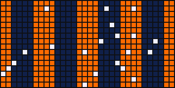

1. Colour 3 has no inputs or settings: its `color` is the third colour picked on the WLED page.
2. It shows through a **Mask** of a **Sparkle** (reseeded ten times a second): sparks of the accent colour.
3. A **Blend** in max mode lays them over stripes of Colour 1 on a ground of Colour 2 (another Blend, by scrolling **Stripes**).
4. **Effect settings** names the three pickers Stripes, Background and Accent.

[Try it in the studio](studio:try/colour_3): the graph opens live in the Node tutorials project; your own project is saved and comes back with **Back to my project**.

**Try this**

- [Pick another accent](studio:try/colour_3/1): In the side panel's COLOURS section, pick another colour for Accent (Colour 3): the sparks' colour changes at once - the effect reads the picker every frame.

### Custom 1

The third slider on the WLED page, 0..1, with whatever name you give it.

**Outputs**
- **value** *(float)*: the slider's position, 0..1

**Settings**
- **label** *(text)*: the name the slider shows
- **default** *(int)*: where the slider starts, 0..255

**Why use it**

Speed and Intensity are not always enough: an effect might want a size, a count, a softness, a second speed. Custom 1 is the third slider on the WLED page, 0..1, named whatever you like - the name you give it is what the page shows.

Its neighbours: Custom 2 and Custom 3 are the next two (Custom 3 has only 32 steps on the device); Speed and Intensity are the standard pair.

**Tutorial**

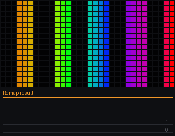

1. Custom 1 has no inputs. Its `value` is the slider, 0..1.
2. **label** is Stripes, so the slider is called Stripes on the WLED page. **default** is 64: it starts a quarter of the way.
3. A **Remap** turns the slider into 2..12: the **count** of a scrolling **Stripes** node. The **Palette** colours them.

[Try it in the studio](studio:try/custom_1): the graph opens live in the Node tutorials project; your own project is saved and comes back with **Back to my project**.

**Try this**

- [Move the slider](studio:try/custom_1/1): In the side panel's PARAMETERS section, drag the Stripes (Custom 1) slider: and the number of stripes goes from 2 at the left to 12 at the right. Nothing is rebuilt: the effect reads the slider every frame.
- [Rename it](studio:try/custom_1/2): label Bands: the slider is called Bands on the WLED page (and in PARAMETERS) - the effect is rebuilt with the new name.

**Used in**

Box Fire (`box_fire.json`), Breakout (`breakout.json`), Candy Knot (`candy_knot.json`), Cell Weave (`cell_weave.json`), Cube Chladni (`cube_chladni.json`), Fan (`fan.json`), Feigenbaum (`feigenbaum.json`), Fireworks (`fireworks.json`), Garlands (`garlands.json`), Gyro Sand (`gyro_sand.json`), Kaleidoscope (`kaleidoscope.json`), Lightning (`lightning.json`), Liquid (`liquid.json`), Liquid Tunnel (`liquid_tunnel.json`), Maelstrom (`maelstrom.json`), Mandelbrot (`mandelbrot.json`), Marquee (`marquee.json`), Meteors (`meteors.json`), Moire (`moire.json`), Pinwheel (`pinwheel.json`), Question Block (`question_block.json`), Ring Rain (`ring_rain.json`), Shockwave (`shockwave.json`), Slab Cut (`slab_cut.json`), Snowstorm (`snowstorm.json`), Spirals (`spirals.json`), Tendril (`tendril.json`), Truchet Cube (`truchet_cube.json`), Watershed (`watershed.json`)

### Custom 2

The fourth slider on the WLED page, 0..1, with whatever name you give it.

**Outputs**
- **value** *(float)*: the slider's position, 0..1

**Settings**
- **label** *(text)*: the name the slider shows
- **default** *(int)*: where the slider starts, 0..255

**Why use it**

Custom 2 is the fourth slider on the WLED page - a second one of your own, 0..1, with the name you give it.

Use it for a second quality of the effect next to Custom 1: a softness, a trail length, a mix. Its neighbours: Custom 1 and Custom 3; Speed and Intensity.

**Tutorial**

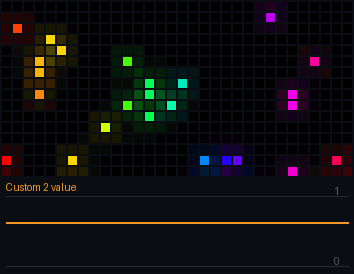

1. Custom 2 has no inputs. Its `value` is the slider, 0..1.
2. **label** is Glow, so that is its name on the WLED page. **default** is 160.
3. The value is a **Glow**'s amount: sparkles (a **Sparkle** reseeded eight times a second, coloured by the **Palette**) get more halo the further the slider goes.

[Try it in the studio](studio:try/custom_2): the graph opens live in the Node tutorials project; your own project is saved and comes back with **Back to my project**.

**Try this**

- [Move the slider](studio:try/custom_2/1): In the side panel's PARAMETERS section, drag the Glow (Custom 2) slider: and the sparkles go from hard dots at the left to soft balls of light at the right. Nothing is rebuilt: the effect reads the slider every frame.
- [Rename it](studio:try/custom_2/2): label Bloom: the slider is called Bloom on the WLED page (and in PARAMETERS) - the effect is rebuilt with the new name.

**Used in**

Breakout (`breakout.json`), Candy Knot (`candy_knot.json`), Cell Weave (`cell_weave.json`), Cube Chladni (`cube_chladni.json`), Cube Ripples (`cube_ripples.json`), Feigenbaum (`feigenbaum.json`), Fireworks (`fireworks.json`), Garlands (`garlands.json`), Gyro Sand (`gyro_sand.json`), Kaleidoscope (`kaleidoscope.json`), Liquid (`liquid.json`), Liquid Tunnel (`liquid_tunnel.json`), Maelstrom (`maelstrom.json`), Mandelbrot (`mandelbrot.json`), Moire (`moire.json`), Slab Cut (`slab_cut.json`), Watershed (`watershed.json`)

### Custom 3

The fifth slider, 0..1. On the device it has only 32 steps, so use it for choices (a shape, a count), not for anything that should glide.

**Outputs**
- **value** *(float)*: the slider's position, 0..1, in 32 steps

**Settings**
- **label** *(text)*: the name the slider shows
- **default** *(int)*: where the slider starts, 0..31

**Why use it**

Custom 3 is the fifth slider. On the device it has only 32 steps, not 256 - too coarse for anything that should glide smoothly, but just right for a choice: a count, a shape, a mode.

Its neighbours: Custom 1 and 2 have the full 256 steps; Check 1, 2 and 3 are on-off choices; Custom 3 is a choice among a few.

**Tutorial**

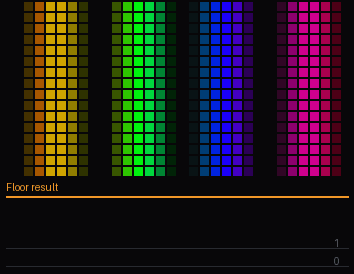

1. Custom 3 has no inputs. Its `value` is the slider, 0..1, in 32 steps.
2. **label** is Cycles, its name on the WLED page. **default** is 12 (of 31).
3. A **Remap** turns it into 1..8 and a **Floor** makes that a whole number: the **cycles** of a **Wave**, so the slider picks between one and eight waves across, a whole number at a time.

[Try it in the studio](studio:try/custom_3): the graph opens live in the Node tutorials project; your own project is saved and comes back with **Back to my project**.

**Try this**

- [Move the slider](studio:try/custom_3/1): In the side panel's PARAMETERS section, drag the Cycles (Custom 3) slider: and the wave count steps between 1 and 8 - in jumps, as a choice should. Nothing is rebuilt: the effect reads the slider every frame.
- [Rename it](studio:try/custom_3/2): label Waves: the slider is called Waves on the WLED page (and in PARAMETERS) - the effect is rebuilt with the new name.

**Used in**

Cell Weave (`cell_weave.json`), Cube Chladni (`cube_chladni.json`), Liquid (`liquid.json`), Liquid Tunnel (`liquid_tunnel.json`), Maelstrom (`maelstrom.json`), Mandelbrot (`mandelbrot.json`), Moire (`moire.json`), Slab Cut (`slab_cut.json`), Truchet Cube (`truchet_cube.json`)

### Intensity

The Intensity slider on the WLED page, 0..1. Use it for how much - brightness, size, how many. The label you give it is what the page shows.

**Outputs**
- **value** *(float)*: the slider's position, 0..1

**Settings**
- **label** *(text)*: the name the slider shows on the WLED page
- **default** *(int)*: where the slider starts, 0..255

**Why use it**

The second standard slider on the WLED page, Intensity, is for how much: how bright, how big, how many. The Intensity node is that slider as a number, 0 at the left to 1 at the right.

Its neighbours: Speed is for how fast; Custom 1, 2 and 3 are extra sliders with names of your own; Intensity is the one people expect to mean 'more'.

**Tutorial**

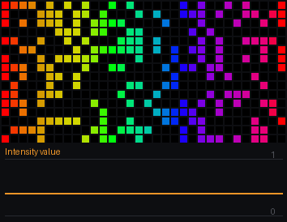

1. Intensity has no inputs. Its `value` is the slider, 0..1.
2. **label** is Intensity, the name the slider shows; **default** is 100 (of 255): where it starts.
3. The value is a **Sparkle**'s density: at 100 of 255, about four in ten pixels lit - more as the slider goes up. The sparkles are reseeded twelve times a second (**Time**, a **Multiply** and a **Floor**) and coloured by the **Palette** across `u`.

[Try it in the studio](studio:try/intensity): the graph opens live in the Node tutorials project; your own project is saved and comes back with **Back to my project**.

**Try this**

- [Move the slider](studio:try/intensity/1): In the side panel's PARAMETERS section, drag the Intensity slider: to the right and the matrix fills with sparkles, to the left they thin to a few. Nothing is rebuilt: the effect reads the slider every frame.
- [Rename it](studio:try/intensity/2): label Sparkles: the slider is called Sparkles on the WLED page (and in PARAMETERS) - the effect is rebuilt with the new name.

**Used in**

Box Fire (`box_fire.json`), Breakout (`breakout.json`), Butterfly (`butterfly.json`), Candy Knot (`candy_knot.json`), Cell Weave (`cell_weave.json`), Cube Chladni (`cube_chladni.json`), Cube Ripples (`cube_ripples.json`), Curtain (`curtain.json`), Fan (`fan.json`), Feigenbaum (`feigenbaum.json`), Fireworks (`fireworks.json`), Garlands (`garlands.json`), Gyro Sand (`gyro_sand.json`), Kaleidoscope (`kaleidoscope.json`), Lightning (`lightning.json`), Liquid (`liquid.json`), Liquid Tunnel (`liquid_tunnel.json`), Maelstrom (`maelstrom.json`), Mandelbrot (`mandelbrot.json`), Marquee (`marquee.json`), Meteors (`meteors.json`), Moire (`moire.json`), Morph (`morph.json`), Pinwheel (`pinwheel.json`), Question Block (`question_block.json`), Ring Rain (`ring_rain.json`), Shockwave (`shockwave.json`), Slab Cut (`slab_cut.json`), Snowstorm (`snowstorm.json`), Spirals (`spirals.json`), Tendril (`tendril.json`), Truchet Cube (`truchet_cube.json`), Watershed (`watershed.json`)

### Speed

The Speed slider on the WLED page, as a number from 0 (left) to 1 (right). Multiply it into a rate (Integrate's rate, a Multiply before Time) so the slider sets how fast things move.

**Outputs**
- **value** *(float)*: the slider's position, 0..1

**Settings**
- **label** *(text)*: the name the slider shows on the WLED page (set in the properties; the node's title carries it)
- **default** *(int)*: where the slider starts, 0..255 (set in the properties)

**Why use it**

Every WLED effect has a Speed slider, and people expect it to set how fast things move. The Speed node is that slider: its value is 0 at the left, 1 at the right - multiply it into a rate and the slider controls the speed.

Its neighbours: Intensity is the other standard slider (how much); Custom 1, 2 and 3 are the extra sliders, named as you like; Number is a fixed value; Speed is what people reach for first.

**Tutorial**

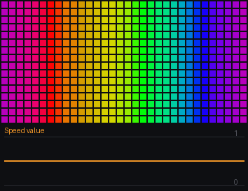

1. Speed has no inputs. Its `value` is the slider, 0..1 (it starts at the middle, 0.5).
2. **label** is Speed: the name the slider shows on the WLED page. **default** is 128: where it starts, 0..255.
3. The value times **Time**'s `t` (a **Multiply**) is a phase that grows faster with the slider higher; added to **Coords** `u` it is the **Palette**'s index - the colours scroll at the slider's speed.
4. This is the graph a new graph starts as.

[Try it in the studio](studio:try/speed): the graph opens live in the Node tutorials project; your own project is saved and comes back with **Back to my project**.

**Try this**

- [Move the slider](studio:try/speed/1): In the side panel's PARAMETERS section, drag the Speed slider: to the right the colours race, to the left they creep, at 0 they stop. Nothing is rebuilt: the effect reads the slider every frame.
- [Rename it](studio:try/speed/2): label Drift: the slider is called Drift on the WLED page (and in PARAMETERS) - the effect is rebuilt with the new name.

**Used in**

Box Fire (`box_fire.json`), Breakout (`breakout.json`), Butterfly (`butterfly.json`), Candy Knot (`candy_knot.json`), Cell Weave (`cell_weave.json`), Cube Chladni (`cube_chladni.json`), Cube Ripples (`cube_ripples.json`), Curtain (`curtain.json`), Fan (`fan.json`), Feigenbaum (`feigenbaum.json`), Fireworks (`fireworks.json`), Garlands (`garlands.json`), Gyro Sand (`gyro_sand.json`), Kaleidoscope (`kaleidoscope.json`), Lightning (`lightning.json`), Liquid (`liquid.json`), Liquid Tunnel (`liquid_tunnel.json`), Maelstrom (`maelstrom.json`), Mandelbrot (`mandelbrot.json`), Marquee (`marquee.json`), Meteors (`meteors.json`), Moire (`moire.json`), Morph (`morph.json`), Pinwheel (`pinwheel.json`), Question Block (`question_block.json`), Ring Rain (`ring_rain.json`), Shockwave (`shockwave.json`), Slab Cut (`slab_cut.json`), Snowstorm (`snowstorm.json`), Spirals (`spirals.json`), Tendril (`tendril.json`), Truchet Cube (`truchet_cube.json`), Watershed (`watershed.json`)

## signals

### ADSR

An envelope fired by a switch, as a synth shapes a note. One shot: every time gate turns on, the value climbs to 1 over attack and falls back to 0 over decay, however long gate stays on - a flash on the kick that fades the way you shape it. Held: it climbs, falls to sustain and stays there while gate is on, then falls to 0 over release when it goes off. Feed it Audio's beat, a Gate or a Counter.

**Inputs**
- **gate** *(bool)*: the switch that fires it (the beat)
- **attack** *(float)*: how long the climb to 1 takes, in milliseconds
- **decay** *(float)*: how long the fall from 1 takes, in milliseconds
- **sustain** *(float)*: held: the level it stays at while gate is on, 0..1
- **release** *(float)*: held: how long the fall to 0 takes once gate is off, in milliseconds

**Outputs**
- **value** *(float)*: the envelope, 0..1
- **active** *(bool)*: true while it is anywhere but at rest

**Settings**
- **mode** *(choice)*: one shot (attack, decay on each rise) or held (attack, decay, sustain, release)

**Why use it**

A light that just switches on and off with the beat looks mechanical. Instruments do not: a note swells in, falls to a level, holds, and dies away. ADSR shapes a value the same way - attack, decay, sustain, release - every time its gate opens, so a flash on the beat has a shape you choose.

In one shot mode it plays attack and decay whenever the gate turns on (a flash that fades); in held mode it also sustains while the gate stays on and releases when it closes (a swell that lasts as long as the bass does). Its neighbours: Envelope follows a level smoothly (no trigger); Slew and Ease glide toward a target; ADSR is a shape played on a trigger.

**Tutorial**

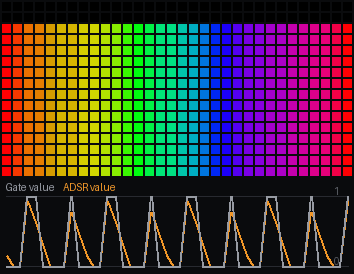

1. **Audio**'s `bass` goes into a **Gate** (on above 0.5, off below 0.3); the gate's `on` is ADSR's **gate** - open while the bass is loud.
2. **attack** is 10 ms: on each opening the value jumps up almost at once. **decay** is 300 ms: it falls away again over a third of a second.
3. **mode** is one shot, so **sustain** (0.5) and **release** (400 ms) are not used yet - they matter in held mode (see below).
4. `value` drives a level meter: the value plus **Coords** `v` reaches 1 (a **Threshold**) only where `v` is above 1 minus the value, so a column is lit from the bottom as high as the value, in the **Palette**'s colours across. `active` is true while the envelope is anywhere but at rest.
5. The trace shows the gate (grey) and the envelope (orange): a sharp rise at each opening, then the decay.

[Try it in the studio](studio:try/adsr): the graph opens live in the Node tutorials project; your own project is saved and comes back with **Back to my project**.

**Try this**

- [Slow attack](studio:try/adsr/1): attack 250: each opening swells up over a quarter of a second instead of snapping - a soft pad rather than a hit.
- [Held](studio:try/adsr/2): mode held: the value falls to sustain (0.5) and stays there while the gate is open, then fades out over release when the bass drops.
- [Long tail](studio:try/adsr/3): decay 1200: each hit fades over more than a second, so the hits overlap into a continuous glow.

### Audio

What the microphone hears, as numbers 0..1. volume is the overall loudness; bass, mid and treble are the low, middle and high bands; beat is true on the frame a kick lands; hit is how hard it landed. Plug bass into a brightness, beat into a Random hold or Emitters.

**Outputs**
- **volume** *(float)*: overall loudness, 0..1
- **bass** *(float)*: the low band, 0..1
- **mid** *(float)*: the middle band, 0..1
- **treble** *(float)*: the high band, 0..1
- **beat** *(bool)*: true for the frame a kick is detected
- **hit** *(float)*: how hard the kick was, 0..1 (0 between kicks)

**Why use it**

Audio is where an effect hears the music: the overall loudness, three bands (bass, mid and treble) and a beat, all as numbers each frame. In the sim it is the synth (or a file, or the line in); on the device it is WLED's microphone through the audioreactive usermod.

Plug bass into a brightness and the effect pumps with the kick; plug beat into a trigger and something happens on every hit. Its neighbours: Spectrum and FFT bin give the sixteen bands in detail; Onset hears hits over a steady bass; Tempo measures the beat's speed; Audio is the everyday summary.

**Tutorial**

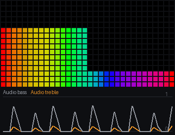

1. Audio has no inputs or settings. Its outputs, each 0..1 unless it is a switch: `volume` (overall loudness), `bass`, `mid` and `treble` (the low, middle and high bands), `beat` (true on the frame a kick lands) and `hit` (how hard it landed).
2. Two **Mix** nodes choose what the meters show: the left one passes `bass` (its t at 0, with `hit` waiting in b), the right one passes `treble` (with `mid` waiting).
3. Then two meters - a **Threshold** on `u` switches a **Select** between the two values, left half and right half; each value plus `v` through a Threshold at 1 lights a column from the bottom as high as the value.
4. Watch them move differently: the bass jumps on every kick and drops between; the treble ticks with the hats. The trace shows the bass (grey) and the treble (orange).

[Try it in the studio](studio:try/audio): the graph opens live in the Node tutorials project; your own project is saved and comes back with **Back to my project**.

**Try this**

- [Hit instead of bass](studio:try/audio/1): the left Mix's t at 1: the left meter shows `hit` - a spike on each kick as hard as it landed, nothing between.
- [Mid instead of treble](studio:try/audio/2): the right Mix's t at 1: the right meter shows the middle band - voices and chords, steadier than the hats.

**Used in**

Box Fire (`box_fire.json`), Candy Knot (`candy_knot.json`), Cell Weave (`cell_weave.json`), Cube Chladni (`cube_chladni.json`), Cube Ripples (`cube_ripples.json`), Feigenbaum (`feigenbaum.json`), Fireworks (`fireworks.json`), Gyro Sand (`gyro_sand.json`), Kaleidoscope (`kaleidoscope.json`), Liquid (`liquid.json`), Liquid Tunnel (`liquid_tunnel.json`), Maelstrom (`maelstrom.json`), Mandelbrot (`mandelbrot.json`), Moire (`moire.json`), Question Block (`question_block.json`), Ring Rain (`ring_rain.json`), Shockwave (`shockwave.json`), Slab Cut (`slab_cut.json`), Truchet Cube (`truchet_cube.json`), Watershed (`watershed.json`)

### Beat kick

A position that jumps forward on each beat and settles over a few frames - the way a hit should move a pattern. Add its phase to whatever you scroll (a Wave's phase, a Palette index) and the picture lurches on the kick and eases.

**Inputs**
- **beat** *(bool)*: the beat, from Audio
- **throw** *(float)*: how far each beat throws it

**Outputs**
- **phase** *(float)*: the running offset: add it to a position

**Why use it**

A pattern that moves with the music should be pushed by the beat - but a jump looks like a glitch, and a pattern that only pulses its brightness does not move at all. Beat kick gives a position that jumps forward on each beat and settles over a few frames: add it to anything that scrolls and the picture lurches on the kick, like it was hit.

Its neighbours: Spring swings back and forth after a kick; Ease glides to a target; Counter steps by whole numbers; Beat kick is forward motion with a soft landing, always onward.

**Tutorial**

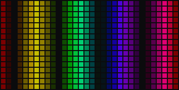

1. **Audio**'s `beat` is the **beat** input: true on the frame a kick lands.
2. **throw** is 1: how far each kick moves the phase - one whole cycle of whatever it scrolls.
3. `phase` is a **Wave**'s phase (x from **Coords** `u`, 4 cycles, triangle): on each kick the stripes lurch along by a cycle and ease to a stop. That wave is the **Palette**'s brightness.
4. Watch the stripes: still between kicks, a quick lurch on each one that eases to a stop.

[Try it in the studio](studio:try/beat_kick): the graph opens live in the Node tutorials project; your own project is saved and comes back with **Back to my project**.

**Try this**

- [Harder kicks](studio:try/beat_kick/1): throw 2.5: each kick throws the stripes two and a half cycles - a big lurch.
- [Nudge](studio:try/beat_kick/2): throw 0.25: a quarter cycle per kick - a gentle nudge on the beat.
- [Finer stripes](studio:try/beat_kick/3): the Wave's cycles at 10: narrow stripes, so the same throw moves them past many stripes at once.

**Used in**

Shockwave (`shockwave.json`)

### Colour

A fixed colour you pick.

**Outputs**
- **color** *(color)*: the colour

**Settings**
- **rgb** *(color)*: the colour

**Why use it**

Not everything should follow the palette: a brand colour, a warning red, a warm white for a lamp. Colour is one fixed colour you pick, part of the effect itself.

Use it wherever a single steady colour is wanted, then shape it with a mask, a blend or a scale. Its neighbours: Colour 1, 2 and 3 (controls) are the colour pickers on the WLED page, chosen by the person; Colour pick is eight fixed colours by number; Colour is one, fixed in the graph.

**Tutorial**

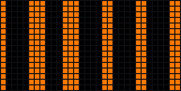

1. Colour has no inputs; its **rgb** setting is the colour - here a warm orange.
2. Its `color` goes into a **Mask**, shown only where scrolling **Stripes** (count 5, duty 0.4, a clock as phase) are lit.
3. The masked colour goes to the **Output**: orange stripes on black, whatever palette is chosen on the WLED page.

[Try it in the studio](studio:try/colour): the graph opens live in the Node tutorials project; your own project is saved and comes back with **Back to my project**.

**Try this**

- [Another colour](studio:try/colour/1): rgb at teal: the stripes change colour at once - the colour is set on the node, not the page.
- [Warm white](studio:try/colour/2): rgb at a warm white: a lamp-like light rather than a colour.

**Used in**

Breakout (`breakout.json`), Candy Knot (`candy_knot.json`), Lightning (`lightning.json`), Liquid (`liquid.json`), Meteors (`meteors.json`), Ring Rain (`ring_rain.json`), Snowstorm (`snowstorm.json`)

### Counter

Counts: each time trigger turns on, one more, and at steps it starts again from 0. wrap fires on the trigger that brings it back to 0, so with the beat in and 4 steps it fires once a bar - a clock divider. phase is the count as 0..1, for stepping through a palette or a set of looks.

**Inputs**
- **trigger** *(bool)*: a rise counts one (the beat)
- **reset** *(bool)*: true holds the count at 0
- **steps** *(float)*: how many counts before it starts again

**Outputs**
- **count** *(float)*: the count, 0 .. steps-1
- **phase** *(float)*: the count over steps, 0..1
- **wrap** *(bool)*: true for the frame the count goes back to 0 - every steps-th trigger

**Why use it**

Music comes in bars: four beats, then again. Counter counts triggers - beats, presses, anything - and starts again at the number of steps you give it, so an effect can do something on every fourth beat, or step through four looks a bar at a time.

Its wrap output fires on the trigger that brings it back to 0 - once a bar with four steps, a clock divider. Its neighbours: Steps plays a sequence of values on each trigger; Toggle flips between two; Tempo measures beats in time; Counter counts them.

**Tutorial**

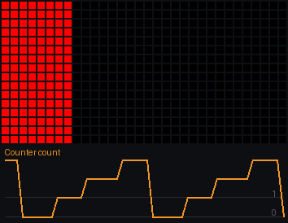

1. **Audio**'s `beat` is the **trigger**: each kick counts one more.
2. **steps** is 4: the count goes 0, 1, 2, 3, 0... **reset** (unwired) would put it back to 0.
3. `count` lights one column of four: **Coords** `u` times 4, floored, minus the count, made positive (**Abs**), into a **Smoothstep** (edges 0.5 and 0) - 1 only in the column whose number matches. That is the **Palette**'s brightness.
4. `phase` (the count as 0..1) is the palette's index, so each count has its own colour; `wrap` (unused here) is true on the beat that starts the next bar. The trace shows the count stepping up and falling back.

[Try it in the studio](studio:try/counter): the graph opens live in the Node tutorials project; your own project is saved and comes back with **Back to my project**.

**Try this**

- [Two steps](studio:try/counter/1): steps 2: the count only goes 0, 1 - the light swaps between the first two columns on every beat.
- [Eight steps](studio:try/counter/2): steps 8: the count runs to 7, so after the fourth column it goes dark for four beats, then starts again - a two-bar cycle.
- [Hold at the start](studio:try/counter/3): reset on: the counter is held at 0, so only the first column lights.

### Delay

Remembers a number for one frame. It is the one node a wire may loop back through: feed it a value and plug its output back into what made that value, and each frame sees last frame's result. For 'only restart the cycle when the cycle is over' and the like. The editor puts one on a wire for you when the wire would close a loop (undo takes it out again).

**Inputs**
- **x** *(float)*: the value to remember

**Outputs**
- **value** *(float)*: what x was last frame (0 on the first)

**Why use it**

A graph normally runs from inputs to the output once a frame, with no wire allowed to loop back. Some things need last frame's answer to work out this frame's: a running total, a value that only restarts when it is done. Delay remembers a number for one frame, and it is the one node a wire may loop back through.

Its neighbours: Integrate and the other signal nodes keep their own memory inside; Previous remembers colours, Field per-pixel numbers; Delay lets you build your own memory out of ordinary nodes.

**Tutorial**

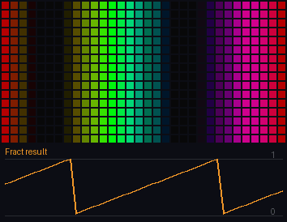

1. **Delay**'s `value` is what went into its **x** last frame.
2. An **Add** puts 0.01 onto it, and a **Fract** keeps the result within 0..1 - and that result goes back into Delay's x: a loop. Each frame the number is last frame's plus 0.01: a phase that climbs and wraps.
3. The phase is a **Wave**'s phase (x from **Coords** `u`, 2 cycles): the stripes scroll a hundredth of a cycle a frame.
4. The trace shows the loop's phase: a ramp that climbs and drops back to 0 - built from nothing but an Add, a Fract and a Delay.

[Try it in the studio](studio:try/delay): the graph opens live in the Node tutorials project; your own project is saved and comes back with **Back to my project**.

**Try this**

- [Faster](studio:try/delay/1): the Add's b at 0.04: four times the step each frame - the stripes scroll four times as fast.
- [Backwards](studio:try/delay/2): the Add's b at -0.01: the loop counts down, so the stripes scroll the other way.

**Used in**

Question Block (`question_block.json`)

### Ease

A value that glides instead of jumping. Give it a target - a slider, a switch, a random - and it moves there over about `seconds`, so a change on the WLED page fades in rather than snapping.

**Inputs**
- **target** *(float)*: where to go
- **seconds** *(float)*: roughly how long the glide takes

**Outputs**
- **value** *(float)*: where it is now
- **moving** *(bool)*: true while it is still on its way

**Why use it**

Values that change in steps - a slider moved on the WLED page, a random picked on the beat, a switch flipped - look abrupt when they drive a picture directly. Ease glides to each new target over about the time you set, so the change fades in instead of snapping.

Its neighbours: Slew moves at a fixed speed (a big jump takes longer); Spring overshoots and settles; Envelope follows a level with separate rise and fall; Ease takes about the same time for any jump, easing in and out.

**Tutorial**

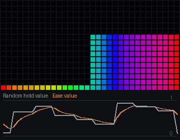

1. A **Random hold** picks a new random level on each of **Audio**'s beats: that is Ease's **target**.
2. **seconds** is 0.5: Ease reaches each new target in about half a second.
3. `moving` is true while it is still on its way.
4. The left meter is the target, the right one Ease's `value`: two meters - a **Threshold** on `u` switches a **Select** between the two values, left half and right half; each value plus `v` through a Threshold at 1 lights a column from the bottom as high as the value. The trace shows the target jumping (grey) and Ease following it in smooth curves (orange).

[Try it in the studio](studio:try/ease): the graph opens live in the Node tutorials project; your own project is saved and comes back with **Back to my project**.

**Try this**

- [Slower](studio:try/ease/1): seconds 2: Ease takes two seconds to arrive, so it rarely gets there before the next beat picks another target.
- [Snappy](studio:try/ease/2): seconds 0.1: almost a jump, with just the corners rounded off.

### Emitters

Drops a thing on the surface each time the trigger fires - up to eight alive at once - and remembers where and how old each is. Plug the beat into trigger and the Shells node reads them: rings spreading from wherever each kick landed.

**Inputs**
- **trigger** *(bool)*: true drops a new one (the beat)
- **pos** *(vector)*: where to drop it, if not random (a vector; z = 1 is the lid)
- **tag** *(float)*: a number kept with it - a hue, say (Loudest bin)
- **life** *(float)*: how many seconds each one lives

**Outputs**
- **slots** *(float)*: the list - wire this to Shells
- **count** *(float)*: how many are alive

**Settings**
- **random** *(bool)*: drop each one at a random point on the surface instead of x, y, z

**Why use it**

Some effects are made of events: something happens at a place, at a moment, and spreads or fades from there. Emitters keeps track of them - on each trigger it drops one at a place on the surface, and it remembers up to eight at once, with where each is, how old, and a tag of your choice.

It does not draw anything itself; Shells (rings growing from each one) reads it. Its neighbours: Particles keeps moving points with velocity and gravity; Random hold picks one random number per trigger; Emitters is a set of events in space and time.

**Tutorial**

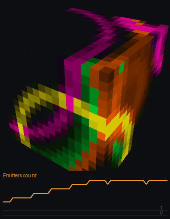

1. **Audio**'s `beat` is the **trigger**: each kick drops a new emitter.
2. **random** is on, so each one lands at a random place on the cube's surface; with it off they all start at **pos** (here the middle of the lid, 0, 0, 1).
3. **life** is 4: each lives four seconds, then its slot is free again. **tag** comes from a **Random hold** on the same beat - each emitter gets its own number, read back as its colour.
4. `slots` goes to **Shells** (with **Position**'s `pos`), which draws each emitter as a ring growing from where it landed; `count` is how many are alive.

[Try it in the studio](studio:try/emitters): the graph opens live in the Node tutorials project; your own project is saved and comes back with **Back to my project**.

**Try this**

- [Always from the top](studio:try/emitters/1): random off: every emitter starts at pos, the middle of the lid - each beat sends a ring down the cube from the top.
- [Short lives](studio:try/emitters/2): life 1: each emitter lives one second, so only the newest ring or two are on the cube at once.

**Used in**

Cube Ripples (`cube_ripples.json`)

### Envelope

Smooths a jumpy signal. It follows rises quickly (attack) and falls slowly (release), so a bass that flickers becomes a swell that breathes. Put it between Audio and anything that would flicker.

**Inputs**
- **x** *(float)*: the signal to smooth

**Outputs**
- **value** *(float)*: the smoothed signal

**Settings**
- **attack** *(float)*: how fast it rises, in milliseconds
- **release** *(float)*: how fast it falls, in milliseconds

**Why use it**

Audio levels flicker frame to frame; wired straight to brightness, the flicker shows. Envelope smooths a signal the way the ear hears loudness: it follows a rise quickly (attack) and lets go slowly (release), so a stuttering bass becomes a swell that breathes.

Put one between Audio and anything that would flicker. Its neighbours: Slew limits speed in units a second; Peak hold jumps to peaks and holds them; ADSR plays a shape on a trigger; Envelope is a smooth follower with separate attack and release times.

**Tutorial**

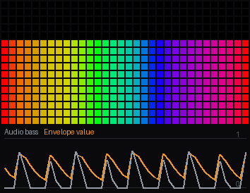

1. **Audio**'s `bass` is the **x** input.
2. **attack** is 20 ms: a rise is followed almost at once. **release** is 250 ms: a fall takes about a quarter of a second.
3. The left meter is the raw bass, the right one the envelope: two meters - a **Threshold** on `u` switches a **Select** between the two values, left half and right half; each value plus `v` through a Threshold at 1 lights a column from the bottom as high as the value.
4. The trace: the bass (grey) spikes and drops; the envelope (orange) rises with each spike and slides down after it.

[Try it in the studio](studio:try/envelope): the graph opens live in the Node tutorials project; your own project is saved and comes back with **Back to my project**.

**Try this**

- [Long release](studio:try/envelope/1): release 800: the envelope barely falls between kicks - a level that holds up through the beat.
- [Slow attack](studio:try/envelope/2): attack 150: even the rise is smoothed - the envelope swells into each kick rather than jumping.

**Used in**

Candy Knot (`candy_knot.json`), Cell Weave (`cell_weave.json`), Cube Chladni (`cube_chladni.json`), Feigenbaum (`feigenbaum.json`), Gyro Sand (`gyro_sand.json`), Kaleidoscope (`kaleidoscope.json`), Liquid (`liquid.json`), Liquid Tunnel (`liquid_tunnel.json`), Maelstrom (`maelstrom.json`), Mandelbrot (`mandelbrot.json`), Moire (`moire.json`), Watershed (`watershed.json`)

### FFT bin

One of the sixteen frequency bands the microphone is split into, from low (0) to high (15). For a whole spectrum along a coordinate use Spectrum instead.

**Outputs**
- **level** *(float)*: how loud that band is, 0..1

**Settings**
- **bin** *(int)*: which band, 0 (lowest) to 15 (highest)

**Why use it**

The microphone's sound is split into sixteen frequency bands, from the deepest bass (0) to the highest treble (15). FFT bin gives you one of them: when you want an effect to follow exactly the kick drum, or exactly the hi-hats, rather than Audio's broad bass and treble.

Its neighbours: Audio sums the bands into bass, mid and treble; Spectrum spreads all sixteen along a coordinate; Loudest bin says which band is loudest; FFT bin is one band, chosen.

**Tutorial**

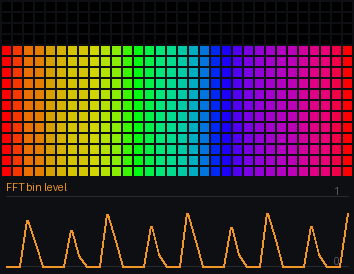

1. FFT bin has no inputs. **bin** is 2: the third band, low bass - where most kick drums sit.
2. `level` (0..1) drives a level meter: the value plus **Coords** `v` reaches 1 (a **Threshold**) only where `v` is above 1 minus the value, so a column is lit from the bottom as high as the value, in the **Palette**'s colours across.
3. The trace shows that one band over time: tall spikes on the kicks, nearly nothing between.

[Try it in the studio](studio:try/fft_bin): the graph opens live in the Node tutorials project; your own project is saved and comes back with **Back to my project**.

**Try this**

- [Treble](studio:try/fft_bin/1): bin 12: a high band - it ticks with the hats and ignores the kick.
- [Mid](studio:try/fft_bin/2): bin 7: a middle band - voices and chords, steadier than either end.

### Frame count

first is true only on the very first frame, for setting something up once (seeding a Field). count is how many frames have run.

**Outputs**
- **first** *(bool)*: true on the first frame only
- **count** *(float)*: frames since the effect started

**Why use it**

Some things should happen exactly once, when the effect starts: seeding a simulation, picking a starting colour, clearing a field. Frame count says when that is (first is true on the first frame only) and how many frames have run since.

The count also works as a clock that counts frames rather than seconds - steady steps, whatever the frame rate. Its neighbours: Time counts seconds; Integrate grows at a rate; Counter counts triggers; Frame count counts frames, and marks the first.

**Tutorial**

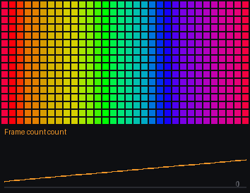

1. Frame count has no inputs or settings. `count` is how many frames have run; `first` is true on the very first frame only.
2. `count` times 0.004 (a **Multiply**) plus **Coords** `u` (an **Add**) is the **Palette**'s index: the colours creep along a little every frame.
3. `first` lights the whole matrix white for that one frame through a **Select** into the brightness of a white **Colour** blended on top - you only see it if you restart the effect (the restart button, or Ctrl+R).
4. The trace shows the count climbing steadily, one a frame.

[Try it in the studio](studio:try/frame_count): the graph opens live in the Node tutorials project; your own project is saved and comes back with **Back to my project**.

**Try this**

- [Faster](studio:try/frame_count/1): the count's Multiply at 0.02: five times the step per frame - the colours scroll quickly.
- [Backwards](studio:try/frame_count/2): the count's Multiply at -0.004: the colours creep the other way.

**Used in**

Breakout (`breakout.json`)

### Gate

A switch with a gap: it turns on when x reaches high and only turns off again when x falls to low. A level that wobbles about one point - a bass band, a noisy volume - would flicker a plain Threshold; the gap between high and low stops that. rise is true for the one frame it turns on.

**Inputs**
- **x** *(float)*: the level to watch
- **high** *(float)*: turns on when x reaches this
- **low** *(float)*: turns off when x falls to this

**Outputs**
- **on** *(bool)*: true while on
- **rise** *(bool)*: true for the frame it turns on
- **value** *(float)*: 1 while on, else 0

**Why use it**

Turning a level into on and off with one threshold flickers: a level that hovers near the line crosses it back and forth every frame. Gate has two lines - it turns on when the level reaches high, and only turns off again when it falls to low - so a wobbling level gives a clean on and off.

Its neighbours: Threshold is the single line (fine for steady values); Rising edge turns on into a one-frame tap; ADSR shapes what happens when a gate opens; Gate is a clean switch from a noisy level.

**Tutorial**

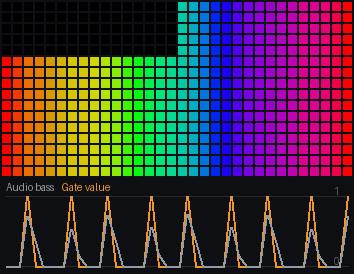

1. **Audio**'s `bass` is the **x** input.
2. **high** is 0.6: the gate opens when the bass reaches it. **low** is 0.4: it closes only when the bass falls back to there.
3. `value` is 1 while open, 0 while closed (`on` is the same as a switch, `rise` true on the frame it opens). The left meter is the bass, the right one the gate: two meters - a **Threshold** on `u` switches a **Select** between the two values, left half and right half; each value plus `v` through a Threshold at 1 lights a column from the bottom as high as the value.
4. The trace: the bass (grey) and the gate (orange) - a square pulse for each kick, with no chatter at the edges.

[Try it in the studio](studio:try/gate): the graph opens live in the Node tutorials project; your own project is saved and comes back with **Back to my project**.

**Try this**

- [More sensitive](studio:try/gate/1): high 0.35 and low 0.2: quieter kicks open the gate too.
- [No gap](studio:try/gate/2): low 0.59: high and low nearly the same, so it behaves like a plain threshold - watch the edges for chatter.

### Gravity

Which way is down, as a direction in the cube's own frame. With a motion sensor fitted it is the real down; without one it is straight down, tilted by the two inputs. Feed the direction into Dot 3 with Position to get 'height', or step along it to make things fall.

**Inputs**
- **tilt x** `tilt_x` *(float)*: lean, -1..1, used when there is no sensor
- **tilt y** `tilt_y` *(float)*: lean the other way, -1..1

**Outputs**
- **g** *(vector)*: down, as one vector wire
- **down x** `gx` *(float)*: down's x part
- **down y** `gy` *(float)*: down's y part
- **down z** `gz` *(float)*: down's z part (-1 is straight down)
- **sensor** *(bool)*: true when a real sensor is supplying it

**Why use it**

An effect that should behave like something real - water, sand, a ball rolling - needs to know which way is down. Gravity gives it: with a motion sensor fitted, the real down; without one, straight down, tilted by the two inputs, which a slider or a slow wave can move.

Dotted with each pixel's Position it gives that pixel's height above the floor, measured the way gravity sees it. Its neighbours: Position gives the place in the cube; Dot 3 and Vector math combine directions; Gravity is the direction of down.

**Tutorial**

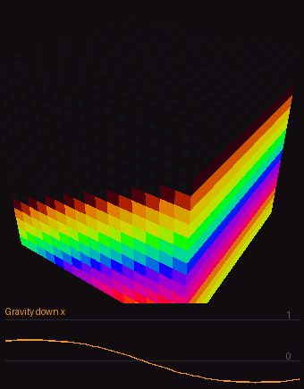

1. **tilt x** comes from a slow **Wave** of the clock (**Time** times 0.15), remapped to -0.6..0.6 by a **Remap**: down rocks from one side to the other. **tilt y** is 0.
2. `g` is down as a direction (`down x`, `down y`, `down z` its parts; `sensor` is true when a real motion sensor is fitted - not in the sim).
3. A **Vector math** in dot mode takes **Position**'s `pos` with `g`: how far along down each pixel is - its depth in the tank.
4. A **Smoothstep** (edges -0.1 and 0.1) lights every pixel deeper than the middle: water filling the lower half of the cube, its surface staying level as down rocks. The **Palette** colours it by depth.

[Try it in the studio](studio:try/gravity): the graph opens live in the Node tutorials project; your own project is saved and comes back with **Back to my project**.

**Try this**

- [Tilt the other way too](studio:try/gravity/1): tilt y 0.5: down leans toward one face as well, so the water surface tilts both ways.
- [Fuller tank](studio:try/gravity/2): the Smoothstep's edges at -0.5 and -0.3: the water fills to well above the middle.

**Used in**

Gyro Sand (`gyro_sand.json`)

### Hold

Sample and hold: x as it was the last time trigger turned on, kept until it turns on again. Feed it a Random, a spectrum level or the time and trigger it from the beat: a value that changes only on the beat and holds in between.

**Inputs**
- **x** *(float)*: the value to catch
- **trigger** *(bool)*: a rise catches x

**Outputs**
- **value** *(float)*: x as it was at the last rise
- **changed** *(bool)*: true on the frame it caught a new one

**Why use it**

Sometimes a value should only change on the beat: a colour that moves on with each kick, a position that jumps to wherever the music has got to. Hold samples its input when the trigger fires and keeps that value until the next trigger - sample and hold.

Its neighbours: Random hold holds a new random number per trigger; Peak hold keeps the highest lately; Delay keeps last frame's; Hold keeps whatever its input was at the last trigger.

**Tutorial**

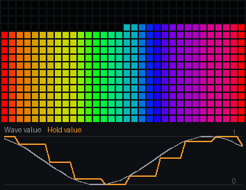

1. A slow **Wave** of the clock (**Time** times 0.25, sine) is the **x** input - a value gliding up and down.
2. **Audio**'s `beat` is the **trigger**: on each kick Hold takes x as it is then, and keeps it.
3. `changed` is true on the frame it takes a new value.
4. The left meter is the wave, the right one what Hold keeps: two meters - a **Threshold** on `u` switches a **Select** between the two values, left half and right half; each value plus `v` through a Threshold at 1 lights a column from the bottom as high as the value. The trace shows the smooth wave (grey) and Hold's staircase following it a beat at a time (orange).

[Try it in the studio](studio:try/hold): the graph opens live in the Node tutorials project; your own project is saved and comes back with **Back to my project**.

**Try this**

- [Faster wave](studio:try/hold/1): the clock's Multiply at 1: the wave rises and falls within a few beats, so the staircase jumps by bigger steps.
- [Slower wave](studio:try/hold/2): the clock's Multiply at 0.05: the wave barely moves between beats - small steps.

### Integrate

A number that keeps growing at a rate you set - the way to make a phase, a scroll or an angle that never stops. Plug a Speed slider into rate and you have a clock the slider controls. wrap makes it start over at that value (1 for a phase, 0 to never wrap).

**Inputs**
- **rate** *(float)*: how much to add per second (a slider, a Multiply of one)
- **reset** *(bool)*: true starts it from 0 again (the beat, to restart on a kick)

**Outputs**
- **value** *(float)*: the running total

**Settings**
- **wrap** *(float)*: start over when it reaches this; 0 = never

**Why use it**

Moving something steadily means adding a little every frame - the right little for how long the frame took. Integrate does that: give it a rate (units a second) and it grows by exactly that much a second, whatever the frame rate, wrapping back to 0 at the value you set.

Plug a Speed slider into rate and you have a scroll the slider controls, which keeps its place when the slider moves (a Multiply of time would jump). Its neighbours: Time is seconds since the start; Delay builds a loop by hand; Integrate is a smooth, rate-controlled phase.

**Tutorial**

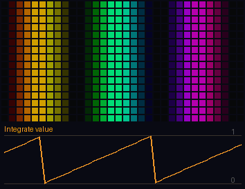

1. **rate** is 0.5: the value grows half a unit a second.
2. **wrap** is 1: at 1 it starts again from 0, so the value is a phase that cycles every two seconds. **reset**, while on, holds it at 0.
3. `value` is a **Wave**'s phase (x from **Coords** `u`, 3 cycles): the stripes scroll.
4. The trace shows the phase: a ramp that climbs to 1 and drops back to 0.

[Try it in the studio](studio:try/integrate): the graph opens live in the Node tutorials project; your own project is saved and comes back with **Back to my project**.

**Try this**

- [Faster](studio:try/integrate/1): rate 2: the phase cycles twice a second - a quick scroll.
- [Never wrap](studio:try/integrate/2): wrap 0: the value keeps growing - the trace climbs forever (the stripes look the same, as a Wave repeats every 1 anyway).
- [Stopped](studio:try/integrate/3): reset on: the value is held at 0 and the stripes stop.

**Used in**

Breakout (`breakout.json`), Butterfly (`butterfly.json`), Candy Knot (`candy_knot.json`), Cell Weave (`cell_weave.json`), Curtain (`curtain.json`), Fan (`fan.json`), Feigenbaum (`feigenbaum.json`), Garlands (`garlands.json`), Kaleidoscope (`kaleidoscope.json`), Lightning (`lightning.json`), Liquid (`liquid.json`), Liquid Tunnel (`liquid_tunnel.json`), Maelstrom (`maelstrom.json`), Mandelbrot (`mandelbrot.json`), Marquee (`marquee.json`), Meteors (`meteors.json`), Moire (`moire.json`), Morph (`morph.json`), Pinwheel (`pinwheel.json`), Question Block (`question_block.json`), Ring Rain (`ring_rain.json`), Shockwave (`shockwave.json`), Slab Cut (`slab_cut.json`), Snowstorm (`snowstorm.json`), Spirals (`spirals.json`), Tendril (`tendril.json`), Truchet Cube (`truchet_cube.json`), Watershed (`watershed.json`)

### Loudest bin

Which of the sixteen frequency bands is loudest right now, as a number from 0 (bass) to 1 (treble), and how loud it is. A hue for whatever the beat drops: kicks come out red, hi-hats blue.

**Outputs**
- **bin** *(float)*: the loudest band, 0..1
- **level** *(float)*: its loudness, 0..1

**Settings**
- **from** *(int)*: only look at bands from this one
- **to** *(int)*: up to this one

**Why use it**

A kick drum, a voice and a hi-hat each sit in a different part of the spectrum. Loudest bin says which part is loudest right now - 0 for bass up to 1 for treble - and how loud it is, so the colour of an effect can follow what is playing: red on the kicks, blue on the hats.

Its neighbours: FFT bin follows one band you choose; Timbre gives the balance of the whole mix; Spectrum gives every band; Loudest bin gives the winner.

**Tutorial**

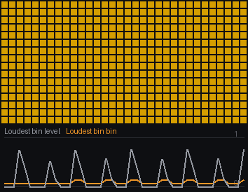

1. Loudest bin has no inputs. **from** is 1 and **to** is 15: it listens to bands 1..15 (band 0, the very lowest rumble, is left out).
2. `bin` - which band is loudest, 0..1 - is the **Palette**'s index, so the whole matrix takes the colour for that part of the spectrum.
3. `level` - how loud that band is - lifted by a **Remap** (0..0.5 into 0.15..1) is the brightness, so the matrix is never quite dark.
4. The trace shows which band wins (orange) jumping between the kick's band and the hats', and its level (grey).

[Try it in the studio](studio:try/loudest_bin): the graph opens live in the Node tutorials project; your own project is saved and comes back with **Back to my project**.

**Try this**

- [Ignore the bass](studio:try/loudest_bin/1): from 6: only the middle and high bands compete, so the colour follows the melody and the hats.
- [Only the bass](studio:try/loudest_bin/2): to 4: only the low bands compete - the colour changes with which bass note is loudest.

**Used in**

Cube Chladni (`cube_chladni.json`), Cube Ripples (`cube_ripples.json`), Fireworks (`fireworks.json`)

### Notes

Which notes are sounding: the strength of each of the twelve pitch classes, C first (C, C#, D ... B), over the last fifth of a second, the strongest 1 - read at index 0..1 across the twelve (unwired, the pixel's u: a strip shows the twelve as keys). note is the strongest as 0..1 round the circle of notes - put it into a hue and each chord gets its colour; clarity is how far it stands out. It reads the studio's audioreactive patch, on an ESP32 or an S3; elsewhere all 0.

**Inputs**
- **index** *(float)*: which note, 0..1 across the twelve - unwired, the pixel's u

**Outputs**
- **level** *(float)*: that note's strength, 0..1
- **note** *(float)*: the strongest note, 0..1 round the circle (C is 0)
- **clarity** *(float)*: how far the strongest stands out, 0 when every note is alike, 1 when it is alone

**Settings**
- **smooth** *(float)*: 0 = as heard, near 1 = slow and steady

**Why use it**

Bands tell you how loud the bass and treble are; they do not tell you what is being played. Notes does: it measures the twelve pitch classes - C, C#, D up to B, in any octave - so you can see the chord, and colour an effect by it.

`note` is the strongest note as a position round the circle of notes - into a hue, each chord gets its own colour - and `clarity` says how clearly it stands out. It reads the studio's audioreactive patch (the sim's synth plays chords); WLED's stock audioreactive does not have it. Its neighbours: Spectrum shows the bands; Timbre the brightness of the mix; Notes the harmony.

**Tutorial**

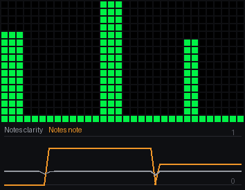

1. **index** is unwired, so it is the pixel's own `u`: the twelve notes are spread across the matrix, C at the left, B at the right.
2. `level` is how strongly that note is sounding: a level meter: the level plus **Coords** `v` reaches 1 (a **Threshold**) only where `v` is above 1 minus the level, so a column is lit from the bottom as high as the level, in the **Palette**'s colours across.
3. **smooth** is 0.5: how much the levels are smoothed from frame to frame.
4. `note` (the strongest) is the **Palette**'s index for every key, so the whole picture takes the colour of the chord, changing as the synth's chords change. The trace shows `note` and `clarity`.

[Try it in the studio](studio:try/notes): the graph opens live in the Node tutorials project; your own project is saved and comes back with **Back to my project**.

**Try this**

- [Steadier](studio:try/notes/1): smooth 0.9: the keys rise and fall slowly - the chord rather than every note.
- [Raw](studio:try/notes/2): smooth 0: every frame's measurement as it is - jumpy, but quick to follow.

### Number

A fixed number you type in. Most pins can be typed straight on the node instead; this is for a value you want to send to several places.

**Outputs**
- **value** *(float)*: the number

**Settings**
- **value** *(float)*: the number

**Why use it**

Most pins can have a number typed straight onto them. When the same number belongs in several places - the count of stripes and the colours that go with them, a size used three times - typing it in each place means changing it in each place. Number holds one value and sends it wherever you wire it.

Its neighbours: Speed, Intensity and the other controls are numbers the person sets on the WLED page; Number is a fixed one, set in the graph and shared.

**Tutorial**

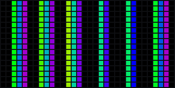

1. Number has no inputs; its **value** setting is 6.
2. It goes to two places: the **count** of a **Stripes** node (six stripes, scrolling with a clock), and a **Multiply** with **Coords** `u` that is the **Palette**'s index - the palette repeated six times across.
3. So each stripe has the whole palette's worth of colour in it, and the two always agree, because one number sets both.

[Try it in the studio](studio:try/number): the graph opens live in the Node tutorials project; your own project is saved and comes back with **Back to my project**.

**Try this**

- [Three](studio:try/number/1): value 3: three stripes and three runs of the palette - both change together.
- [Twelve](studio:try/number/2): value 12: twelve thin stripes, the palette repeated twelve times to match.

### Onset

A hit anywhere in the sound - a snare, a hat, a pluck: true for one frame when the bands rise more than they have been lately (the spectral flux against its recent mean and spread). Audio's beat is a jump in the loudness and mostly hears the kick; this hears what lands over a steady bass too. Narrow from and to to listen to part of the spectrum.

**Inputs**
- **sensitivity** *(float)*: how far over the recent rise a hit must be: lower hears more

**Outputs**
- **onset** *(bool)*: true for the frame after a hit
- **strength** *(float)*: how big the last rise was, 0..1

**Settings**
- **from** *(int)*: the lowest band to listen to, 0..15
- **to** *(int)*: the highest, 0..15

**Why use it**

Audio's beat listens for jumps in loudness, which mostly means the kick. Music has many more hits: snares, hats, plucked notes, a piano chord. Onset hears them - it watches all the bands for a rise bigger than they have been rising lately - and is true for one frame on each.

Narrow it to part of the spectrum to hear only the hats or only the snare. Its neighbours: Audio's beat is the kick; Tempo times the beat; Gate turns a level into on and off; Onset is any hit, anywhere in the sound.

**Tutorial**

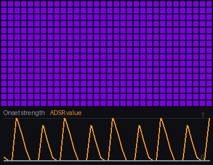

1. Onset has one input, **sensitivity** (1.5): how far above the recent average a rise has to be to count. Lower hears more, higher only the strongest hits.
2. **from** and **to** (0 and 15) are the bands it listens to: all of them.
3. `onset` fires an **ADSR** (attack 5 ms, decay 250 ms) - a flash on each hit - and a **Random hold**, which picks a new colour on each.
4. The flash drives a level meter: the value plus **Coords** `v` reaches 1 (a **Threshold**) only where `v` is above 1 minus the value, so a column is lit from the bottom as high as the value, in the **Palette**'s colours across - here the palette's index is the random colour rather than `u`. `strength` is how big the hit was. The trace shows the strength (grey) and the flashes (orange) - more of them than there are kicks.

[Try it in the studio](studio:try/onset): the graph opens live in the Node tutorials project; your own project is saved and comes back with **Back to my project**.

**Try this**

- [Only big hits](studio:try/onset/1): sensitivity 3: only the strongest hits count - mostly the kick and snare.
- [Highs only](studio:try/onset/2): from 9: only the high bands are watched - the hats and cymbals, not the kick.

### Particles

Sparks, rain, fireworks, embers. Points are born at `rate` a second (and `burst size` at once when burst is true), fly with a velocity plus some random spread, fall with gravity, slow with drag, and die after `life` seconds. They stay on the cube's surface unless you say otherwise. Wire slots to Sprites to see them.

**Inputs**
- **rate** *(float)*: how many are born a second
- **burst** *(bool)*: true births a burst (the beat)
- **burst size** `burst_count` *(float)*: how many in a burst
- **pos** *(vector)*: where they are born (unless random)
- **velocity** *(vector)*: the speed and direction they start with
- **spread** *(float)*: how much random is added to that
- **gravity** *(vector)*: the pull, e.g. (0, 0, -1) for down
- **drag** *(float)*: how quickly they slow, 0 never
- **life** *(float)*: seconds each lives
- **tag** *(float)*: a number kept with each - a hue

**Outputs**
- **slots** *(float)*: the particles - wire this to Sprites
- **count** *(float)*: how many are alive

**Settings**
- **max** *(int)*: the most alive at once (up to 48)
- **born anywhere** `random_pos` *(bool)*: born anywhere on the surface instead of at pos
- **on the surface** `on_surface` *(bool)*: keep them on the cube's surface
- **floor** *(choice)*: at the bottom edge: die, bounce, or wrap to the lid

**Why use it**

Sparks, rain, fireworks, embers, snow: many points, each moving on its own. Particles keeps up to the number you set alive at once - born at a rate (or in bursts), thrown with a velocity and some random spread, pulled by gravity, slowed by drag, dying after their life - and on a cube they stay on the surface, flowing over the edges.

It moves them; Sprites draws them. Its neighbours: Emitters are events that stay where they land; Sparkle lights random pixels that do not move; Particles are points with motion.

**Tutorial**

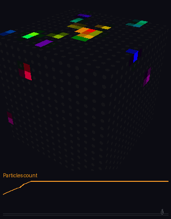

1. **rate** is 12: twelve are born a second at **pos**, the middle of the lid (0, 0, 1). **burst** is off; when it turns on, **burst size** are born at once.
2. **velocity** is 0 and **spread** 0.8: each leaves in a random direction at up to 0.8. **gravity** pulls them down (0, 0, -1), **drag** (0.2) slows them, and each lives **life** 2 seconds. **tag** is a number each carries (0 here).
3. **max** is 32 alive at once. **born anywhere** is off (all from pos), **on the surface** is on (they slide over the cube rather than through it), and **floor** is die: one that reaches the bottom is gone.
4. `slots` goes to **Sprites** with **Position**'s `pos`, which draws each as a soft dot coloured by its age. `count` is how many are alive - the trace.

[Try it in the studio](studio:try/particles): the graph opens live in the Node tutorials project; your own project is saved and comes back with **Back to my project**.

**Try this**

- [No gravity](studio:try/particles/1): gravity 0, 0, 0: the sparks drift outward and never fall - a slow bloom over the lid and down the walls only by their own push.
- [Bounce](studio:try/particles/2): floor bounce: sparks reaching the bottom edge bounce back up instead of dying.
- [A downpour](studio:try/particles/3): rate 40 and born anywhere on: forty a second, born all over the cube - rain everywhere at once.

**Used in**

Fireworks (`fireworks.json`)

### Peak hold

A VU meter's falling bar: it jumps at once to each new peak of x, holds it for hold, then falls at fall a second - never below x. The highest a level has been lately, for a meter or a flash that lingers.

**Inputs**
- **x** *(float)*: the level to follow
- **hold** *(float)*: how long a peak is held before it falls, in milliseconds
- **fall** *(float)*: how fast it falls after that, in units a second

**Outputs**
- **value** *(float)*: the held peak
- **fresh** *(bool)*: true on a frame x reached a new peak

**Why use it**

A VU meter on a mixing desk has a little bar that jumps to each peak and hangs there for a moment before falling. It makes a meter readable: you see how loud it got, not just how loud it is this instant. Peak hold is that bar - it jumps to each new peak, holds it, then falls at a steady rate, never below the live value.

Its neighbours: Envelope rises fast and falls smoothly (no hold); Slew limits both directions; Hold samples on a trigger; Peak hold is the highest lately, held then dropping.

**Tutorial**

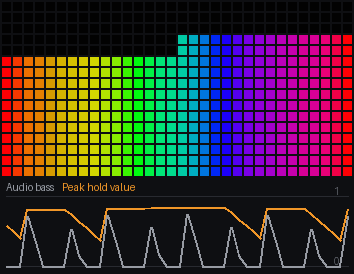

1. **Audio**'s `bass` is the **x** input.
2. **hold** is 500 ms: after a peak the value stays put for half a second. **fall** is 1: then it drops by 1 a second until it meets the bass again.
3. `fresh` is true on the frame a new peak arrives. The left meter is the bass, the right one the peak: two meters - a **Threshold** on `u` switches a **Select** between the two values, left half and right half; each value plus `v` through a Threshold at 1 lights a column from the bottom as high as the value.
4. The trace: the bass (grey) and the peak (orange) - flat tops after each kick, then straight lines down.

[Try it in the studio](studio:try/peak_hold): the graph opens live in the Node tutorials project; your own project is saved and comes back with **Back to my project**.

**Try this**

- [Long hold](studio:try/peak_hold/1): hold 1500: each peak hangs for a second and a half - nearly always waiting for the next kick.
- [Slow fall](studio:try/peak_hold/2): fall 0.3: once the hold is over the bar sinks slowly, a third of the way a second.

### Random hold

A random number that stays put until the trigger fires, then picks a new one. Feed it the beat and something changes direction, colour or place on every kick and holds in between.

**Inputs**
- **trigger** *(bool)*: true to pick a new random (the beat)

**Outputs**
- **value** *(float)*: the current random, 0..1
- **changed** *(bool)*: true on the frame it picked a new one

**Why use it**

Variety on the beat: a new colour, a new place, a new direction with every kick, and steady in between. Random hold picks a random number when its trigger fires and keeps it until the next one.

Its neighbours: Hash is a random per thing, steady for ever; Sparkle is random pixels; Hold samples a value you give it; Random hold is a new random each trigger, the same for every pixel.

**Tutorial**

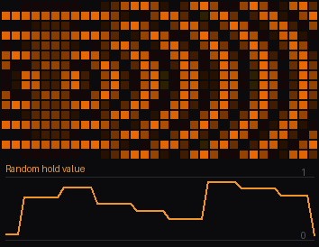

1. **Audio**'s `beat` is the **trigger**: on each kick a new random number, 0..1. `changed` is true on that frame.
2. A **Remap** turns it into -0.8..0.8 - the centre x of a **Ripple** - so the rings jump to a new place across the matrix on every kick.
3. The same random is the **Palette**'s index, so each place has its own colour.
4. The trace shows the random: a new level on each beat, flat between.

[Try it in the studio](studio:try/random_hold): the graph opens live in the Node tutorials project; your own project is saved and comes back with **Back to my project**.

**Try this**

- [Closer to the middle](studio:try/random_hold/1): the Remap's out range at -0.2..0.2: the centre only moves a little each beat.
- [More rings](studio:try/random_hold/2): the Ripple's rings at 10: finer rings from each new centre.

**Used in**

Liquid (`liquid.json`), Slab Cut (`slab_cut.json`), Truchet Cube (`truchet_cube.json`)

### Rising edge

Turns a switch into a tap: true for exactly one frame when its input goes from off to on. Use it when something should happen once per press or per beat, not for as long as the input stays on.

**Inputs**
- **x** *(bool)*: the switch to watch

**Outputs**
- **pulse** *(bool)*: true for one frame when x turns on

**Why use it**

A switch that is on stays on - for as many frames as the bass is loud, a button is held, a level is high. When something should happen once per press, not every frame of it, you need the moment it turns on. Rising edge gives exactly that: true for one frame, when its input goes from off to on.

Its neighbours: Gate's own rise output does the same for its gate; Counter and Toggle count triggers (they need a tap, not a hold); Rising edge turns any held switch into a tap.

**Tutorial**

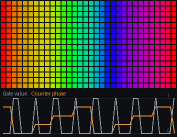

1. **Audio**'s `bass` opens a **Gate** (high 0.5, low 0.3); the gate's `on` stays true for several frames on each kick - that is Rising edge's **x**.
2. `pulse` is true only on the first frame of each opening.
3. The pulse drives a **Counter** (steps 4), and its `phase` is the **Palette**'s index across the matrix (plus **Coords** `u`): the colours step once per kick.
4. The trace shows the gate (grey) held open for several frames on each kick, and the Counter (orange) stepping once per opening - the pulse itself lasts a single frame, too short to draw.

[Try it in the studio](studio:try/rising_edge): the graph opens live in the Node tutorials project; your own project is saved and comes back with **Back to my project**.

**Try this**

- [More sensitive gate](studio:try/rising_edge/1): the Gate's high at 0.3 and low at 0.15: quieter kicks open it too, so the colours step more often.
- [Smaller steps](studio:try/rising_edge/2): the Counter's steps at 12: each kick moves the colours a twelfth of the way round.

### Scenes

Scenes on the device: the graph's snapshots (Snapshots, Ctrl+Shift+K) kept in the effect, and the one index picks faded to over fade seconds - every typed value on a pin moving from where it was to the scene's, a switch crossing at the middle. A verse look and a chorus look in one effect: a Counter on the beat into index steps through them a bar at a time, a slider picks one. A node's settings are the build's (they are compiled in); a snapshot without a pin's value leaves it as built. Rebuild after saving a snapshot: the table is made when the graph compiles.

**Inputs**
- **index** *(float)*: which scene: 0 the first, 1 the next... (rounded, held to the last)
- **fade** *(float)*: seconds to fade to a newly picked scene (0: at once)

**Outputs**
- **scene** *(float)*: the scene picked
- **blend** *(float)*: how far the fade to it is, 0..1

**Settings**
- **scenes** *(text)*: which snapshots, in order, comma separated (empty: every snapshot as they were made)

**Why use it**

An effect for a whole song wants more than one look: calm in the verse, busy in the chorus. Scenes keeps several snapshots of the graph's values inside the effect itself - each a look - and fades between them when its index changes, so the device switches looks without the studio.

Snapshots are taken in the studio (Snapshots, Ctrl+Shift+K); the Scenes node puts them in the build. Its neighbours: Sequencer and Counter decide when; Mix fades two numbers; Scenes fades every typed value of the graph at once.

**Tutorial**

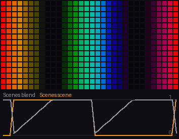

1. This graph has two snapshots: calm (the **Wave**'s cycles 2, its clock's **Multiply** 0.2) and busy (cycles 8, clock 1.5).
2. A **Counter** counts **Audio**'s beats (steps 8), and a **Threshold** at 4 turns that into 0 for four beats, then 1 for four: Scenes' **index**, which scene to show.
3. **fade** is 1: each change of scene glides every value over a second. **scenes** is empty, which means every snapshot, in order.
4. `scene` is the scene shown and `blend` how far the fade has got - the trace. The stripes calm and quicken every four beats.

[Try it in the studio](studio:try/scenes): the graph opens live in the Node tutorials project; your own project is saved and comes back with **Back to my project**.

**Try this**

- [Hard cut](studio:try/scenes/1): fade 0: the values jump at once - a cut, not a fade.
- [Slow fade](studio:try/scenes/2): fade 3: a three-second glide, so the look is changing for most of each four beats.

### Sequencer

A timed cycle of up to four phases - a bump, a spin, a hold, a rest - each lasting the seconds you give it, started by the trigger (or straight away). It tells you which phase is on, how far through it is (0..1) and how long since the cycle began; loop makes it repeat.

**Inputs**
- **trigger** *(bool)*: true starts the cycle from the top (the beat)
- **phase 1** `t1` *(float)*: phase 1's length in seconds
- **phase 2** `t2` *(float)*: phase 2's length
- **phase 3** `t3` *(float)*: phase 3's length
- **phase 4** `t4` *(float)*: phase 4's length

**Outputs**
- **phase** *(float)*: 1, 2, 3 or 4 while running, 0 when finished
- **progress** *(float)*: how far through the current phase, 0..1
- **since** *(float)*: seconds since the cycle started
- **running** *(bool)*: true until the last phase ends

**Settings**
- **loop** *(bool)*: start again at the end
- **run at start** `start_running` *(bool)*: run once from the first frame without a trigger

**Why use it**

Some effects are routines: a burst, a spin, a hold, a rest. Sequencer runs a cycle of up to four phases, each lasting the time you give it, started by a trigger or straight away, and tells you which phase is on and how far through it is.

Drive different parts of the effect from which phase it is, and their speed from the progress. Its neighbours: Steps plays a value per trigger; Counter counts triggers; Scenes fades between looks; Sequencer is timed phases.

**Tutorial**

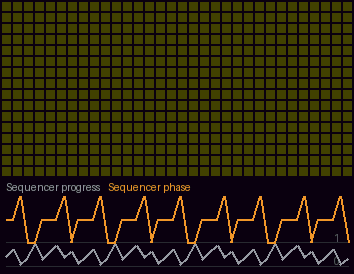

1. **Audio**'s `beat` is the **trigger**: each kick starts the cycle again.
2. **phase 1** is 0.15 seconds, **phase 2** 0.3, **phase 3** 0.15 and **phase 4** 0.6. **loop** is off, so after phase 4 it stops until the next trigger; **run at start** is on, so it starts once when the effect does.
3. `phase` (1..4 while running, 0 when finished) times 0.25 is the **Palette**'s index - each phase its colour; `progress` (0..1 through the phase) is the brightness, so each phase ramps up.
4. `since` is the seconds since the cycle began and `running` whether it is. The trace shows the phase stepping 1, 2, 3, 4 after each kick.

[Try it in the studio](studio:try/sequencer): the graph opens live in the Node tutorials project; your own project is saved and comes back with **Back to my project**.

**Try this**

- [Loop](studio:try/sequencer/1): loop on: when phase 4 ends it starts again at phase 1 by itself, between beats too.
- [Long first phase](studio:try/sequencer/2): phase 1 at 0.8: the first phase takes most of the gap between kicks.

### Silence

Whether there is any sound. sound stays on while the volume has passed threshold in the last hold seconds; quiet counts the seconds since it last did; mix is 1 while there is sound and falls to 0 over fade seconds after the hold. Blend a music look by mix and an idle look by 1 - mix, and the cube settles into the idle one when the music stops.

**Inputs**
- **threshold** *(float)*: the volume that counts as sound, 0..1
- **hold** *(float)*: seconds of quiet before it gives up
- **fade** *(float)*: seconds mix takes to fall to 0 after that

**Outputs**
- **sound** *(bool)*: true while there is sound
- **quiet** *(float)*: seconds since the last sound, 0 while there is some
- **mix** *(float)*: 1 with sound, falling to 0 after the hold

**Why use it**

An audio effect with no music is often a dead, dark cube - or a flicker of noise. Silence notices when the sound has stopped: it says whether there is sound, how long it has been quiet, and gives a mix that is 1 while there is sound and fades to 0 after it stops.

Blend the music look by that mix and an idle look by the rest, and the effect settles into the idle look on its own when the music ends. Its neighbours: Audio's volume is the level itself; Gate makes on and off from a level; Silence is about whether there is any sound at all, with a hold and a fade.

**Tutorial**

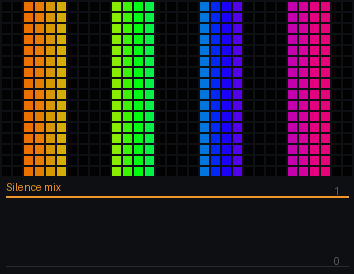

1. **threshold** is 0.03: the volume that counts as sound. **hold** is 1.5: sound stays on for a second and a half after the volume last passed it. **fade** is 2: after that, the mix falls to 0 over two seconds.
2. `mix` is the amount of a **Blend**: over a slow palette scroll (the idle look) it lays bright stripes that lurch on the beat (the music look, a **Beat kick** into a **Wave**).
3. `sound` is true while there is sound; `quiet` counts the seconds since there was any.
4. The synth never stops, so the mix stays at 1 - see below to hear it stop. The trace shows the mix.

[Try it in the studio](studio:try/silence): the graph opens live in the Node tutorials project; your own project is saved and comes back with **Back to my project**.

**Try this**

- [Pretend it is quiet](studio:try/silence/1): threshold 0.99: almost nothing counts as sound, so after the hold the mix fades to the idle look.
- [Quick to settle](studio:try/silence/2): threshold 0.99, hold 0.2 and fade 0.5: the idle look takes over within a second of the music counting as gone.

### Slew

Follows x, but no faster than up a second while rising and down a second while falling - a straight glide at a speed. Ease and Envelope glide in curves over a time; Slew moves at a pace, so a big jump takes longer than a small one.

**Inputs**
- **x** *(float)*: where to go
- **up** *(float)*: the most it may rise in a second
- **down** *(float)*: the most it may fall in a second

**Outputs**
- **value** *(float)*: where it is now

**Why use it**

Audio levels and other live values jump: the bass leaps on a kick and drops between kicks, frame to frame. Wired straight to brightness or size, that jumping reads as flicker. Slew follows the value but no faster than a speed you set, so jumps become glides.

Its speeds are separate for rising and falling, which is how a VU meter behaves: rise fast enough to catch the hit, fall slowly so it reads. Compared with its neighbours: Ease and Envelope glide in curves over a set time; Spring overshoots and settles; Slew moves at a constant pace, so a big jump takes longer than a small one.

**Tutorial**

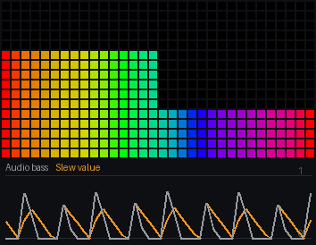

1. **Audio**'s `bass` goes into Slew's **x** - the value to follow. The synth plays a beat, so the bass jumps on every kick.
2. **up** is 6: Slew rises at most 6 a second, so from 0 to full takes a sixth of a second - not quite as fast as a kick, so it rounds each one off. **down** is 1.5: it falls at most 1.5 a second, two thirds of a second from top to bottom.
3. Two meters show both: **Coords** `u` into a **Threshold** at 0.5 switches a **Select** from the raw bass (left half) to Slew's `value` (right half).
4. The meter itself: the level plus `v` (an **Add**) reaches 1 only where `v` is above 1 minus the level, so a second **Threshold** at 1 lights a column from the bottom up as high as the level. That is the **Palette**'s brightness.
5. Watch the right meter lag the left: it climbs after each kick and sinks smoothly between them.

[Try it in the studio](studio:try/slew): the graph opens live in the Node tutorials project; your own project is saved and comes back with **Back to my project**.

**Try this**

- [Snappy rise](studio:try/slew/1): up 40: Slew rises forty a second - it catches each kick at once - but still falls at its own pace, a peak meter.
- [Slow fall](studio:try/slew/2): down 0.3: after a kick the meter takes three seconds to sink, so it barely drops between beats and holds near the top.
- [Lazy both ways](studio:try/slew/3): up 0.5 and down 0.5: Slew can no longer keep up with the beat at all, so it settles at a level that rises and falls with how busy the music is.

### Spectrum

The whole spectrum as a curve you can read anywhere: index 0 is the lowest band, 1 the highest. Feed a coordinate into index and the bands spread across the cube - a graphic equaliser along u, or round the ring. smooth stops it flickering.

**Inputs**
- **index** *(float)*: where to read, 0 (bass) .. 1 (treble); a coordinate spreads the spectrum out

**Outputs**
- **level** *(float)*: how loud it is there, 0..1

**Settings**
- **smooth** *(float)*: 0 = raw, near 1 = very smooth and slow
- **interpolate** *(bool)*: blend between bands rather than stepping

**Why use it**

The classic picture of music on lights is the graphic equaliser: bass at one end, treble at the other, each band a bar as tall as it is loud. Spectrum gives the whole spectrum as a curve you can read anywhere - feed a coordinate into index and the bands spread across it.

Across u it is an equaliser; round a ring's angle it is a circular one; down a wall it is a level. Its neighbours: FFT bin is one band; Spectrum history adds the past; Audio is the summary; Spectrum is all the bands now.

**Tutorial**

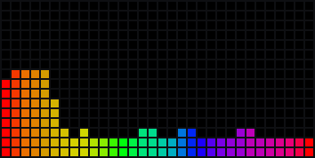

1. **index** is **Coords** `u`: the lowest band at the left edge, the highest at the right.
2. **smooth** is 0.5: the levels are smoothed a little so the bars do not flicker. **interpolate** is on: between bands the curve blends, so the bars flow into each other rather than stepping.
3. `level` is how loud the spectrum is there: plus `v`, through a **Threshold** at 1, it lights each column from the bottom up to its level - the bars. The **Palette** colours them by `u`.

[Try it in the studio](studio:try/spectrum): the graph opens live in the Node tutorials project; your own project is saved and comes back with **Back to my project**.

**Try this**

- [Smoother](studio:try/spectrum/1): smooth 0.9: the bars rise and fall slowly, like an analogue meter.
- [Steps](studio:try/spectrum/2): interpolate off: each band is a flat block of columns, sixteen distinct bars.

**Used in**

Slab Cut (`slab_cut.json`)

### Spectrum history

The sixteen bands as they were over the last two seconds: read at index 0..1 across the bands and age 0 (now) to 1 (the oldest). Unwired, index is the pixel's u and age its v - the spectrum across the picture flowing down it, a waterfall.

**Inputs**
- **index** *(float)*: which band, 0 (bass) .. 1 (treble) - unwired, the pixel's u
- **age** *(float)*: how long ago, 0 now .. 1 about 2 s - unwired, the pixel's v

**Outputs**
- **level** *(float)*: how loud that band was then, 0..1

**Why use it**

A spectrum shows the music now; a waterfall shows it over time - the bands across, the past flowing down the picture - so you can see the rhythm as well as the pitch. Spectrum history keeps the sixteen bands for the last two seconds and lets you read any band at any age.

Its neighbours: Spectrum is only now; Previous at could scroll a picture down by itself; Spectrum history is the past of the bands, ready to read.

**Tutorial**

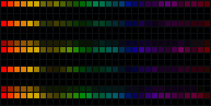

1. **index** is unwired, so it is the pixel's own `u`: the bands across the matrix.
2. **age** is unwired, so it is the pixel's `v`: now at the top (0), two seconds ago at the bottom (1).
3. `level` is how loud that band was at that age; times 2.5 (a **Multiply**, as most bands are quiet) it is the **Palette**'s brightness, coloured by `u`.
4. Each kick is a bright line across the low bands that slides down the matrix and leaves at the bottom two seconds later.

[Try it in the studio](studio:try/spectrum_history): the graph opens live in the Node tutorials project; your own project is saved and comes back with **Back to my project**.

**Try this**

- [Now only](studio:try/spectrum_history/1): age typed 0: every row reads the present, so the waterfall becomes a flat display of the current spectrum.
- [One band](studio:try/spectrum_history/2): index typed 0.1: every column reads the same low band - its last two seconds down the matrix, a scrolling beat graph.

### Spring

A weight on a spring. It is pulled toward target, and a kick sends it swinging: overshoot, swing back, settle. Plug the beat's hit into kick and use the value to tilt or bounce something - it will slosh like liquid rather than snap.

**Inputs**
- **target** *(float)*: where it settles
- **kick** *(float)*: a push - the beat's hit

**Outputs**
- **value** *(float)*: where it is now
- **velocity** *(float)*: how fast it is moving

**Settings**
- **swings a second** `hz` *(float)*: how many swings a second
- **damping** *(float)*: how quickly the swinging dies away, 0 (forever) .. 1

**Why use it**

Things in the real world do not stop dead: a knocked weight on a spring overshoots, swings back and settles. Spring gives a value that behaves that way - pulled toward a target, knocked by a kick - so a bounce or a tilt on the beat sloshes like liquid instead of snapping.

Its neighbours: Beat kick moves onward and settles without swinging back; Ease glides; Slew moves at a pace; Spring overshoots and wobbles.

**Tutorial**

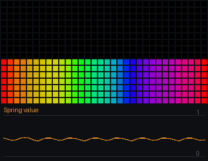

1. **target** is 0.4: where the weight rests.
2. **kick** is **Audio**'s `hit`: on each kick it is knocked by how hard the kick landed.
3. **swings a second** is 1.2: how fast it wobbles. **damping** is 0.15: how quickly the wobble dies away.
4. `value` drives a level meter: the value plus **Coords** `v` reaches 1 (a **Threshold**) only where `v` is above 1 minus the value, so a column is lit from the bottom as high as the value, in the **Palette**'s colours across. `velocity` is how fast it is moving. The trace shows the value: a knock up, a swing below the rest, smaller swings, settling.

[Try it in the studio](studio:try/spring): the graph opens live in the Node tutorials project; your own project is saved and comes back with **Back to my project**.

**Try this**

- [Stiff spring](studio:try/spring/1): swings a second 3: quick little wobbles after each kick.
- [Heavily damped](studio:try/spring/2): damping 0.6: it barely overshoots - a soft bump on each kick.
- [Higher rest](studio:try/spring/3): target 0.7: the weight rests higher, and swings about that.

**Used in**

Liquid (`liquid.json`)

### Statistics

The least, the most and the average of a field over every pixel, from last frame. Divide a field by its max to keep it in range whatever it does, or use the mean to know how much of the cube is lit.

**Outputs**
- **min** *(float)*: the smallest value anywhere
- **max** *(float)*: the largest
- **mean** *(float)*: the average

**Settings**
- **field** *(int)*: which field to measure

**Why use it**

A field of numbers - heat, water, noise - wanders: one moment it sits between 0.4 and 0.6, the next it fills 0..1. Statistics reads the least, the most and the average of a field over every pixel, so you can keep it in range whatever it does: subtract the least and divide by the spread and it always fills 0..1.

The average says how much of the picture is lit, for an effect that should keep its overall brightness. Its neighbours: Field reads one pixel's stored number; Field write stores it; Statistics sums up the whole field.

**Tutorial**

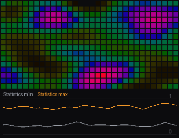

1. A **Noise** (scale 3, drifting with a clock in z) is written into field 0 by a **Field write** every frame.
2. Statistics' **field** is 0: it reads that field's `min`, `max` and `mean` - from last frame, over every pixel.
3. The noise minus `min` (a **Subtract**), divided (a **Divide**) by `max` minus `min`, runs from 0 at the lowest point on the matrix to 1 at the highest - the **Palette**'s index and brightness. Without it the noise would sit in a narrow band of colour.
4. The trace shows the min (grey) and max (orange) moving as the noise drifts.

[Try it in the studio](studio:try/statistics): the graph opens live in the Node tutorials project; your own project is saved and comes back with **Back to my project**.

**Try this**

- [Another field](studio:try/statistics/1): field 1: Statistics reads a field nothing writes - its min and max are 0, so the division has nothing to stretch by and the picture goes dark.

### Steps

A step sequencer: eight values (sliders on the node), one at a time - each trigger moves to the next, the last wraps to the first, reset goes back to the start. Trigger it from Audio's beat, a Tempo's phase through a Threshold and Rising edge, or any pulse. The value drives whatever you like: a palette index that jumps on the beat, a brightness pattern, which of the States shows.

**Inputs**
- **trigger** *(bool)*: a rise here moves to the next step
- **reset** *(bool)*: back to the first step while true

**Outputs**
- **value** *(float)*: the current step's value
- **step** *(float)*: which step, 0..7
- **changed** *(bool)*: true on the frame a step changes

**Settings**
- **length** *(int)*: how many of the eight play
- **step 1** `s1` *(float)*: step 1
- **step 2** `s2` *(float)*: step 2
- **step 3** `s3` *(float)*: step 3
- **step 4** `s4` *(float)*: step 4
- **step 5** `s5` *(float)*: step 5
- **step 6** `s6` *(float)*: step 6
- **step 7** `s7` *(float)*: step 7
- **step 8** `s8` *(float)*: step 8

**Why use it**

A drum machine plays a pattern of eight steps, one per beat, round and round. Steps does the same with values: eight sliders on the node, one played on each trigger, so a brightness, a colour or a size follows a pattern you set rather than the music's own levels.

Its neighbours: Counter counts (the steps are its numbers); Sequencer runs timed phases; States shows drawings by index; Steps plays a pattern of your values.

**Tutorial**

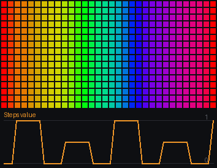

1. **Audio**'s `beat` is the **trigger**: each kick moves to the next step. **reset** would go back to step 1.
2. **length** is 8. **step 1** is 1, **step 2** 0, **step 3** 0.5, **step 4** 0, **step 5** 1, **step 6** 0, **step 7** 0.5 and **step 8** 0: full, off, half, off - a rhythm.
3. `value` is the step's level and drives a level meter: the value plus **Coords** `v` reaches 1 (a **Threshold**) only where `v` is above 1 minus the value, so a column is lit from the bottom as high as the value, in the **Palette**'s colours across. `step` is which step it is on, `changed` true on the frame it moves.
4. The trace shows the pattern stepping with the beat.

[Try it in the studio](studio:try/steps): the graph opens live in the Node tutorials project; your own project is saved and comes back with **Back to my project**.

**Try this**

- [Four steps](studio:try/steps/1): length 4: only the first four steps play - full, off, half, off, again.
- [Rewrite a step](studio:try/steps/2): step 2 at 0.8: the second step, silent before, now plays nearly full.

### Tempo

Musical time. Wire Audio's beat in and it measures the tempo from the gaps between hits (30..300 bpm, smoothed) and counts time in beats: a Wave with `beats` / 4 on its x is one cycle a bar at whatever speed the song runs. On each hit the count snaps to the nearest whole beat, so the phase stays with the music; without beats it runs at the fallback bpm (the synth's, in the sim).

**Inputs**
- **beat** *(bool)*: the beat, from Audio
- **fallback** *(float)*: the bpm to run at until beats arrive

**Outputs**
- **bpm** *(float)*: the tempo measured
- **beats** *(float)*: time in beats, running
- **phase** *(float)*: where in the beat, 0..1
- **bar** *(float)*: where in a four-beat bar, 0..1

**Why use it**

Reacting to each kick is one thing; moving in time with the music between kicks is another. Tempo measures the tempo from the gaps between beats and counts time in beats, so a wave can run once a bar, a pulse can land on the beat - at whatever speed the song goes.

On each hit the count snaps to the nearest whole beat, so it stays with the music. Its neighbours: Audio's beat is the hit itself; Counter counts hits; Time counts seconds; Tempo counts beats, smoothly, in between too.

**Tutorial**

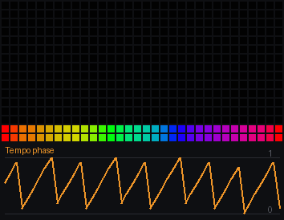

1. **Audio**'s `beat` is the **beat** input. **fallback** is 120: the bpm it runs at when there are no beats (here the synth's beats are always there).
2. `bpm` is the measured tempo; `beats` counts beats; `phase` runs 0..1 through each beat; `bar` counts bars.
3. `phase` drives a level meter: the value plus **Coords** `v` reaches 1 (a **Threshold**) only where `v` is above 1 minus the value, so a column is lit from the bottom as high as the value, in the **Palette**'s colours across - a ramp that rises through every beat and drops on the next.
4. The trace shows the phase: a sawtooth, one tooth per beat, locked to the synth's kicks.

[Try it in the studio](studio:try/tempo): the graph opens live in the Node tutorials project; your own project is saved and comes back with **Back to my project**.

### Timbre

The colour of the sound from its sixteen bands. brightness is where its weight sits, 0 all bass to 1 all treble - a hue that follows the mix; noisiness is how flat the spectrum is, 0 for a pure tone to 1 for a hiss - cymbals and rain are noisy, a held chord is not. Both 0 in silence.

**Outputs**
- **brightness** *(float)*: where the sound's weight sits, 0 bass .. 1 treble
- **noisiness** *(float)*: how noisy it is, 0 a tone .. 1 a hiss

**Why use it**

Two sounds at the same loudness can sound completely different: a bass synth and a cymbal. Timbre describes that difference in two numbers - brightness (is the weight in the bass or the treble?) and noisiness (a pure tone, or a hiss?) - so an effect can change with the character of the music, not just its level.

Its neighbours: Audio gives the levels; Loudest bin gives the strongest band; Notes gives the harmony; Timbre gives the tone colour.

**Tutorial**

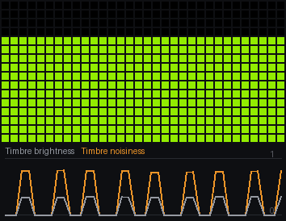

1. Timbre has no inputs or settings. `brightness` is 0 when all the sound is bass and 1 when it is all treble; `noisiness` is 0 for a pure tone and 1 for a hiss. Both are 0 in silence.
2. `noisiness` drives a level meter: the value plus **Coords** `v` reaches 1 (a **Threshold**) only where `v` is above 1 minus the value, so a column is lit from the bottom as high as the value, in the **Palette**'s colours across - but the **Palette**'s index is `brightness`, so the whole meter changes colour as the mix tilts between bass and treble.
3. The trace shows brightness (grey) and noisiness (orange): both jump on the kicks and hats.

[Try it in the studio](studio:try/timbre): the graph opens live in the Node tutorials project; your own project is saved and comes back with **Back to my project**.

### Time

The clock. t counts seconds since the effect started; feed it into a Wave, a Noise's z, or an Add to make something drift. dt is how long this frame took, for things that move a fixed amount per second.

**Outputs**
- **t** *(float)*: seconds since the effect started
- **frame ms** `dt` *(float)*: this frame's length in milliseconds

**Why use it**

Anything that moves without being pushed by the music moves with the clock. Time counts seconds since the effect started; times a speed, it is a scroll, a spin, a drift. It also gives how long this frame took, for things that should move a fixed amount a second however fast the effect runs.

Its neighbours: Integrate grows at a rate (and keeps its place when the rate changes); Frame count counts frames; Tempo counts beats; Time is plain seconds.

**Tutorial**

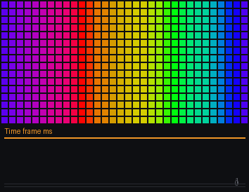

1. Time has no inputs or settings. `t` is the seconds since the effect started; `frame ms` is how long this frame took, in milliseconds.
2. `t` times 0.3 (a **Multiply**) is added to **Coords** `u` (an **Add**): the **Palette**'s index, so the colours scroll steadily left.
3. The trace shows `frame ms`: steady here, as the sim runs at a fixed step; on the device it rises when the effect is busy.

[Try it in the studio](studio:try/time): the graph opens live in the Node tutorials project; your own project is saved and comes back with **Back to my project**.

**Try this**

- [Faster](studio:try/time/1): the Multiply at 1.5: the colours scroll five times as fast.
- [Reverse](studio:try/time/2): the Multiply at -0.3: they scroll the other way.

**Used in**

Box Fire (`box_fire.json`), Gyro Sand (`gyro_sand.json`), Watershed (`watershed.json`)

### Toggle

A switch: on or off as you set it, and flipped each time flip turns on - wire the beat in and it changes on every kick (a flip-flop). Nothing wired, it is a fixed on or off.

**Inputs**
- **flip** *(bool)*: a rise flips it

**Outputs**
- **on** *(bool)*: the switch

**Settings**
- **on** *(bool)*: how it starts

**Why use it**

Some things alternate: left then right, warm then cool, one pattern then the other. Toggle is a switch that flips each time its flip input turns on - wire the beat in and it changes on every kick - or a fixed on or off when nothing is wired.

Its neighbours: Counter counts through more than two; Gate is on and off by a level; Rising edge makes the one-frame tap a flip needs; Toggle is the flip-flop.

**Tutorial**

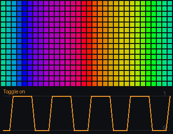

1. **Audio**'s `beat` is **flip**: each kick turns the switch over.
2. **on** (the setting) is the state it starts in - on.
3. Its `on` output picks between 0 and 0.5 through a **Select**, added to **Coords** `u` for the **Palette**'s index: each kick the colours jump half the palette, to their opposites.
4. The trace shows the switch going 1, 0, 1, 0 with the kicks.

[Try it in the studio](studio:try/toggle): the graph opens live in the Node tutorials project; your own project is saved and comes back with **Back to my project**.

**Try this**

- [Smaller jump](studio:try/toggle/1): the Select's b at 0.15: each flip moves the colours only a little - a shimmer on the beat.
- [Start off](studio:try/toggle/2): on unticked: the switch starts off - the same flipping, the other way round.

### Waveform

The sound's own shape, as a scope draws it: the last 23 ms of it, read at index 0..1 - unwired, the pixel's u, so the wave lies across the picture. sample swings -1..1 about 0; level is its size. It reads the studio's audioreactive patch (the PCM waveform); with WLED's stock audioreactive it is flat.

**Inputs**
- **index** *(float)*: where along the 23 ms to read, 0..1 - unwired, the pixel's u
- **gain** *(float)*: how much to scale it by

**Outputs**
- **sample** *(float)*: the waveform there, -1..1
- **level** *(float)*: its size, 0..1

**Why use it**

The bands say how loud each part of the sound is; the waveform is the sound itself - the line an oscilloscope draws, swinging up and down hundreds of times a second. Waveform gives the last 23 milliseconds of it, read anywhere along 0..1, so an effect can draw the music's own shape.

It reads the studio's audioreactive patch (the sim's synth makes one); with WLED's stock audioreactive it is flat. Its neighbours: Spectrum is the sound split into bands; Audio its levels; Waveform its shape.

**Tutorial**

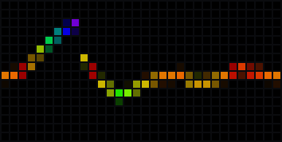

1. **index** is unwired, so it is the pixel's own `u`: the 23 ms are spread across the matrix.
2. **gain** is 1: how much the swing is magnified.
3. `sample` swings -1..1: times -0.5 plus 0.5 (a **Multiply** and an **Add**), it is the row the trace is at; the distance from the pixel's `v` (a **Subtract**, made positive by **Abs**) through a **Smoothstep** (edges 0.08 and 0) lights a thin line there.
4. `level` - the size of the swing - is the **Palette**'s index, so a loud moment changes the trace's colour.

[Try it in the studio](studio:try/waveform): the graph opens live in the Node tutorials project; your own project is saved and comes back with **Back to my project**.

**Try this**

- [More gain](studio:try/waveform/1): gain 3: the swing is tripled, so quiet passages fill the height - loud ones clip at the edges.
- [Thicker line](studio:try/waveform/2): the Smoothstep's first edge at 0.2: a broader trace.

## coords

### Coords

Where this pixel is. u and v run 0..1 across and down the whole logical picture (on a cube, the unfolded net). cx, cy are the same centred (-1..1); r and angle are polar about the centre. The simplest way to make something vary across the strip or panel.

**Outputs**
- **u** *(float)*: across, 0 (left) .. 1 (right)
- **v** *(float)*: down, 0 (top) .. 1 (bottom)
- **centred x** `cx` *(float)*: across, centred: -1 .. 1
- **centred y** `cy` *(float)*: up, centred: -1 .. 1
- **r** *(float)*: distance from the centre, 0 .. ~1.4
- **angle** *(float)*: angle round the centre, in radians (-pi .. pi)

**Why use it**

A graph runs once for every pixel, every frame. Without knowing which pixel it is working on, it can only make every pixel the same colour. Coords is how a graph knows where it is - and so how anything comes to vary across the strip or panel.

It gives the place several ways, for different jobs: `u` and `v` run 0..1 across and down (for things laid out in rows and columns); `centred x` and `centred y` (cx, cy) are the same centred, -1..1 (for things symmetric about the middle); `r` and `angle` are polar about the centre (for rings, spirals and anything round). Position is the neighbour for real 3-D places on a shape; Coords is the picture's own grid.

**Tutorial**

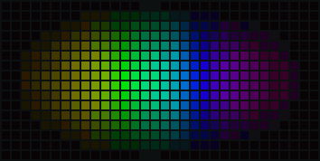

1. Coords has no inputs or settings - it only answers. Its six outputs are six ways of saying where this pixel is.
2. `u` goes into a **Mix**'s a, and the Mix's result into the **Palette**'s index: with the Mix's t at 0 it passes a straight through, so the colours run left to right across the matrix.
3. `angle` waits in the Mix's b - the angle round the centre, 0..1 for a full turn. The Mix chooses between u and angle, so one change shows the other.
4. `r` - the distance from the centre - goes into a **Smoothstep** whose edges are 1.2 and 0: bright where r is 0, fading to dark by r 1.2. That is the Palette's brightness, so the corners fall away.
5. `v`, `centred x` and `centred y` are left unwired here; v is u's partner down the matrix, centred x and y are u and v moved so the centre is 0.

[Try it in the studio](studio:try/coords): the graph opens live in the Node tutorials project; your own project is saved and comes back with **Back to my project**.

**Try this**

- [Colour by angle](studio:try/coords/1): the Mix's t at 1: the palette's index comes from angle instead of u, so the colours go round the centre - a colour wheel, the start of every spinner.
- [Halfway](studio:try/coords/2): the Mix's t at 0.5: the index is half u and half angle, so the bands bend - a spiral between a gradient and a wheel.
- [No falloff](studio:try/coords/3): the Smoothstep's edges at -1 and -0.5: r is never below them, so the brightness is 1 everywhere and the whole matrix is lit evenly.

**Used in**

Breakout (`breakout.json`), Butterfly (`butterfly.json`), Curtain (`curtain.json`), Fan (`fan.json`), Garlands (`garlands.json`), Gyro Sand (`gyro_sand.json`), Lightning (`lightning.json`), Marquee (`marquee.json`), Meteors (`meteors.json`), Morph (`morph.json`), Pinwheel (`pinwheel.json`), Shockwave (`shockwave.json`), Snowstorm (`snowstorm.json`), Spirals (`spirals.json`), Tendril (`tendril.json`), Watershed (`watershed.json`)

### Cube face

Which face this pixel is on, and where on that face - a and b run 0..1 across each face, so the same picture repeats on every face (tiles, sprites). nx, ny, nz is the face's outward normal.

**Outputs**
- **face** *(float)*: 0 east, 1 west, 2 north, 3 south, 4 lid, 5 bottom
- **a** *(float)*: across the face, 0..1
- **b** *(float)*: down the face, 0..1
- **normal** *(vector)*: the face's outward direction as one vector wire
- **normal x** `nx` *(float)*: the face's outward direction, x
- **normal y** `ny` *(float)*: y
- **normal z** `nz` *(float)*: z

**Why use it**

Coords sees the cube as the unfolded net - one flat picture with the faces laid out in a cross - so a pattern drawn from it is cut and turned at the folds. When you want the same thing on every face, each face the right way round, you need coordinates that start again on each face. Cube face gives them.

`a` and `b` run 0..1 across and down each face; `face` numbers the faces (0 east, 1 west, 2 north, 3 south, 4 lid, 5 bottom), so each can be treated differently; `normal x`, `normal y`, `normal z` say which way the face looks. Its neighbours: Coords is the whole net; Direction and Position see the cube as a solid; Cube face is one tile per face.

**Tutorial**

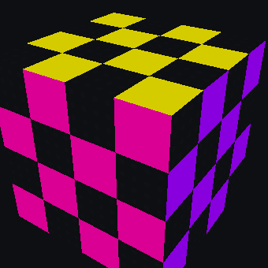

1. Cube face has no inputs or settings: it only says, for each pixel, which face it is on and where.
2. `a` and `b` go into a **Checker**'s x and y (scale 4): four squares across each face, the same on every face and lined up with its edges.
3. `face` times 1/6 (a **Multiply**) gives each face its own number 0..0.83, and a slow clock (**Time** times 0.1, added) moves them all together: the **Palette**'s index, so each face takes its own colour of the palette.
4. The checker's value is the palette's brightness, so the dark squares are off.
5. `normal` (and `normal x`, `normal y`, `normal z`) are unused here: they point out of the face, for lighting a face by which way it looks.

[Try it in the studio](studio:try/cube_face): the graph opens live in the Node tutorials project; your own project is saved and comes back with **Back to my project**.

**Try this**

- [Finer tiles](studio:try/cube_face/1): the Checker's scale at 8: eight squares across every face.
- [One colour](studio:try/cube_face/2): the face Multiply at 0: every face gets the same index, so the cube is one colour - only the squares show where the faces are.
- [Faces far apart](studio:try/cube_face/3): the face Multiply at 0.5: neighbouring faces are half the palette apart, so they contrast strongly.

**Used in**

Gyro Sand (`gyro_sand.json`), Question Block (`question_block.json`), Smiley (`smiley.json`), Truchet Cube (`truchet_cube.json`)

### Cube ring

The cube as a well: 'around' goes once round the walls (0..1), 'depth' goes from the middle of the lid (0), over the rim (0.5), down to the bottom edge (1). Rain falls along depth; a spiral is around plus depth.

**Outputs**
- **around** *(float)*: round the cube, 0..1 (wraps)
- **depth** *(float)*: 0 lid centre, 0.5 rim, 1 bottom edge

**Why use it**

A cube standing on a table is a lid and four walls - and a lot of effects want it treated as exactly that: rain running off the top and down the sides, fire climbing the walls, a spiral round them. Cube ring gives each pixel two numbers for that shape.

`around` goes once round the walls, 0..1; `depth` goes from the middle of the lid (0) out to the rim (0.5) and down the walls to the bottom edge (1). Anything that moves along depth flows off the lid and down; anything along around circles the cube. Its neighbours: Cube face repeats on each face; Position is straight lines through the box; Cube ring is the well.

**Tutorial**

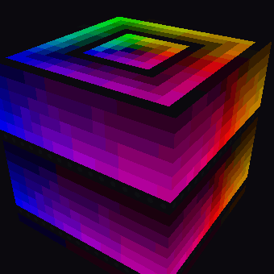

1. Cube ring has no inputs or settings - two outputs that describe each pixel's place on the lid and walls.
2. `depth` goes into a **Wave**'s x (4 cycles, saw), with a clock (**Time** times -0.5) as its phase: bright rings start in the middle of the lid, cross the rim and run down the walls.
3. `around` is the **Palette**'s index, so the colour changes as you go round the cube; the wave is the brightness.
4. Because depth is continuous over the rim, the rings never break at the edge between the lid and a wall.

[Try it in the studio](studio:try/cube_ring): the graph opens live in the Node tutorials project; your own project is saved and comes back with **Back to my project**.

**Try this**

- [More rings](studio:try/cube_ring/1): the Wave's cycles at 8: twice the rings, half as far apart.
- [Rising](studio:try/cube_ring/2): the clock's Multiply at 0.5: the phase runs the other way, so the rings climb the walls and close in on the middle of the lid.
- [Soft rings](studio:try/cube_ring/3): the Wave's shape sine: smooth swells of light instead of sharp-fronted rings.

**Used in**

Box Fire (`box_fire.json`), Breakout (`breakout.json`), Gyro Sand (`gyro_sand.json`), Liquid Tunnel (`liquid_tunnel.json`), Maelstrom (`maelstrom.json`), Ring Rain (`ring_rain.json`)

### Direction

On a cube, the direction from the middle of the cube out through this pixel (a unit vector, length 1). Because it never sees the folds, anything drawn from it - Noise, Dot 3, Mirror fold - flows over every edge seamlessly. On a flat panel it is a gentle dome.

**Outputs**
- **dir** *(vector)*: the direction as one vector wire - plug it into Noise, Dot 3, Mirror fold, Torus knot
- **x** `nx` *(float)*: the direction's x part
- **y** `ny` *(float)*: its y part
- **z** `nz` *(float)*: its z part (1 straight up)

**Why use it**

Draw noise from Coords on a cube and every edge shows a seam: the net is cut there, and neighbours across the fold get unrelated values. Direction avoids the folds entirely - for each pixel it gives the direction from the middle of the cube out through that pixel, a point on a sphere, and anything drawn from that flows over every edge.

Use it for anything that should wrap the cube seamlessly: noise, a direction of light (Dot 3), a mirror fold, a torus knot. Its neighbours: Position is the place in the box, for straight lines and planes; Coords is the flat net; Direction is the angle, for things that should flow round.

**Tutorial**

1. Direction has no inputs or settings. Its `dir` output is the direction as one vector; `x`, `y` and `z` are its three parts (z is straight up).
2. `x` and `y` go into a **Noise**'s x and y; `z` plus a clock (**Time** times 0.3, added) goes into its z, so the field drifts.
3. **scale** on the Noise is 2: a few big blobs round the whole cube.
4. The noise picks a colour from the **Palette** - and the blobs cross each edge without a break.

[Try it in the studio](studio:try/direction): the graph opens live in the Node tutorials project; your own project is saved and comes back with **Back to my project**.

**Try this**

- [Smaller blobs](studio:try/direction/1): the Noise's scale at 5: more, smaller blobs round the cube - still no seams.
- [Faster drift](studio:try/direction/2): the clock's Multiply at 1: the blobs churn three times as fast.
- [Detail](studio:try/direction/3): the Noise's octaves at 3: finer layers on top of the blobs, like clouds.

**Used in**

Candy Knot (`candy_knot.json`), Feigenbaum (`feigenbaum.json`), Kaleidoscope (`kaleidoscope.json`), Liquid Tunnel (`liquid_tunnel.json`), Mandelbrot (`mandelbrot.json`)

### Flip

u and v turned round: left for right, top for bottom, or swapped so the picture lies on its diagonal. Between Coords and the nodes that draw, to mirror a whole effect without touching it.

**Inputs**
- **u** *(float)*: across, 0..1 - unwired, the pixel's u
- **v** *(float)*: down, 0..1 - unwired, the pixel's v

**Outputs**
- **u** *(float)*: across, flipped as asked
- **v** *(float)*: down, flipped as asked

**Settings**
- **left-right** `flip_u` *(bool)*: mirror left-right
- **top-bottom** `flip_v` *(bool)*: mirror top-bottom
- **swap** *(bool)*: u and v exchanged

**Why use it**

A matrix hung the other way round, a panel seen from behind, a strip wired from the wrong end: the picture comes out mirrored. Flip turns the coordinates round before anything is drawn from them, so the whole effect is mirrored or rotated without touching the nodes that draw it.

It is also a design tool - mirror half a pattern, swap the axes to turn stripes from vertical to horizontal. Its neighbours: Transform moves, turns and zooms coordinates by any amount; Mirror fold (maths) folds a value back on itself; Flip is the three quick flips.

**Tutorial**

1. **u** and **v** are unwired, so they are the pixel's own place.
2. **left-right** is on: u is turned round, 1 at the left edge and 0 at the right. **top-bottom** is off, **swap** is off.
3. Flip's `u` and `v` go into a **Text** node's u and v, so the text is read through the flip: it comes out mirrored, and its scroll (**Time** times 10 into the Text's offset) runs the other way.
4. The letters are coloured by the **Palette**: `i` (which letter) is its index and `level` its brightness.

[Try it in the studio](studio:try/flip): the graph opens live in the Node tutorials project; your own project is saved and comes back with **Back to my project**.

**Try this**

- [Not flipped](studio:try/flip/1): left-right off: the text reads normally and scrolls to the left.
- [Upside down](studio:try/flip/2): top-bottom on as well: mirrored both ways - the text is turned half round and reads upside down.
- [Swap](studio:try/flip/3): swap on: across and down are exchanged, so the text lies on its diagonal - mostly off the matrix, one column of each letter crossing it.

### Pixel

This pixel's whole-number column, row and index. For when you want to count pixels rather than measure in 0..1.

**Outputs**
- **x** *(float)*: column, 0 .. width-1
- **y** *(float)*: row, 0 .. height-1
- **index** `i` *(float)*: index, row * width + column

**Why use it**

Most coordinates are measured, 0..1, so a pattern stretches to fit any size. Sometimes you want to count instead: every third LED, the fifth column, a pixel at a time. Pixel gives each pixel's whole-number column, row and index.

`index` counts the pixels the way the picture is laid out, row by row, so a pattern built on it runs along the rows like a strip. Its neighbours: Coords measures 0..1, so a pattern scales with the panel; Pixel counts, so a pattern keeps its spacing in LEDs.

**Tutorial**

1. Pixel has no inputs or settings. `x` is the column (0 .. width-1), `y` the row, and `index` is row times width plus column.
2. `index` plus a clock (**Time** times 20, added) goes into a **Modulo** with m 7: a number that runs 0..7 and starts again every seven pixels, and creeps along twenty pixels a second.
3. A **Smoothstep** with edges 1 and 0 turns that into 1 where the remainder is near 0, fading by 1: one bright pixel in every seven. That is the **Palette**'s brightness.
4. The matrix is 32 wide, not a multiple of 7, so each row starts at a different point in the count: the dots line up in diagonals. That is the index carrying on from the end of one row to the start of the next.
5. `y` times 1/16 picks the colour, so each row has its own.

[Try it in the studio](studio:try/pixel): the graph opens live in the Node tutorials project; your own project is saved and comes back with **Back to my project**.

**Try this**

- [Every eighth](studio:try/pixel/1): the Modulo's m at 8: 32 is a multiple of 8, so every row starts at the same point in the count and the dots stack into straight columns.
- [Faster](studio:try/pixel/2): the clock's Multiply at 80: the dots race along the rows four times as fast.
- [Sparse](studio:try/pixel/3): the Modulo's m at 32: one pixel in each row of 32 - a single dot running along every row, each row a step behind the last.

### Position

This pixel's place in the cube's box, each of x, y, z from -1 to 1, z up, so the lid is z = 1. Use it where a straight line matters (slabs, planes, gravity height); use Direction for angles.

**Outputs**
- **pos** *(vector)*: the position as one vector wire
- **x** *(float)*: -1 (west) .. 1 (east)
- **y** *(float)*: -1 (south) .. 1 (north)
- **z** *(float)*: -1 (bottom) .. 1 (the lid)

**Why use it**

On a cube, a straight line through the box - a level, a tilted plane, a slab - crosses several faces, and on the unfolded net it comes out broken and bent. Position gives each pixel its real place in the cube's box, x, y and z each -1..1 with z up, so straight things come out straight.

Use it for anything about height or a direction through the box: water filling up, a scan sweeping across, gravity, slabs. Its neighbours: Direction is the angle from the middle (for things that flow round); Cube ring is the lid and walls as a well; Position is straight lines and planes.

**Tutorial**

1. Position has no inputs or settings. `x` runs west to east, `y` south to north, `z` bottom to lid; `pos` is all three as one vector, for nodes that take a point.
2. `z` goes into a **Wave**'s x (2 cycles, triangle), with a clock (**Time** times 0.3) as its phase: level bands of light that slide down through the cube.
3. `x` is the **Palette**'s index, so the colour changes from west to east; the wave is the brightness.
4. Watch a band cross from one face to the next: it stays perfectly level all the way round.

[Try it in the studio](studio:try/position): the graph opens live in the Node tutorials project; your own project is saved and comes back with **Back to my project**.

**Try this**

- [Square bands](studio:try/position/1): the Wave's shape square: hard-edged slabs - water levels in a tank.
- [More bands](studio:try/position/2): the Wave's cycles at 4: twice as many bands, half as thick.
- [Rising](studio:try/position/3): the clock's Multiply at -0.3: the bands rise through the cube instead of sinking.

**Used in**

Cell Weave (`cell_weave.json`), Cube Axes (`cube_axes.json`), Cube Chladni (`cube_chladni.json`), Cube Ripples (`cube_ripples.json`), Fireworks (`fireworks.json`), Gyro Sand (`gyro_sand.json`), Liquid (`liquid.json`), Moire (`moire.json`), Slab Cut (`slab_cut.json`), Watershed (`watershed.json`)

### Position to uv

Any point in the box - even one slightly off the surface - to the pixel that shows it. Take Position, add a small step in some direction, and this tells you which pixel is that way: the neighbour a grain of sand falls into.

**Inputs**
- **pos** *(vector)*: the point, as a vector (Position plus a step)

**Outputs**
- **u** *(float)*: that pixel, across
- **v** *(float)*: that pixel, down

**Why use it**

To make light fall, rise or drift, each pixel copies what was a little way off last frame - and on a cube, 'a little way down' means a different place on the net depending on the face, and crosses the folds. Position to uv does the hard part: give it any point in the cube's box and it tells you which pixel shows it.

So: take this pixel's Position, add a small step in the direction things come from, ask Position to uv which pixel that is, and read it with Previous at. Its neighbours: Ring to uv does the same for the lid-and-walls coordinates of Cube ring; Coords goes the other way (pixel to place); Position to uv is place to pixel.

**Tutorial**

1. **Position** gives this pixel's place; a **Vector** rebuilds it with z raised by 0.15 (an **Add** on z): the point just above this pixel.
2. That point goes into **pos**; Position to uv's `u` and `v` are the pixel that shows it - on the same face, or across the edge when the point is over it.
3. **Previous at** reads that pixel's colour from last frame, and a **Fade** (keep 0.88) dims it: each frame, every pixel takes the light from just above it, a little dimmer - light falls.
4. New light: a **Sparkle** (density 0.03, a new seed ten times a second) lights a few pixels in the **Palette**'s colour for their x. A **Blend** in max mode keeps the brighter of the falling light and the new sparks.

[Try it in the studio](studio:try/position_to_uv): the graph opens live in the Node tutorials project; your own project is saved and comes back with **Back to my project**.

**Try this**

- [Longer trails](studio:try/position_to_uv/1): the Fade's keep at 0.96: the light dims slowly, so each spark leaves a long streak.
- [Rising](studio:try/position_to_uv/2): the Add's step on z at -0.15: each pixel now reads the point just below it, so the light rises up the cube instead of falling.
- [More sparks](studio:try/position_to_uv/3): the Sparkle's density at 0.1: ten times as many sparks - a downpour.

**Used in**

Gyro Sand (`gyro_sand.json`)

### Ring to uv

The reverse of Cube ring: give it a point as around and depth and it tells you which pixel shows it, as the u, v that Previous at and Field read. Add a little to depth and you are reading the pixel one step down the wall - how fire rises and rain leaves a trail.

**Inputs**
- **around** *(float)*: round the cube, 0..1
- **depth** *(float)*: 0 lid centre .. 1 bottom edge

**Outputs**
- **u** *(float)*: that pixel, across
- **v** *(float)*: that pixel, down

**Why use it**

Cube ring describes a pixel as around and depth; Ring to uv goes back the other way - give it an around and a depth, and it tells you which pixel shows that spot. With that, a pixel can read the one just above it on the lid-and-walls path, wherever that is on the net, and light can flow along depth: rain off the lid and down the walls, fire climbing them.

It is the pair to Cube ring, as Position to uv is to Position. Its neighbours: Position to uv works in straight lines through the box; Previous at reads the pixel it names; Ring to uv names the pixel a step along the well.

**Tutorial**

1. **Cube ring** gives this pixel's `around` and `depth`. A **Subtract** takes 0.04 off the depth: the spot a little nearer the lid's middle.
2. That around and depth go into Ring to uv's **around** and **depth**; its `u` and `v` are the pixel there - over the rim, it is on the lid.
3. **Previous at** reads that pixel from last frame and a **Fade** (keep 0.9) dims it: light moves one step outward and down each frame.
4. New drops: a **Sparkle** (density 0.2, reseeded twelve times a second) masked by a **Band** round depth 0.5 (depth minus 0.5, sharp 8) - drops are only born along the rim. Their brightness lights the **Palette** (coloured by around), and a **Blend** in max mode lays them over the falling light, so streaks run from the rim down every wall.

[Try it in the studio](studio:try/ring_to_uv): the graph opens live in the Node tutorials project; your own project is saved and comes back with **Back to my project**.

**Try this**

- [Longer runs](studio:try/ring_to_uv/1): the Fade's keep at 0.96: each drop leaves a long trail down the walls.
- [Faster](studio:try/ring_to_uv/2): the Subtract's step at 0.1: each frame reads further back, so the drops move faster - and in bigger jumps.
- [Rising](studio:try/ring_to_uv/3): the Subtract's step at -0.04: each pixel reads the spot below it, so the light climbs from the rim over the lid toward its middle.

**Used in**

Box Fire (`box_fire.json`)

### Shape part

A shape (GEOMETRY > shape) is parts in wiring order - strips, rings, panels, a cube... This says which part the pixel belongs to and where along that part it sits, so one graph can treat the parts differently: a chase along each strip, ring 2 in another colour. On a cube net or a matrix, or on the device without the shape table sent, every pixel is part 0 of 1.

**Inputs**
- **pick** *(float)*: the part number whose mask you want (0 is the first)

**Outputs**
- **part** *(float)*: the part's number, 0 for the first
- **along** *(float)*: 0 at the part's first LED, 1 at its last
- **count** *(float)*: how many parts the shape has
- **mask** *(bool)*: true for pixels on the picked part

**Why use it**

A shape built from parts - rings, strips, panels - is one long string of LEDs in wiring order. An effect usually wants to know which part a pixel is on and where along it, so each ring can chase on its own, or one part can be lit differently. Shape part says both.

It also gives a mask for one part you pick, the simplest way to make one ring or one strip special. Its neighbours: Coords and Pixel see the shape as one long strip; Position sees it in space; Shape part sees it as its parts. (On a matrix, a cube, or a device that has not been sent the shape, everything is part 0 of 1.)

**Tutorial**

1. The shape is three rings of 12, 24 and 36 LEDs, one inside the next.
2. `along` runs 0..1 round each ring from its first LED to its last. Plus a clock (**Time** times 0.4, added) it goes into a **Wave** (1 cycle, saw): one bright head with a fading tail chasing round every ring at once.
3. `part` numbers the rings 0, 1, 2; times 0.3 (a **Multiply**) it is the **Palette**'s index, so each ring has its own colour.
4. **pick** is 1, so `mask` is true on the middle ring only: a **Select** gives 1 there and 0.25 elsewhere, multiplied into the brightness - the picked ring bright, the others dim. `count` says how many parts there are (3).

[Try it in the studio](studio:try/shape_part): the graph opens live in the Node tutorials project; your own project is saved and comes back with **Back to my project**.

**Try this**

- [Pick the inner ring](studio:try/shape_part/1): pick 0: the mask moves to the first ring, so the small inner ring is the bright one.
- [Pick the outer ring](studio:try/shape_part/2): pick 2: the outer ring is lit full.
- [Only the picked ring](studio:try/shape_part/3): the Select's a at 0: the parts that are not picked go dark.

### Transform

Moves, turns and zooms a pair of coordinates about a pivot - feed Coords' u, v through it and anything drawn from the result pans, spins or scales. A clock into turns spins the whole picture.

**Inputs**
- **u** *(float)*: the coordinate across - unwired, the pixel's u
- **v** *(float)*: the coordinate down - unwired, the pixel's v
- **move across** `move_u` *(float)*: shift across
- **move down** `move_v` *(float)*: shift down
- **turns** *(float)*: spin, 1 = a full circle
- **zoom** *(float)*: 1 leaves it, 2 zooms in, 0.5 out
- **pivot across** `pivot_u` *(float)*: the point it turns and zooms about, across
- **pivot down** `pivot_v` *(float)*: and down

**Outputs**
- **u** *(float)*: the new coordinate across
- **v** *(float)*: the new coordinate down

**Why use it**

Anything drawn from coordinates can be moved, spun or zoomed by changing the coordinates first. Transform does that in one node: give it a u and a v, and it hands back the same point moved, turned about a pivot, and scaled - so whatever reads its output pans, spins or zooms, without the drawing nodes knowing.

A clock into its turns spins the whole picture; a beat into its zoom pulses it. Its neighbours: Flip mirrors or swaps the axes; Rotate (maths) turns one pair of numbers; Transform is move, turn and zoom with a pivot, all at once.

**Tutorial**

1. **u** and **v** are unwired, so they are the pixel's own place.
2. **turns** comes from a clock (**Time** times 0.05): one full turn every twenty seconds. **zoom** is 1.5, so the picture is half as big again. **pivot across** and **pivot down** are 0.5, 0.5: it turns and zooms about the middle.
3. **move across** and **move down** are 0 - no shift.
4. The new `u` and `v` go into a **Checker** (scale 4), halved by a **Multiply** into the **Palette**'s index: a two-colour board turning slowly.

[Try it in the studio](studio:try/transform): the graph opens live in the Node tutorials project; your own project is saved and comes back with **Back to my project**.

**Try this**

- [Zoom in](studio:try/transform/1): zoom 3: twice as close - the squares are twice as big and only a few fit.
- [Spin about a corner](studio:try/transform/2): pivot across 0 and pivot down 0: the board turns about the top-left corner instead of the middle, sweeping across the matrix.
- [Shift it](studio:try/transform/3): move across 0.125 and move down 0.125: the whole board slides by half a square each way.

## generate

### Bifurcation

The famous fig-tree diagram of chaos: for each value of c across the picture, where the sequence x -> x*x + c ends up. Read it with u (the c axis) and v (the x axis); narrow the windows to zoom in. Brightness is how often the sequence lands there.

**Inputs**
- **u** *(float)*: across: which c, 0..1 of the window - unwired, the pixel's u
- **v** *(float)*: down: which x, 0..1 of the window - unwired, the pixel's v
- **c from** `c_lo` *(float)*: the c window's left edge
- **c to** `c_hi` *(float)*: its right edge
- **x from** `x_lo` *(float)*: the x window's bottom
- **x to** `x_hi` *(float)*: its top

**Outputs**
- **density** *(float)*: how often the sequence visits here, 0..1

**Settings**
- **trail** *(float)*: how long visits glow, 0 .. 0.99
- **orbits** *(int)*: how many steps to run each frame

**Why use it**

Some of the most beautiful pictures in mathematics come from a single rule repeated: here, x becomes x times x plus c. For some values of c the sequence settles on one number, for others it flips between two, four, eight - and then into chaos. Plotting where it lands, for every c across the picture, draws the famous branching fig tree.

Use it for a slow, hypnotic, structured texture that keeps glowing as the sequence wanders - ambient pieces, something to stare at. Its neighbours: Mandelbrot draws a still picture of which points escape; Reaction diffusion grows organic shapes; Bifurcation draws where a chaotic orbit lives, and keeps sparkling as it moves.

**Tutorial**

1. **Bifurcation** reads the pixel's place itself: **u** (across) picks a value of c inside the window **c from** .. **c to** (-1.6 to 0.3), and **v** (down) picks a value of x inside **x from** .. **x to** (-1.5 to 1.5). Both are unwired, so they are the pixel's own u and v.
2. Every frame it runs the sequence **orbits** (24) more steps for each column, and lights the pixels it lands on. Its `density` output is how often a pixel has been visited lately.
3. **trail** is 0.97: a visit fades slowly, so the branches build up into lines instead of flickering dots.
4. The density lights the **Palette**: its brightness is the density, its index runs across with **Coords** `u`, so the stable left side, the forking middle and the chaotic right take different colours.

[Try it in the studio](studio:try/bifurcation): the graph opens live in the Node tutorials project; your own project is saved and comes back with **Back to my project**.

**Try this**

- [Zoom into the chaos](studio:try/bifurcation/1): c from -1.45 and c to -1.3: the window is narrowed to the chaotic stretch, so the picture is all fine forks and windows of order inside the noise.
- [Short memory](studio:try/bifurcation/2): trail 0.4: visits fade almost at once, so the picture is a sparkle of where the orbits are right now rather than the whole tree.
- [Fewer steps](studio:try/bifurcation/3): orbits 4: a sixth of the work a frame, so only the brightest branches build up and the rest is a faint scatter.

**Used in**

Feigenbaum (`feigenbaum.json`)

### Bitmap

Pixel art you type: one line per row, a digit for a coloured pixel, a dot for an empty one. Read it with a coordinate and send slot to Colour pick to give each digit a colour.

**Inputs**
- **u** *(float)*: where to read, across, 0..1 - unwired, the pixel's u
- **v** *(float)*: where to read, down, 0..1 - unwired, the pixel's v

**Outputs**
- **slot** *(float)*: the digit there (0..9)
- **on** *(bool)*: false where there is a dot

**Settings**
- **rows** *(text)*: the rows: digits and dots, one row per line

**Why use it**

Sometimes you know exactly which pixels you want lit: an icon, a letter, a face, a heart. Bitmap is pixel art you type - one row per line of digits, a dot for empty - and it is baked into the effect, so the device needs no file.

Each digit is a colour slot rather than a colour, so the same drawing can be recoloured by whatever turns slots into colours (Colour pick here). Its neighbours: Image reads a picture file instead of typed digits; States holds several bitmaps and shows one at a time, for animation; Text draws letters from a font.

**Tutorial**

1. The **rows** setting is the drawing: eight rows of eight characters, separated by '/'. `1` is the heart, `2` its highlight, `.` empty.
2. **u** and **v** are unwired, so they are the pixel's own place: the drawing is stretched over the whole matrix, two LEDs for each of its pixels.
3. `slot` is the digit under the pixel - 1, 2, or 0 where there is a dot - and goes into **Colour pick**'s index, which turns 0 into black, 1 into red and 2 into pink.
4. `on` is false on the dots; it is unused here because slot 0 is already black, but it is how you would leave the background to another pattern (a Select or a Mix).

[Try it in the studio](studio:try/bitmap): the graph opens live in the Node tutorials project; your own project is saved and comes back with **Back to my project**.

**Try this**

- [A smile instead](studio:try/bitmap/1): rows set to a smiley face: the same colours, a different drawing - type any shape you like the same way.
- [Recolour it](studio:try/bitmap/2): Colour pick's colour 1 at blue: the slot-1 pixels change colour without touching the drawing.
- [Finer drawing](studio:try/bitmap/3): rows of sixteen characters: one character per LED, so the heart is drawn at full resolution, smaller, in the middle of a wider drawing.

**Used in**

Question Block (`question_block.json`)

### Brick

A brick wall, alternate rows offset by half a brick, with a mortar gap you can size.

**Inputs**
- **x** *(float)*: across - unwired, the pixel's u
- **y** *(float)*: down - unwired, the pixel's v
- **scale** *(float)*: rows of bricks per unit
- **mortar** *(float)*: how wide the gaps are, 0..0.5

**Outputs**
- **value** *(float)*: 1 on a brick, 0 in the mortar
- **row** *(float)*: which row this brick is in
- **column** *(float)*: which brick along the row

**Why use it**

Plenty of effects want a grid that is not a plain grid - tiles, bricks, panels - and want to treat each tile as a thing of its own. Brick lays out a wall, alternate rows offset by half a brick, and tells you for every pixel whether it is on a brick or in the mortar, and which brick it is.

That last part is what makes it useful: `row` and `column` number the bricks, so anything keyed on them (a Hash for a random colour, a delay per brick) treats each brick separately. Its neighbours: Checker is a plain grid of two values; Voronoi makes irregular cells; Brick is the regular, offset kind.

**Tutorial**

1. **Coords** `u` plus a slow clock (**Time** times 0.1, added) goes into **x**, so the wall slides to the left; `v` goes into **y**.
2. **scale** is 4: four rows of bricks down the matrix. **mortar** is 0.1: the gaps take a tenth of each brick's height and width.
3. `value` is 1 on a brick and 0 in the mortar - the **Palette**'s brightness, so the mortar is dark.
4. `row` and `column` go into a **Hash**, which gives every brick a fixed random number - the Palette's index, so each brick keeps its own colour as it slides.

[Try it in the studio](studio:try/brick): the graph opens live in the Node tutorials project; your own project is saved and comes back with **Back to my project**.

**Try this**

- [Smaller bricks](studio:try/brick/1): scale 8: twice the rows, so the bricks are half the size and there are four times as many.
- [Thick mortar](studio:try/brick/2): mortar 0.3: the gaps take nearly a third of each brick, so the bricks become separate tiles on a dark ground.
- [No mortar](studio:try/brick/3): mortar 0: the bricks touch; only their different colours show where one ends and the next begins.

### Checker

A chessboard of 1s and 0s.

**Inputs**
- **x** *(float)*: across - unwired, the pixel's u
- **y** *(float)*: down - unwired, the pixel's v
- **scale** *(float)*: squares per unit

**Outputs**
- **value** *(float)*: 1 or 0, alternating

**Why use it**

A checkerboard is the simplest pattern with two dimensions in it: squares that alternate across and down. Checker gives you that as a 1 or a 0 for every pixel, at any size.

Use it as a pattern on its own (a retro floor, a flag), or as a mask - multiply it into something else to light alternate squares, or use it to pick between two colours. Its neighbours: Stripes alternates along one direction only; Brick offsets its rows; Checker alternates both ways at once.

**Tutorial**

1. **Coords** `u` goes into **x** through an **Add** with **Beat kick**'s `phase`: on each kick of the synth's beat the phase jumps forward and settles, so the board lurches sideways on the beat. `v` goes into **y**.
2. **scale** is 4: four squares per unit, so four squares across and four down the matrix.
3. `value` is 1 on one colour of square and 0 on the other. Halved by a **Multiply**, it picks palette positions 0 and 0.5 - two contrasting colours from the **Palette** (0 and 1 would be the same colour: the palette wraps).
4. The beat comes from **Audio**'s `beat`, true for one frame on each kick.

[Try it in the studio](studio:try/checker): the graph opens live in the Node tutorials project; your own project is saved and comes back with **Back to my project**.

**Try this**

- [Finer board](studio:try/checker/1): scale 8: twice the squares each way, so the lurch moves a smaller step.
- [Big squares](studio:try/checker/2): scale 2: two squares across - bold blocks of colour, and a kick swaps them almost entirely.
- [A harder kick](studio:try/checker/3): Beat kick's throw at 2: each beat moves the board twice as far.

### Gradient

A smooth ramp in the shape you pick: along x, curved, round the centre, from the centre, or diagonal. Feed Coords' cx, cy for the round ones.

**Inputs**
- **x** *(float)*: across (cx for radial and spherical) - unwired, the pixel's u
- **y** *(float)*: down (cy) - unwired, the pixel's v

**Outputs**
- **value** *(float)*: 0..1

**Settings**
- **shape** *(choice)*: linear, quadratic, radial (angle round the centre), spherical (bright at the centre), diagonal

**Why use it**

A ramp from 0 to 1 is the start of most colour layouts: a fade across, a glow from the middle, a wheel. Gradient makes the common shapes of ramp in one node, so you do not have to build them from coordinates and maths.

Pick the shape with a setting: linear and quadratic run along x, diagonal across both, radial goes round the centre and spherical out from it. Its neighbours: Coords gives the raw coordinates the ramps are made from (u is the linear ramp itself); Colour ramp turns a 0..1 into your own colours; Gradient is the 0..1.

**Tutorial**

1. **Coords** `centred x` and `centred y` - the place measured from the centre, -1..1 - go into **x** and **y**. The round shapes need the centred coordinates; the straight ones read x as a plain ramp.
2. **shape** is radial: the value is the angle round the centre, 0..1 for a full turn.
3. A clock (**Time** times 0.2) is added to it, and the sum is the **Palette**'s index: the palette goes once round the wheel, and the clock turns it.
4. Change the shape and the same clock does something different - see below.

[Try it in the studio](studio:try/gradient): the graph opens live in the Node tutorials project; your own project is saved and comes back with **Back to my project**.

**Try this**

- [Spherical](studio:try/gradient/1): shape spherical: bright at the centre falling to the edge - with the clock added, rings of colour pour outward from the middle.
- [Diagonal](studio:try/gradient/2): shape diagonal: a ramp from one corner to the other, so the colours scroll across at an angle.
- [Quadratic](studio:try/gradient/3): shape quadratic: a curved ramp along x - the colours bunch together at one side and spread out at the other.

### Hash

A random number that is always the same for the same inputs. Feed it a cell number and every cell gets its own fixed random - a colour per tile, a speed per column. Change seed to reshuffle them all.

**Inputs**
- **x** *(float)*: what to hash (a cell, a column)
- **y** *(float)*: and this
- **seed** *(float)*: reshuffle: a different seed, different randoms

**Outputs**
- **value** *(float)*: the random, 0..1

**Why use it**

Random numbers that change every frame flicker. What a pattern usually wants is a random that stays put: each tile its own colour, each column its own speed, each brick its own shade. Hash gives that - the same inputs always give the same random 0..1, and different inputs give unrelated ones.

Feed it whole numbers that name things (a tile, a column, a beat count) and it hands each thing its own fixed random. Change the seed and every random reshuffles at once. Its neighbours: Noise is smooth - neighbours get similar values; Random hold picks a new random when triggered, one for the whole frame; Hash is a random per thing, steady.

**Tutorial**

1. **Coords** `u` times 8, rounded down by a **Floor**, numbers eight columns of tiles 0..7; `v` times 4 the same way numbers four rows. Every pixel in a tile gets the same two numbers.
2. Those go into Hash's **x** and **y**, so each tile gets its own random `value`, the same for all its pixels: the **Palette**'s index, a random colour per tile.
3. **Time** times 2, floored, goes into **seed**: it steps up twice a second, and each step reshuffles every tile's colour at once.
4. Leave seed alone and the mosaic stays still - the randoms only change when what goes in changes.

[Try it in the studio](studio:try/hash): the graph opens live in the Node tutorials project; your own project is saved and comes back with **Back to my project**.

**Try this**

- [Frozen](studio:try/hash/1): the seed's Multiply at 0: the seed stays 0, so the mosaic never changes - the same tiles, the same colours, every frame.
- [Smaller tiles](studio:try/hash/2): the columns' Multiply at 16: sixteen columns of tiles, so the tiles are narrow and the mosaic busy.
- [Reshuffle faster](studio:try/hash/3): the seed's Multiply at 8: eight new mosaics a second - nearly a flicker.

**Used in**

Gyro Sand (`gyro_sand.json`), Lightning (`lightning.json`), Meteors (`meteors.json`), Ring Rain (`ring_rain.json`), Truchet Cube (`truchet_cube.json`)

### Image

A picture file, baked into the effect. Pick the file, choose how many pixels across and down and how many colours, and read it with any coordinate - Cube face's a, b puts it on every face. The device needs no file. Right-click the node to turn it into editable pixel art.

**Inputs**
- **u** *(float)*: where to read, across, 0..1 - unwired, the pixel's u
- **v** *(float)*: where to read, down, 0..1 - unwired, the pixel's v

**Outputs**
- **color** *(color)*: the picture's colour there
- **slot** *(float)*: which of its colours (a number)
- **on** *(bool)*: false where the picture is transparent

**Settings**
- **file** *(file)*: the image file (png, jpg, gif...)
- **width** *(int)*: pixels across
- **height** *(int)*: pixels down
- **colours** *(int)*: how many colours to keep
- **transparent is off** `alpha_clear` *(bool)*: treat transparent pixels as off

**Why use it**

A logo, an icon, a photo reduced to a few pixels: when the picture already exists as a file, drawing it digit by digit is wasted effort. Image reads the file when the graph compiles, shrinks it to the size you ask, keeps a few colours, and bakes the result into the effect - the device never needs the file.

Read it with any coordinate, like the other pictures: across the whole panel, on each face of a cube (Cube face's a, b), scrolled. Its neighbours: Bitmap is pixel art you type, with colour slots; States is several bitmaps shown in turn; Image takes its pixels and colours from a picture file.

**Tutorial**

1. **file** names the picture - `assets/smiley.png`, from the project's own folder (Try it copies it into the tutorials project).
2. **width** and **height** are 16: the picture is shrunk to 16 x 16 pixels, one per LED on this matrix. **colours** is 6: it is reduced to the six colours that matter most, which keeps the effect small.
3. **u** and **v** are unwired, so the picture is read at the pixel's own place, stretched over the matrix.
4. `color` is the picture's colour there, straight to the **Output**. `slot` says which of its colours it is (a number, for Colour pick), and `on` is false where the picture is transparent - **transparent is off** is ticked, so its clear corners stay off.

[Try it in the studio](studio:try/image): the graph opens live in the Node tutorials project; your own project is saved and comes back with **Back to my project**.

**Try this**

- [Two colours](studio:try/image/1): colours 2: the picture is posterised to two colours - a stencil.
- [Chunky](studio:try/image/2): width and height 8: the picture is shrunk to 8 x 8 first, so each of its pixels covers four LEDs.
- [Keep the background](studio:try/image/3): transparent is off unticked: transparent pixels take the nearest colour instead of turning off, so the corners fill in.

**Used in**

Smiley (`smiley.json`)

### Mandelbrot

The Mandelbrot set. Give it a point x, y and it says how quickly that point escapes (0 = at once, 1 = never, it is inside). Scale and offset a coordinate to zoom around the edge. Julia mode draws a Julia set instead, with jx, jy as its constant.

**Inputs**
- **x** *(float)*: the point's x (real part) - unwired, the pixel's cx
- **y** *(float)*: the point's y (imaginary part) - unwired, the pixel's cy
- **julia x** `jx` *(float)*: the Julia constant's x (Julia mode)
- **julia y** `jy` *(float)*: the Julia constant's y (Julia mode)

**Outputs**
- **value** *(float)*: 0 (escaped at once) .. 1 (inside the set)

**Settings**
- **iterations** *(int)*: how carefully to look - more shows finer detail, costs more
- **julia** *(bool)*: draw a Julia set instead

**Why use it**

The Mandelbrot set is the best-known picture in mathematics: an endlessly detailed edge between points that stay put under a simple rule and points that fly off. For every point, the node runs the rule and reports how quickly the point escapes - 0 at once, 1 never (it is inside).

Colouring that escape time gives the familiar bands round the edge; adding a clock to the colour makes them flow, the classic colour-cycling look. With julia on, the same rule draws a Julia set - one of the infinitely many shapes the Mandelbrot set is a map of. Its neighbours: Bifurcation is the same rule seen another way (where the orbits live); Noise is smooth random texture; Mandelbrot is exact, infinitely detailed structure.

**Tutorial**

1. **Coords** `centred x` and `centred y` (-1..1 from the centre) are scaled and moved by **Multiply** and **Add** nodes into **x** and **y**: x runs -2.1 .. 0.9 so the whole set fits, y -1.1 .. 1.1.
2. **iterations** is 40: how many times the rule runs before a point counts as inside - more shows finer detail at the edge and costs more.
3. `value` plus a slow clock (**Time** times 0.15) is the **Palette**'s index: the bands of escape time take the palette's colours, and the clock cycles them. The value also goes through a **Smoothstep** (edges 0.02 and 0.3) into the brightness, so points that escape at once stay dark and the set stands out.
4. **julia** is off, so **julia x** and **julia y** do nothing yet - they are the Julia set's constant (see below).

[Try it in the studio](studio:try/mandelbrot): the graph opens live in the Node tutorials project; your own project is saved and comes back with **Back to my project**.

**Try this**

- [A Julia set](studio:try/mandelbrot/1): julia on, julia x -0.8 and julia y 0.156: every pixel now runs the rule with that constant - a twisting, lacy Julia set in place of the Mandelbrot set.
- [Rough edge](studio:try/mandelbrot/2): iterations 10: the rule gives up early, so the fine detail goes and the bands are broad and soft.
- [Zoom in](studio:try/mandelbrot/3): the x Multiply at 0.4 and its Add at -0.75 (and y's Multiply at 0.3): the window closes in on the seahorse valley between the two big bulbs.

**Used in**

Mandelbrot (`mandelbrot.json`)

### Noise

Smooth random blobs - clouds, plasma, flames. Give it a point (Direction's nx, ny, nz for a seamless cube, or Coords) and it returns 0..1 that varies smoothly from place to place. Plug Time into z to make the blobs drift; raise scale for smaller blobs.

**Inputs**
- **x** *(float)*: where to sample - unwired, the pixel's position x
- **y** *(float)*: where to sample - unwired, the pixel's position y
- **z** *(float)*: where to sample - Time makes it move - unwired, the pixel's position z
- **scale** *(float)*: how many blobs across: bigger = finer

**Outputs**
- **value** *(float)*: the noise, 0..1

**Settings**
- **octaves** *(int)*: 1 is smooth blobs; 3-5 adds finer and finer detail on top - clouds, smoke
- **roughness** *(float)*: how strong each finer layer is, 0..1

**Why use it**

Nature does not repeat: clouds, flames, water and smoke vary smoothly from place to place without a pattern you can see. Noise gives you that - a value 0..1 for every point, close to its neighbours' values, never the same twice across the picture.

Use it for anything organic, or to break up something too regular (added to a Wave's x, it wobbles the stripes). Compared with its neighbours: Wave repeats exactly; Hash and Sparkle are random per pixel, with no smoothness between neighbours; Noise is random but smooth.

**Tutorial**

1. **Coords** `u` and `v` go into **x** and **y**: every pixel asks the noise for the value at its own place on the matrix, so neighbouring pixels get neighbouring values - blobs.
2. **scale** is 4: how many blobs fit across a unit of x and y. Higher gives smaller, busier blobs; lower gives big slow clouds.
3. **Time** times 0.3 (the Multiply) goes into **z**. Noise is a 3-D field; moving through its third dimension makes the blobs change shape and drift without sliding, the way clouds boil.
4. The value picks a colour from the **Palette**; **Effect settings** starts the effect on Lava, so low values are dark red and high ones yellow - the blobs read as flame. Noise rarely reaches 0 or 1 (the trace stays near the middle): to use the whole palette, stretch it with a Remap.
5. **octaves** is 1 - one layer of blobs. **roughness** only matters with more octaves: how strong each finer layer is.

[Try it in the studio](studio:try/noise): the graph opens live in the Node tutorials project; your own project is saved and comes back with **Back to my project**.

**Try this**

- [Smaller blobs](studio:try/noise/1): scale 10: more blobs fit across, so the picture gets busy and fine - sparkly water rather than clouds.
- [Add detail](studio:try/noise/2): octaves 4 and roughness 0.6: three finer layers are added on top of the big blobs, so edges get ragged - smoke and flames rather than lava lamp.
- [Drift faster](studio:try/noise/3): the Multiply's b at 1.5: the clock runs through z five times as fast, so the blobs churn quickly.

**Used in**

Box Fire (`box_fire.json`), Lightning (`lightning.json`), Snowstorm (`snowstorm.json`), Watershed (`watershed.json`)

### Path

A route through the cube, from points you type (x, y, z in the -1..1 box, one point per ';'). For each pixel: how far it is from the route, and how far along the route the nearest point is - a light running along a track (Band on `along` plus a clock), a glowing wire, a shape's outline.

**Inputs**
- **pos** *(vector)*: this pixel's position (Position) - unwired, the pixel's position

**Outputs**
- **distance** *(float)*: how far from the route
- **along** *(float)*: how far along it the nearest point is, 0..1
- **nearest** *(vector)*: that point

**Settings**
- **points** *(text)*: the corners: x,y,z; x,y,z; ...
- **closed** *(bool)*: join the last point back to the first

**Why use it**

Shapes on a cube are awkward to draw from flat coordinates: a line that crosses from one face to the next bends at the fold. Path works in the cube's real space - you type the corners of a route, and for every pixel it says how far the pixel is from the route and how far along the route its nearest point is.

Distance gives you a glowing wire, an outline, a tube; along gives you something to run along it - a light chasing round a track, colours flowing. Its neighbours: Torus knot is one fixed looping tube; Shells grow from points; Path is any route you choose.

**Tutorial**

1. **points** are the route's corners, x, y, z each -1..1 in the cube's box, separated by ';'. The four here are the lid's corners (z = 1), and **closed** is on, so the last joins back to the first: a square round the top.
2. **pos** is unwired, so it is the pixel's own place on the cube.
3. `distance` goes into a **Smoothstep** whose edges are 0.3 and 0: 1 on the route, fading to 0 by 0.3 away - the **Palette**'s brightness, a glowing wire.
4. `along` plus a clock (**Time** times 0.25) is the palette's index: the colours run round the route as the clock turns.

[Try it in the studio](studio:try/path): the graph opens live in the Node tutorials project; your own project is saved and comes back with **Back to my project**.

**Try this**

- [A spiral down the walls](studio:try/path/1): points at the four vertical edges, each a third lower than the last, and closed off: one line winding round the cube from the lid to the floor, over every edge it meets.
- [A zigzag round the walls](studio:try/path/2): points zigzagging up and down round the four walls: a crown of light.
- [Thicker wire](studio:try/path/3): the Smoothstep's first edge at 0.7: the glow reaches more than twice as far, so the route is a broad band.

### Reaction diffusion

Real chemistry: two substances that spread and react on a small hidden grid, making tendrils, spots and stripes that grow, split and merge - with a memory, so the picture is never the same twice. Read it with any coordinate (Coords u, v; or Cube ring). feed and kill choose the pattern family.

**Inputs**
- **u** *(float)*: where to read, across, 0..1 (wraps)
- **v** *(float)*: where to read, down, 0..1

**Outputs**
- **v** *(float)*: the second substance - the tendrils, 0..1
- **u** *(float)*: the first substance - the background, 0..1

**Settings**
- **feed** *(float)*: 0.03 .. 0.06: how much fuel comes in
- **kill** *(float)*: 0.055 .. 0.065: how fast the pattern dies
- **steps** *(int)*: simulation steps per frame - faster growth, more work
- **seed** *(float)*: how much to start with

**Why use it**

Coral, zebra stripes, fingerprints and leopard spots are made by the same process: two chemicals spreading out while one eats the other. Reaction diffusion runs that process on a small hidden grid, frame after frame, and the patterns grow by themselves - never quite the same twice.

It is the one generator here with a memory: the picture is the result of everything before it, so it evolves rather than repeats. Read it with any coordinate. Its neighbours: Noise is smooth random with no structure; Voronoi is cells that sit still; Reaction diffusion grows living shapes.

**Tutorial**

1. **Coords** `u` and `v` go into **u** and **v**: where to read the hidden grid. The grid wraps across, so the pattern has no seam left to right.
2. **feed** (0.037) is how fast fresh chemical flows in, **kill** (0.06) how fast the second one dies away. Between them they choose the family of pattern - these give branching tendrils.
3. **steps** is 2: the simulation runs two steps each frame. **seed** is how much of the second chemical it starts with.
4. The `v` output - the second chemical, the tendrils - rarely goes above 0.4, so a **Smoothstep** (edges 0.08 and 0.35) stretches it to 0..1. That is the **Palette**'s index and its brightness: the tendrils glow in the palette's colours on a dark ground. `u` (the first chemical) is the inverse, the background.

[Try it in the studio](studio:try/reaction_diffusion): the graph opens live in the Node tutorials project; your own project is saved and comes back with **Back to my project**.

**Try this**

- [Spots](studio:try/reaction_diffusion/1): feed 0.03 and kill 0.062: the tendrils break up into separate spots that divide like cells.
- [Maze](studio:try/reaction_diffusion/2): feed 0.055 and kill 0.062: the pattern grows into a winding maze of lines that fills the whole picture.
- [Grow faster](studio:try/reaction_diffusion/3): steps 6: three times the simulation a frame - the pattern spreads quickly, at three times the work.

**Used in**

Liquid Tunnel (`liquid_tunnel.json`)

### Ripple

Rings spreading from a point, like a drop in water. cx, cy is the centre in the -1..1 picture; phase moves the rings outward; rings is how many.

**Inputs**
- **centre x** `cx` *(float)*: the centre, across, -1..1
- **centre y** `cy` *(float)*: the centre, up, -1..1
- **phase** *(float)*: a clock spreads the rings
- **rings** *(float)*: how many rings across the picture

**Outputs**
- **value** *(float)*: the rings, 0..1

**Why use it**

Rings spreading from a point read instantly as a drop in water, a sound wave, a pulse from the middle. Ripple draws them: for every pixel, where it sits on rings centred on a point you choose, with a phase that moves the rings outward.

Move the centre and the rings spread from somewhere else; drive the phase with a beat and they pulse with the music. Its neighbours: Gradient's spherical shape is one ramp out from the centre; Shells are rings that start on beats and travel over a cube; Ripple is an endless train of rings from one point.

**Tutorial**

1. **centre x** and **centre y** are the centre, in the picture's -1..1 coordinates: 0, 0 is the middle.
2. **rings** is 4: how many rings fit across the picture.
3. **Time** times 0.5 goes into **phase**: as it grows the rings move outward, half a ring a second.
4. `value` is the **Palette**'s brightness - bright on each ring, dark between - while **Coords** `r` (the distance from the centre) picks the colour, so each ring changes colour as it travels out.

[Try it in the studio](studio:try/ripple): the graph opens live in the Node tutorials project; your own project is saved and comes back with **Back to my project**.

**Try this**

- [Off centre](studio:try/ripple/1): centre x -0.7: the rings spread from near the left edge and sweep across the matrix.
- [More rings](studio:try/ripple/2): rings 10: ten rings across - fine ripples, like rain on a pond.
- [Slow swell](studio:try/ripple/3): the clock's Multiply at 0.15: the rings creep outward, a slow swell rather than a pulse.

### Shells

Spheres growing out of every Emitter: at each pixel, how much of a shell is passing through. Wire Emitters' slots here and Position into x, y, z, and each beat becomes a ring that crosses every edge of the cube as one ring.

**Inputs**
- **slots** *(float)*: from Emitters
- **pos** *(vector)*: this pixel's position (Position's pos)
- **speed** *(float)*: how fast the shells grow, in cube-widths per second
- **width** *(float)*: how thick a shell is

**Outputs**
- **value** *(float)*: how much shell is here, 0..1
- **tag** *(float)*: the tag of the strongest shell (its colour)
- **age** *(float)*: how old that shell is, in seconds

**Why use it**

On a cube, a ring drawn on one face stops at its edge. Shells works in the cube's real space instead: each beat starts a sphere growing from a point on the surface, and wherever the sphere's skin crosses the LEDs they light - so the ring flows over the edges and round the cube as one ring.

It reads where the spheres are from Emitters, which drops one on each trigger and remembers up to eight. Each shell carries a tag (a colour) and an age. Its neighbours: Ripple is rings on a flat picture from a fixed centre; Sprites draws Particles as dots; Shells draws Emitters as growing rings.

**Tutorial**

1. **Audio**'s `beat` fires **Emitters**' trigger: on every kick a new emitter is dropped at a random place on the surface (its `random` setting), and lives four seconds.
2. A **Random hold** on the same beat picks a new random number per kick - the emitter's tag, so each shell gets its own colour.
3. Emitters' `slots` go into Shells' **slots**, and **Position**'s `pos` into **pos**: each pixel asks how much shell is passing through its place in the cube.
4. **speed** is 1: a shell grows one cube-width a second. **width** is 0.2: how thick its skin is.
5. `value` is the **Palette**'s brightness and `tag` its index: rings of light, each its own colour.

[Try it in the studio](studio:try/shells): the graph opens live in the Node tutorials project; your own project is saved and comes back with **Back to my project**.

**Try this**

- [Slow shells](studio:try/shells/1): speed 0.4: each ring takes more than two seconds to cross the cube, so several are on it at once.
- [Thick shells](studio:try/shells/2): width 0.6: broad bands of light rather than thin rings - each beat floods the cube.
- [Fast and thin](studio:try/shells/3): speed 2.5 and width 0.08: a sharp flash that races over the cube on every kick.

**Used in**

Cube Ripples (`cube_ripples.json`)

### Sparkle

Random pixels lit. density is what fraction; change seed (Time through a Floor for steps) to make them twinkle.

**Inputs**
- **density** *(float)*: what fraction of pixels are lit, 0..1
- **seed** *(float)*: a different seed lights different pixels

**Outputs**
- **value** *(float)*: 1 where lit, else 0

**Why use it**

Glitter, stars, static, snow in a light: random pixels lit, a different few each moment. Sparkle picks which pixels are lit from a density and a seed - the same seed always lights the same pixels, so you choose when they change.

Step the seed with a clock and the pixels twinkle; step it with the beat and they change on the kick; hold it and the stars stay put. Its neighbours: Hash gives a random number per thing (Sparkle is a lit/unlit per pixel); Noise is smooth; Particles are sparks that move.

**Tutorial**

1. **density** is 0.1: a tenth of the pixels are lit.
2. **seed** comes from **Time** times 8 through a **Floor**: it steps up eight times a second, and each step lights a different tenth.
3. `value` - 1 where lit, 0 elsewhere - is the **Palette**'s brightness, and **Coords** `u` its index, so the sparkles take the palette's colour for where they are.

[Try it in the studio](studio:try/sparkle): the graph opens live in the Node tutorials project; your own project is saved and comes back with **Back to my project**.

**Try this**

- [Denser](studio:try/sparkle/1): density 0.4: four in ten pixels lit - busy glitter rather than stars.
- [Slow twinkle](studio:try/sparkle/2): the seed's Multiply at 2: the pixels change twice a second, a slow twinkle.
- [A few stars](studio:try/sparkle/3): density 0.02: one pixel in fifty - sparse stars in a dark sky.

**Used in**

Snowstorm (`snowstorm.json`)

### Sprites

Draws Particles as dots. At each pixel: how much particle is here (a soft dot `size` across), and the nearest one's tag (colour it), age (fade it as it dies) and speed (stretch or brighten it).

**Inputs**
- **slots** *(float)*: from Particles
- **pos** *(vector)*: this pixel's position (Position's pos)
- **size** *(float)*: how big each dot is

**Outputs**
- **value** *(float)*: how much particle is here, 0..1
- **tag** *(float)*: the nearest particle's tag
- **age** *(float)*: its age, 0 born .. 1 dying
- **speed** *(float)*: how fast it is going

**Settings**
- **falloff** *(choice)*: soft (a smooth dot), hard (a disc), spark (a bright pin with a faint halo)

**Why use it**

Particles moves points about - born, flying, falling, dying - but a point has no size: something has to draw it. Sprites does: at each pixel, how much particle is there, as a soft dot of the size you choose, plus the nearest particle's tag, age and speed so you can colour, fade or stretch it.

Keep the two apart and you can change how sparks look without touching how they move. Its neighbours: Shells draws Emitters as growing rings; Sparkle lights random pixels that do not move; Sprites draws moving particles as dots.

**Tutorial**

1. **Particles** makes twelve a second at the middle of the lid, with a spread of 0.8 so they leave in different directions; gravity pulls them down over the edges and they live two seconds.
2. Its `slots` go into Sprites' **slots**, and **Position**'s `pos` into **pos**: every pixel asks how close the nearest particle is to its place in the cube.
3. **size** is 0.15 (in the cube's -1..1 units): how big each dot is. **falloff** is soft: a smooth dot, brightest at its middle.
4. `value` is the **Palette**'s brightness; `age` (0 newborn .. 1 dying) is its index, so each spark changes colour as it falls.

[Try it in the studio](studio:try/sprites): the graph opens live in the Node tutorials project; your own project is saved and comes back with **Back to my project**.

**Try this**

- [Sparks](studio:try/sprites/1): falloff spark: each particle is a bright pin with a faint halo - welding sparks rather than soft blobs.
- [Big blobs](studio:try/sprites/2): size 0.35: each dot more than twice as wide, so they merge into a flowing liquid.
- [Hard discs](studio:try/sprites/3): falloff hard: each particle is a solid disc with a sharp edge.

**Used in**

Fireworks (`fireworks.json`)

### States

Several bitmaps, one shown at a time: the states are separated by '|', each is rows of digits separated by '/' ('.' transparent) like Bitmap. The state at index is read at u, v - wire a beat counter, a Random hold or a slider into index for a face that changes, a sprite that animates. The digit is a colour slot for Colour pick; count says how many states there are.

**Inputs**
- **u** *(float)*: across, 0..1 - unwired, the pixel's u
- **v** *(float)*: down, 0..1 - unwired, the pixel's v
- **index** *(float)*: which state, 0, 1, 2... (rounded down, clamped)

**Outputs**
- **slot** *(float)*: the digit at the pixel (0 where transparent)
- **on** *(bool)*: true where the state has a pixel
- **count** *(float)*: how many states

**Settings**
- **states** *(text)*: the states, '|' between them; rows of digits, '/' between rows, '.' for none

**Why use it**

An animation is a few drawings shown in turn; a face that blinks or changes expression is two or three. States holds several bitmaps in one node and shows the one you ask for - so the drawing changes with a beat, a counter, a slider, a random pick.

Each state is rows of digits like Bitmap's, and each digit is a colour slot. Its neighbours: Bitmap is a single drawing; Image is a picture file; States is a set of drawings with an index to choose between them.

**Tutorial**

1. **states** holds three 4 x 4 drawings, separated by '|': a ring, a dot in the middle, and a cross - rows separated by '/', '.' for empty.
2. A **Counter** counts **Audio**'s beats from 0 to 2 and starts again: its `count` is the **index**, so the drawing steps on every kick.
3. **u** and **v** are unwired, so the drawing fills the matrix (four LEDs for each of its pixels).
4. `slot` (the digit there) goes into **Colour pick**: 0 black, 1 orange, 2 blue. `count` says there are three states, for a counter that should match; `on` is false on the dots.

[Try it in the studio](studio:try/states): the graph opens live in the Node tutorials project; your own project is saved and comes back with **Back to my project**.

**Try this**

- [A blinking eye](studio:try/states/1): states set to an open eye and a closed one, and the Counter's steps at 2: two drawings, so each beat swaps them - a blink on the kick.
- [Hold the last](studio:try/states/2): the Counter's steps at 4: it counts 0 to 3, and index 3 is past the last drawing - an index is clamped, so the cross shows for two beats.
- [Recolour](studio:try/states/3): Colour pick's colour 1 at green: every drawing's 1s turn green at once.

### Stripes

Hard-edged bands along a coordinate. count is how many, duty how wide the bright ones are, phase scrolls them.

**Inputs**
- **x** *(float)*: the coordinate to stripe along - unwired, the pixel's u
- **count** *(float)*: how many stripes
- **phase** *(float)*: slides the stripes
- **duty** *(float)*: how much of each stripe is bright, 0..1

**Outputs**
- **value** *(float)*: 1 in a stripe, else 0

**Why use it**

Hard-edged bands are everywhere in lighting - marquees, barber poles, scanners, flags. Stripes makes them along any coordinate: how many, how wide the lit part of each is, and a phase to scroll them.

Its duty setting is what Wave cannot do cleanly: a thin bright line with wide gaps, or wide bright bands with thin gaps. Its neighbours: Wave is smooth (or square at exactly half); Checker alternates in two directions; Stripes is one direction, hard edges, any width.

**Tutorial**

1. **x** is unwired, so it is the pixel's own `u`: the stripes run across the matrix.
2. **count** is 6: six stripes across. **duty** is 0.5: the bright part takes half of each.
3. **Time** times 0.3 goes into **phase**, which slides the stripes along - a scroll of 0.3 stripes a second.
4. `value` - 1 in a stripe, 0 between - is the **Palette**'s brightness; **Coords** `u` is its index, so each stripe takes the palette's colour for where it is.

[Try it in the studio](studio:try/stripes): the graph opens live in the Node tutorials project; your own project is saved and comes back with **Back to my project**.

**Try this**

- [Thin lines](studio:try/stripes/1): duty 0.15: only the first sixth of each stripe is lit - thin scanning lines with wide gaps.
- [More stripes](studio:try/stripes/2): count 12: twelve stripes in the same width, so they are half as wide.
- [Mostly lit](studio:try/stripes/3): duty 0.85: the stripes are wide and the gaps thin - a lit field with dark lines moving through it.

**Used in**

Fan (`fan.json`), Marquee (`marquee.json`), Pinwheel (`pinwheel.json`)

### Text

Words baked into the effect: in the 5x7 pixel font (only the letters used go in), or drawn in one of this machine's faces - sans, bold or mono (Segoe UI and Consolas on Windows, Helvetica and Menlo on macOS, DejaVu on Linux) - at a height in pixels, when the graph compiles. Wire Coords u, v; colour the 'on' pixels with a Palette, a Colour, anything, or scale a colour by 'level' for the face's smooth edges - 'i' runs 0..1 along the text so each letter can take its own colour. To scroll, wire Time x speed into offset: the text moves left, and with loop on it comes round again after a gap of the matrix's width. row places the top of the letters (-1 centres them).

**Inputs**
- **u** *(float)*: across, 0..1 (Coords u) - unwired, the pixel's u
- **v** *(float)*: down, 0..1 (Coords v) - unwired, the pixel's v
- **offset** *(float)*: scroll, in pixels - Time x speed

**Outputs**
- **on** *(bool)*: true on a letter's pixel (half covered or more, in a face)
- **letter** `i` *(float)*: which letter, 0..1 along the text
- **level** *(float)*: how much of the pixel the letter covers, 0..1 - smooth edges in a face; 0 or 1 in the 5x7

**Settings**
- **text** *(text)*: the words (ASCII in the 5x7; a face draws what it has)
- **size** *(int)*: the 5x7's pixels per font pixel, 1..4
- **row** *(int)*: the top row of the letters; -1 centres them
- **loop** *(bool)*: scroll round again after a gap of the width
- **font** *(choice)*: 5x7 (the same everywhere), or sans, bold or mono: this machine's face, drawn when the graph compiles
- **height** *(int)*: a face's line in pixels, 6..32 - its capitals take about three fifths of it

**Why use it**

A name, a message, a score, a greeting: words on a matrix are one of the things people most often want, and the hardest to draw by hand. Text bakes the letters into the effect - in a 5x7 pixel font that is the same everywhere, or in one of the computer's own faces at a height you choose.

It tells you, for every pixel, whether it is on a letter, how much of it the letter covers (for smooth edges), and which letter it is - so you colour the words with anything. Its neighbours: Bitmap draws a shape you type pixel by pixel; Image draws a picture file; Text draws words.

**Tutorial**

1. **text** is the words; **font** is 5x7, the little pixel font, at **size** 1 (one LED per font pixel). **row** is -1, which centres the letters top to bottom.
2. **Time** times 12 goes into **offset**: the words move twelve pixels a second to the left. **loop** is on, so after the last letter leaves, the text comes round again after a gap the width of the matrix.
3. **u** and **v** are unwired - the pixel's own place.
4. `level` (how much of the pixel is letter) is the **Palette**'s brightness, and `i` (0 at the first letter .. 1 at the last) its index, so each letter takes a different colour. **height** only matters for the computer's faces (see below).

[Try it in the studio](studio:try/text): the graph opens live in the Node tutorials project; your own project is saved and comes back with **Back to my project**.

**Try this**

- [Bigger letters](studio:try/text/1): size 2: each font pixel is two LEDs square, so the letters fill the height of the matrix.
- [A smooth face](studio:try/text/2): font sans and height 14: the words drawn in this computer's sans-serif face, 14 pixels high, with soft edges from `level`.
- [Your own words](studio:try/text/3): text set to HAPPY BIRTHDAY: the effect is rebuilt with the new words baked in.

### Torus knot

A looping, twisted tube floating inside the cube, seen from the middle. Feed it Direction and it tells you whether this pixel looks at the tube, how far along the tube that spot is (for stripes), how close to its edge (for shading), and which way its surface faces (for lighting).

**Inputs**
- **dir** *(vector)*: the pixel's direction (Direction's dir)
- **tube** *(float)*: how fat the tube is

**Outputs**
- **on** *(float)*: 1 where the tube is seen, else 0
- **along** *(float)*: how far along the tube, 0..1 - stripes
- **edge** *(float)*: 0 at the tube's middle, 1 at its edge
- **normal** *(vector)*: which way the tube's surface faces, as a vector
- **Nx** *(float)*: which way the tube's surface faces, x
- **Ny** *(float)*: y
- **Nz** *(float)*: z

**Settings**
- **p** *(int)*: how many times the knot winds round
- **q** *(int)*: how many times it winds through
- **R** *(float)*: the knot's overall size
- **r** *(float)*: the loop's size

**Why use it**

A knot is a striking thing to see on a cube of LEDs: a tube that loops round and through itself, appearing on every face. Torus knot draws one as seen from the cube's middle - each pixel looks out in its own direction and asks whether the tube is there.

Besides on and off, it says how far along the tube the spot is (for stripes and flowing colour), how near its edge (for shading, so it looks round) and which way its surface faces (for lighting). Its neighbours: Path is a route you type, seen from outside; Shells are growing spheres; Torus knot is one beautiful closed curve, ready-made.

**Tutorial**

1. **Direction**'s `dir` - the way out from the cube's middle through this pixel - goes into **dir**.
2. **p** is 2 and **q** is 3: the knot winds twice round and three times through - the classic trefoil. **R** is the knot's overall size and **r** the size of its loop; **tube** (0.25) is how fat the tube is.
3. `edge` (0 at the tube's middle, 1 at its edge) goes into a **Smoothstep** whose edges are 1 and 0.3, and that is multiplied by `on`: bright down the middle of the tube, darker at its sides - it looks round.
4. `along` plus a clock (**Time** times 0.2) is the **Palette**'s index, so colour flows along the tube.

[Try it in the studio](studio:try/torus_knot): the graph opens live in the Node tutorials project; your own project is saved and comes back with **Back to my project**.

**Try this**

- [Another knot](studio:try/torus_knot/1): p 3 and q 5: a knot that winds three times round and five through - more loops, more crossings.
- [A fat tube](studio:try/torus_knot/2): tube 0.45: the tube nearly doubles in width and covers most of the cube.
- [A tight knot](studio:try/torus_knot/3): R 0.45 and r 0.35: the knot drawn smaller with bigger loops, so it bunches in the middle of each face.

**Used in**

Candy Knot (`candy_knot.json`)

### Video

Live video - a webcam, a video file or the test pattern, chosen in the side panel's VIDEO section - at this pixel. The projection puts it on any shape: the picture as it is, through the shape from the front or the top, round it, on every cube face, or all round a sphere. The style is a quick look: the palette, a few flat colours, shades of Colour 1, outlines, or big blocks. Video plays in the studio; the LEDs get it by streaming (Device > Stream) - on the device by itself the node is black.

**Inputs**
- **u** *(float)*: where on the frame, across, 0..1 (the picture projection) - unwired, the pixel's u
- **v** *(float)*: where on the frame, down, 0..1 (the picture projection) - unwired, the pixel's v
- **levels** *(float)*: posterize: how many steps each colour has
- **blocks** *(float)*: pixelate: how many blocks across and down
- **gain** *(float)*: edges: how bright the outlines are

**Outputs**
- **color** *(color)*: the video's colour here, in the style chosen
- **luma** *(float)*: the video's brightness here, 0..1 - for a mask, a palette index, anything

**Settings**
- **projection** *(choice)*: how the frame lies on the shape: picture, front, top, around, faces or sphere
- **style** *(choice)*: none, palette, posterize, mono (Colour 1), edges or pixelate

**Why use it**

Some of the best light shows are not drawn at all: a webcam pointed at a dancer, a music video, a fire filmed close up. Video brings a live picture into a graph - a webcam, a video file, or the built-in test pattern, chosen in the side panel's VIDEO section - and gives its colour at every pixel.

The projection puts it on any shape: the picture as it is on a matrix or a cube's net, through a 3-D shape from the front or the top, wrapped round a cylinder or a tree, upright on every cube face, or all round a sphere. The style is a quick look, and everything else in the graph - Adjust, Levels, Blend, Layers, any pattern - works on it as on any colour. Video plays in the studio; the LEDs get it by streaming (Device > Stream). On the device by itself the node is black, as the device cannot play video. Its neighbours: Image is one still picture baked into the effect; Video is moving, live, studio-only.

**Tutorial**

1. The side panel's VIDEO section chooses the source; Try it starts the test pattern (colour bars, a white disc going round) if nothing is playing.
2. **projection** is picture, so **u** and **v** - unwired, the pixel's own place - say where on the frame each LED looks: the frame is laid over the whole matrix.
3. **style** is none: the frame's own colours. **levels**, **blocks** and **gain** belong to the posterize, pixelate and edges styles and show only with them.
4. `color` is the **under** of a **Blend**; over it, a pattern layer - **Stripes** (count 6, duty 0.15) scrolling with a clock, coloured by the **Palette** - in screen mode at 0.6, so the stripes lighten the video without covering it.
5. `luma` (the frame's brightness here) is unused - wire it into a palette index or a mask to drive anything by the picture.

[Try it in the studio](studio:try/video): the graph opens live in the Node tutorials project; your own project is saved and comes back with **Back to my project**.

**Try this**

- [Palette style](studio:try/video/1): style palette: the frame's brightness read through the WLED palette - the video recoloured to match the effect.
- [Outlines](studio:try/video/2): style edges: only where the picture changes - the disc and the bars' edges as lines of light. gain sets how bright.
- [Big blocks](studio:try/video/3): style pixelate with blocks 8: the frame read in an 8 x 8 grid - easy to read on a small or sparse shape.
- [No pattern](studio:try/video/4): the Blend's amount at 0: the stripe layer gone - the video alone.

### Voronoi

Cells. Random points are scattered through space and every pixel belongs to the nearest one - the pattern of a giraffe, dried mud, stained glass. Feed Position (seamless on the cube) and use distance for soft cells, edge for the cracks between them, id to colour each cell.

**Inputs**
- **pos** *(vector)*: where to sample (Position) - unwired, the pixel's position
- **scale** *(float)*: how many cells per unit: bigger = smaller cells
- **seed** *(float)*: a different seed, different cells

**Outputs**
- **distance** *(float)*: how far to the nearest point, 0 at it
- **edge** *(float)*: 0 on a cell's edge, larger toward its middle
- **cell** `id` *(float)*: a random 0..1 that is the same over the whole cell
- **centre** *(vector)*: where the cell's point is

**Why use it**

Scatter points through space and give every place to its nearest point: you get cells - the pattern of a giraffe's coat, dried mud, foam, stained glass. Voronoi does that for every pixel, in the cube's real space, so the cells run over the edges without a seam.

It answers three ways: the distance to the nearest point (soft round cells), how far from the edge between two cells (the cracks), and a random number per cell (its own colour). Its neighbours: Brick and Checker are regular grids; Noise has no cells; Voronoi is irregular cells.

**Tutorial**

1. **pos** is unwired, so it is the pixel's own place in the cube: the cells are three-dimensional and flow over the edges.
2. **scale** is 1.2: about one cell per unit of the cube's -1..1 box, so two or three cells to a face. **seed** picks the scatter of points - another seed, other cells.
3. `edge` - 0 on the boundary between cells, larger toward the middle - goes into a **Smoothstep** whose edges are 0 and 0.15: dark on the cracks, lit inside. That is the **Palette**'s brightness.
4. `id` - one random number for the whole cell - plus a slow clock (**Time** times 0.1) is the palette's index: each cell its own colour, all of them shifting slowly together.

[Try it in the studio](studio:try/voronoi): the graph opens live in the Node tutorials project; your own project is saved and comes back with **Back to my project**.

**Try this**

- [Smaller cells](studio:try/voronoi/1): scale 3 (the node's own default): two and a half times the cells each way - a fine mosaic, each cell a few LEDs.
- [Different cells](studio:try/voronoi/2): seed 7: the points are scattered differently, so every cell changes shape and place.
- [Wide cracks](studio:try/voronoi/3): the Smoothstep's second edge at 0.45: the dark spreads far in from each edge, leaving glowing islands in the middle of the cells.

### Wave

A repeating wave along its input: sine, triangle, square or saw. Feed a coordinate into x for stripes and a phase (Integrate, or Time times a speed) to scroll them. cycles is how many waves fit in one unit of x.

**Inputs**
- **x** *(float)*: what to wave along - a coordinate - unwired, the pixel's u
- **phase** *(float)*: slides the wave along; a clock scrolls it
- **cycles** *(float)*: waves per unit of x
- **distort** *(float)*: bends the wave with noise, 0 = straight

**Outputs**
- **value** *(float)*: the wave, 0..1

**Settings**
- **shape** *(choice)*: sine (smooth), triangle (linear), square (on/off), saw (ramp)

**Why use it**

Most patterns that repeat - stripes, bars, pulses, ripples - are a wave read along some coordinate. Wave is that one job: give it a position and it answers how far up the wave that position is, 0..1, repeating as often as you ask.

Reach for it whenever something should repeat evenly. Noise is the neighbour to compare: Noise wanders without repeating, Wave repeats exactly. Sine (in maths) is the raw function, -1..1 and one cycle per turn; Wave is already scaled to 0..1, counts cycles for you, and has the other shapes (triangle, square, saw) a pattern usually wants.

**Tutorial**

1. **Coords** gives each pixel its place: `u` runs 0 at the left edge to 1 at the right. Wired into Wave's **x**, the wave is laid out across the matrix.
2. **cycles** is 3, so three whole waves fit between the left edge and the right: three bright stripes and three dark ones.
3. **Speed** times **Time**'s `t` (the Multiply) is a number that grows steadily, faster with the slider higher. Wired into **phase**, it slides the wave along x - the stripes scroll. A phase of 1 moves the wave one whole cycle.
4. Wave's `value` sets the **Palette**'s brightness, while the palette's index follows `u`: the colours stay put across the matrix and the wave lights and darkens them as it passes.
5. **shape** is sine, the smoothest. **distort** is 0, so every stripe is the same width.

[Try it in the studio](studio:try/wave): the graph opens live in the Node tutorials project; your own project is saved and comes back with **Back to my project**.

**Try this**

- [Square stripes](studio:try/wave/1): shape square: the wave snaps between 0 and 1, so the stripes get hard edges - a marquee's on and off.
- [Eight cycles](studio:try/wave/2): cycles 8: eight waves across the same width, so the stripes are narrower and there are more of them.
- [Distort it](studio:try/wave/3): distort 0.6: the wave is pushed off even spacing, so the stripes bunch and stretch - organic rather than mechanical.
- [Saw](studio:try/wave/4): shape saw: each cycle ramps up and drops at once, so the stripes have a soft side and a hard side, and scroll like a wipe.

**Used in**

Breakout (`breakout.json`), Butterfly (`butterfly.json`), Curtain (`curtain.json`), Fan (`fan.json`), Garlands (`garlands.json`), Liquid Tunnel (`liquid_tunnel.json`), Morph (`morph.json`), Spirals (`spirals.json`), Tendril (`tendril.json`)

## maths

### Abs

Drops the sign: -0.3 becomes 0.3. Distance from zero.

**Inputs**
- **x** *(float)*: any number

**Outputs**
- **result** *(float)*: |x|

**Why use it**

Many patterns should be symmetrical: the same either side of a centre line, a point, a moment. Abs drops the sign of a number - -0.3 becomes 0.3 - which turns a coordinate that runs through zero into a distance from zero, the same on both sides.

Its neighbours: Mirror fold mirrors in 3-D with many copies; Flip mirrors coordinates left to right; Abs is the plain sum that makes anything symmetrical about 0.

**Tutorial**

1. **Coords** `centred x` runs -1 at the left edge, 0 in the middle, 1 at the right. An **Add** shifts it (by 0 for now).
2. Abs turns it into its distance from 0 - the **x** input made positive: 1 at both edges, 0 in the middle.
3. That plus a clock (**Time** times 0.2, another Add) is the **Palette**'s index: the colours flow outward from the middle line to both edges at once, mirrored.
4. Without Abs the colours would run straight across; with it, they fold back at 0.

[Try it in the studio](studio:try/abs): the graph opens live in the Node tutorials project; your own project is saved and comes back with **Back to my project**.

**Try this**

- [Move the mirror](studio:try/abs/1): the first Add's b at 0.5: the zero point moves to the left of centre, so the mirror line moves with it.
- [Inward](studio:try/abs/2): the clock's Multiply at -0.2: the colours flow from both edges into the middle line.

**Used in**

Breakout (`breakout.json`), Butterfly (`butterfly.json`), Cube Chladni (`cube_chladni.json`), Curtain (`curtain.json`), Garlands (`garlands.json`), Lightning (`lightning.json`), Liquid (`liquid.json`), Morph (`morph.json`), Tendril (`tendril.json`), Truchet Cube (`truchet_cube.json`)

### Add

a + b. Offsets a value, or sums two patterns.

**Inputs**
- **a** *(float)*: the first number
- **b** *(float)*: the second number

**Outputs**
- **result** *(float)*: a + b

**Why use it**

Add is the most basic way to combine two things: a + b. It offsets a value (a coordinate plus a clock is a scroll) or sums two patterns into one, where each contributes its light.

Its neighbours: Multiply masks (both must be bright); Max keeps the brighter; Mix crossfades; Add lets both count, so where two patterns overlap the result is brighter than either.

**Tutorial**

1. A **Wave** along **Coords** `u` (3 cycles, scrolled by a clock) is **a**: vertical stripes.
2. A Wave along `v` (2 cycles) is **b**: horizontal stripes.
3. Add sums them, 0..2; a **Multiply** halves that into 0..1 for the **Palette**'s brightness. Where both stripes cross the sum is brightest; where neither, dark; where one, half.
4. The colour follows `u`.

[Try it in the studio](studio:try/add): the graph opens live in the Node tutorials project; your own project is saved and comes back with **Back to my project**.

**Try this**

- [More across](studio:try/add/1): the vertical Wave's cycles at 6: twice the vertical stripes - a finer weave.
- [No halving](studio:try/add/2): the Multiply at 1: the sum is not halved, so wherever either stripe is lit the brightness tops out - a bolder grid.

**Used in**

Box Fire (`box_fire.json`), Butterfly (`butterfly.json`), Candy Knot (`candy_knot.json`), Cell Weave (`cell_weave.json`), Cube Chladni (`cube_chladni.json`), Cube Ripples (`cube_ripples.json`), Curtain (`curtain.json`), Fan (`fan.json`), Feigenbaum (`feigenbaum.json`), Garlands (`garlands.json`), Gyro Sand (`gyro_sand.json`), Kaleidoscope (`kaleidoscope.json`), Lightning (`lightning.json`), Liquid (`liquid.json`), Liquid Tunnel (`liquid_tunnel.json`), Maelstrom (`maelstrom.json`), Mandelbrot (`mandelbrot.json`), Meteors (`meteors.json`), Moire (`moire.json`), Morph (`morph.json`), Pinwheel (`pinwheel.json`), Question Block (`question_block.json`), Ring Rain (`ring_rain.json`), Shockwave (`shockwave.json`), Slab Cut (`slab_cut.json`), Snowstorm (`snowstorm.json`), Spirals (`spirals.json`), Tendril (`tendril.json`), Truchet Cube (`truchet_cube.json`), Watershed (`watershed.json`)

### Band

A soft bright band around every whole number of x - slabs, bars, rings. sharp makes the bands narrower.

**Inputs**
- **x** *(float)*: in turns
- **sharp** *(float)*: 1 = wide and soft, 10 = thin lines

**Outputs**
- **result** *(float)*: 0..1

**Why use it**

Many patterns are bright lines at regular places - rings round a point, bars across, slabs through a cube. Band makes them: a soft bright band around every whole number of its input, dark between. Feed it a distance and you get rings; a coordinate and you get bars.

Its neighbours: Stripes are hard-edged; Wave is a smooth wave with bright and dark equal; Band is a narrow bright line with a soft edge, as sharp as you like.

**Tutorial**

1. **Coords** `r` (the distance from the centre) times 4, minus a clock (**Time** times 0.5, a **Subtract**), is the **x** input: four whole numbers from the centre to the edge, moving outward.
2. **sharp** is 2: how narrow each band is. Higher, thinner lines; lower, broader glows.
3. The result - 1 on each whole number, fading off either side - is the **Palette**'s brightness; `r` picks the colour.
4. So: rings of light expanding from the middle.

[Try it in the studio](studio:try/band): the graph opens live in the Node tutorials project; your own project is saved and comes back with **Back to my project**.

**Try this**

- [Thin rings](studio:try/band/1): sharp 8: each ring is a thin bright line.
- [Broad glow](studio:try/band/2): sharp 0.6: the rings are so wide they nearly merge - a soft pulse outward.

**Used in**

Maelstrom (`maelstrom.json`), Slab Cut (`slab_cut.json`)

### Clamp

Keeps a value between lo and hi.

**Inputs**
- **x** *(float)*: the value to limit

**Outputs**
- **result** *(float)*: x, held between lo and hi

**Settings**
- **low** `lo` *(float)*: the lowest allowed
- **high** `hi` *(float)*: the highest allowed

**Why use it**

A value that strays outside the range you want - a brightness above 1, a position past the edge, a negative size - can cause wrapping colours or glitches. Clamp keeps it between a low and a high: anything below low becomes low, anything above high becomes high.

It is also a shaping tool: clamp a smooth wave and its peaks go flat. Its neighbours: Remap and Map range rescale a range; Smoothstep makes a soft edge; Clamp just cuts.

**Tutorial**

1. A **Wave** along **Coords** `u` (3 cycles, scrolled by a clock) is the **x** input: smooth 0..1 hills.
2. **low** is 0.25 and **high** is 0.75: below a quarter becomes a quarter, above three quarters becomes three quarters.
3. The result is the **Palette**'s brightness: the hills have flat tops and the valleys flat floors - never fully dark, never fully bright.
4. The trace shows the wave at the centre pixel, cut flat at both ends.

[Try it in the studio](studio:try/clamp): the graph opens live in the Node tutorials project; your own project is saved and comes back with **Back to my project**.

**Try this**

- [No clamp](studio:try/clamp/1): low 0 and high 1: nothing is cut - the smooth wave again.
- [Dark ceiling](studio:try/clamp/2): high 0.4: everything above 0.4 is held there - dim, flat bands.

**Used in**

Candy Knot (`candy_knot.json`), Cube Chladni (`cube_chladni.json`), Liquid (`liquid.json`), Liquid Tunnel (`liquid_tunnel.json`), Question Block (`question_block.json`), Watershed (`watershed.json`)

### Cosine

A smooth 0..1 hump for every whole number of x: 1 at 0, 0 at 0.5, 1 at 1, and so on.

**Inputs**
- **x** *(float)*: in turns: 1 = one full cycle

**Outputs**
- **result** *(float)*: 0..1

**Why use it**

A smooth repeating swell, bright at whole numbers and dark halfway between, is one of the commonest shapes in lighting. Cosine gives exactly that, already as 0..1 - no rescaling needed.

Its neighbours: Sine is the raw -1..1 sine (one wave per turn); Wave gives 0..1 with more shapes and a cycles input; Band is a narrower bright line; Cosine is the simple smooth hump.

**Tutorial**

1. **Coords** `u` times 3 (a **Multiply**) plus a clock (**Time** times 0.4, an **Add**) is the **x** input.
2. Cosine is 1 wherever x is a whole number and 0 halfway between: three smooth humps across the matrix, moving.
3. The result is the **Palette**'s brightness; `u` picks the colour.
4. The trace shows the value at the centre pixel - a smooth wave between 0 and 1.

[Try it in the studio](studio:try/cosine): the graph opens live in the Node tutorials project; your own project is saved and comes back with **Back to my project**.

**Try this**

- [More humps](studio:try/cosine/1): the Multiply at 8: eight humps across.
- [Faster](studio:try/cosine/2): the clock's Multiply at 1.5: the humps sweep across quickly.

**Used in**

Cube Chladni (`cube_chladni.json`), Moire (`moire.json`)

### Direction to

A direction in 3-D from two angles: turn round (a), then tilt up (b). Feed clocks in and the direction sweeps about - a slab's normal, a light.

**Inputs**
- **round** `turns_a` *(float)*: round, in turns
- **up** `turns_b` *(float)*: up, in turns (0.25 = straight up)

**Outputs**
- **dir** *(vector)*: the direction as one vector wire
- **x** *(float)*: the direction's x
- **y** *(float)*: y
- **z** *(float)*: z

**Why use it**

Aiming something in 3-D - a light, the normal of a slab, a direction to sweep - is awkward with x, y and z. Direction to builds a direction from two angles you can understand: how far round (like a compass heading) and how far up.

Feed a clock into round and the direction sweeps about. Its neighbours: Direction is each pixel's own direction from the middle; Gravity is down; Vector builds one from x, y and z; Direction to builds one from angles.

**Tutorial**

1. **round** comes from a clock (**Time** times 0.15): the heading turns a full circle every seven seconds or so. **up** is 0.1: tilted a little above level (in turns: 0.25 would be straight up).
2. `dir` is that direction; `x`, `y`, `z` are its parts.
3. A **Dot 3** of each pixel's **Direction** with it says how nearly the pixel faces that way - 1 straight on. A **Smoothstep** (edges 0.7 and 1) makes a soft spot of light there.
4. The spot is the **Palette**'s brightness, coloured by the heading, as it sweeps round the walls of the cube.

[Try it in the studio](studio:try/direction_to): the graph opens live in the Node tutorials project; your own project is saved and comes back with **Back to my project**.

**Try this**

- [Higher](studio:try/direction_to/1): up 0.2: the spot rides higher, near the top edge of the walls.
- [Wider beam](studio:try/direction_to/2): the Smoothstep's first edge at 0.3: the spot widens into a broad wash.

**Used in**

Slab Cut (`slab_cut.json`)

### Divide

a / b (0 when b is 0).

**Inputs**
- **a** *(float)*: the number to divide
- **b** *(float)*: what to divide it by

**Outputs**
- **result** *(float)*: a / b

**Why use it**

a divided by b scales a value down by another (a size by a count, a distance by a speed), and one over a distance gives a value that rushes up near the middle - the perspective of a tunnel. Divide gives 0 rather than an error when b is 0, so it is safe on the centre pixel.

Its neighbours: Multiply scales up; Modulo gives the remainder; Divide makes ratios and perspective.

**Tutorial**

1. **a** is 0.3. **b** is **Coords** `r`, the distance from the centre.
2. a over b is small at the edges and grows fast toward the middle.
3. Plus a clock (**Time** times 0.3, an **Add**) it is a **Wave**'s x (1 cycle): rings that are wide at the edge and crowd together toward the middle, moving - looking down a tunnel.
4. The wave is the **Palette**'s brightness; the same sum picks the colour.

[Try it in the studio](studio:try/divide): the graph opens live in the Node tutorials project; your own project is saved and comes back with **Back to my project**.

**Try this**

- [Deeper](studio:try/divide/1): a 0.8: the rings crowd much more toward the centre - a deeper tunnel.
- [Shallow](studio:try/divide/2): a 0.1: the rings are wide nearly everywhere, crowding only at the very centre.

**Used in**

Butterfly (`butterfly.json`), Feigenbaum (`feigenbaum.json`), Gyro Sand (`gyro_sand.json`), Liquid (`liquid.json`), Liquid Tunnel (`liquid_tunnel.json`), Mandelbrot (`mandelbrot.json`), Morph (`morph.json`), Question Block (`question_block.json`), Shockwave (`shockwave.json`), Tendril (`tendril.json`), Truchet Cube (`truchet_cube.json`)

### Dot 3

How far a point lies along a direction (the dot product). Position against Gravity gives height; Position against a slab's direction gives which slab; Direction against a light gives brightness.

**Inputs**
- **a** *(vector)*: the point (a vector)
- **b** *(vector)*: the direction (a vector)

**Outputs**
- **result** *(float)*: the distance along the direction

**Why use it**

How far along a direction is this point? That one question gives slabs (measure along an axis and band it), height (measure along down), lighting (how much a surface faces a light). Dot 3 is that measurement - the dot product of two vectors.

Its neighbours: Vector math has dot among many operations; Length is distance from the origin; Dot 3 is distance along a direction.

**Tutorial**

1. **a** is **Position**'s `pos`, the pixel's place in the cube.
2. **b** is a direction from **Direction to**, its heading turning with a clock (**Time** times 0.1) and tilted up 0.1.
3. The result is how far along that direction the pixel lies, -1.7..1.7: into a **Wave** (3 cycles), it makes flat slabs of light at right angles to the direction - and as the direction turns, the slabs sweep through the cube at a changing angle.
4. The wave is the **Palette**'s brightness, coloured by the same distance.

[Try it in the studio](studio:try/dot_3): the graph opens live in the Node tutorials project; your own project is saved and comes back with **Back to my project**.

**Try this**

- [Thinner slabs](studio:try/dot_3/1): the Wave's cycles at 6: twice as many slabs, half as thick.
- [Tilted up](studio:try/dot_3/2): Direction to's up at 0.2: the direction tips toward vertical, so the slabs lie nearly flat - layers.

**Used in**

Candy Knot (`candy_knot.json`), Gyro Sand (`gyro_sand.json`), Kaleidoscope (`kaleidoscope.json`), Liquid (`liquid.json`), Moire (`moire.json`), Slab Cut (`slab_cut.json`)

### Exp

e to the power x. A zoom that shrinks by the same proportion every second is Exp of a clock.

**Inputs**
- **x** *(float)*: any number

**Outputs**
- **result** *(float)*: e^x

**Why use it**

Many things in light and sound grow by proportion rather than by steps: a zoom that doubles every second, a fade that halves each beat, how the eye sees brightness. Exp - e to the power of x - turns an even ramp into that kind of growth: slow at first, then faster and faster.

Its neighbours: Log is the reverse; Power raises to a fixed power; Exp grows by proportion.

**Tutorial**

1. **Coords** `u` times 3 (a **Multiply**) minus 3 (an **Add** of -3) runs -3 at the left edge to 0 at the right: the **x** input.
2. Exp of that runs from e to the -3 (0.05) up to 1: barely lit across most of the matrix, then climbing steeply near the right edge.
3. The result is the **Palette**'s brightness, with `u` picking the colour - compare a straight ramp, which would be half bright in the middle.

[Try it in the studio](studio:try/exp): the graph opens live in the Node tutorials project; your own project is saved and comes back with **Back to my project**.

**Try this**

- [Steeper](studio:try/exp/1): the Multiply at 6 and the Add at -6: the curve is so steep only the last few columns are lit.
- [Gentle](studio:try/exp/2): the Multiply at 1 and the Add at -1: nearly a straight ramp from a third bright to full.

**Used in**

Feigenbaum (`feigenbaum.json`), Mandelbrot (`mandelbrot.json`)

### Float curve

A curve you draw on the node: points along 0..1, each with a value, smoothly joined. Feed a gradient, a heat or a phase through it to reshape it by hand - a fade that lingers, a response that kicks in late, a bump in the middle.

**Inputs**
- **x** *(float)*: where to read, 0..1

**Outputs**
- **result** *(float)*: the curve's value there

**Settings**
- **points** *(curve)*: the points: position and value, any number from two

**Why use it**

Sometimes no formula gives the shape you want: a fade that lingers then drops, a response that kicks in late, a bump in the middle. Float curve lets you draw it - points along 0..1, each with a value, joined smoothly - and passes any value through it.

Its neighbours: Smoothstep, Power and Exp are fixed shapes; Map range with ease has a few; Colour ramp is a curve for colours; Float curve is any shape for a number.

**Tutorial**

1. **Coords** `u` plus a clock (**Time** times 0.25), wrapped by a **Fract**, is the **x** input: a ramp 0..1 scrolling across.
2. **points** are (0, 0), (0.5, 0.8) and (1, 1): the curve climbs to 0.8 by halfway, then only a little more. Select the node and the Properties pane shows the curve large, to drag points or add them.
3. The result is the **Palette**'s brightness: each ramp brightens quickly and stays bright, instead of rising evenly.
4. The trace shows the curved ramp at the centre pixel.

[Try it in the studio](studio:try/float_curve): the graph opens live in the Node tutorials project; your own project is saved and comes back with **Back to my project**.

**Try this**

- [A bump](studio:try/float_curve/1): points (0, 0), (0.5, 1), (1, 0): a hump - bright in the middle of each ramp, dark at both ends.
- [Late start](studio:try/float_curve/2): points (0, 0), (0.7, 0.1), (1, 1): nearly dark for most of each ramp, then a sudden rise.

### Floor

Rounds down to a whole number. Turns a smooth coordinate into cell numbers.

**Inputs**
- **x** *(float)*: any number

**Outputs**
- **result** *(float)*: x rounded down

**Why use it**

Rounding down turns a smooth number into steps: 2.7 becomes 2. That makes cells out of a coordinate (which column, which tile), stepped colour out of a gradient, and frame-by-frame jumps out of a clock.

Its neighbours: Fract keeps the part after the point (Floor keeps the part before); Map range with steps rounds to a number of steps; Hash turns the whole numbers Floor makes into randoms.

**Tutorial**

1. **Coords** `u` times 8 (a **Multiply**) runs 0..8 across: the **x** input.
2. Floor rounds it down: 0 for the first eighth of the matrix, 1 for the next, up to 7 - eight flat steps.
3. Divided by 8 (a **Multiply** by 0.125) plus a clock (**Time** times 0.15) it is the **Palette**'s index: eight flat bands of colour, each one solid, all shifting together.
4. Without the Floor, the colours would blend smoothly across.

[Try it in the studio](studio:try/floor): the graph opens live in the Node tutorials project; your own project is saved and comes back with **Back to my project**.

**Try this**

- [Three bands](studio:try/floor/1): the first Multiply at 3 and the second at 0.333: three wide bands.
- [Sixteen](studio:try/floor/2): the first Multiply at 16 and the second at 0.0625: sixteen narrow bands - nearly smooth again.

**Used in**

Candy Knot (`candy_knot.json`), Fan (`fan.json`), Garlands (`garlands.json`), Lightning (`lightning.json`), Liquid Tunnel (`liquid_tunnel.json`), Maelstrom (`maelstrom.json`), Marquee (`marquee.json`), Meteors (`meteors.json`), Pinwheel (`pinwheel.json`), Question Block (`question_block.json`), Ring Rain (`ring_rain.json`), Slab Cut (`slab_cut.json`), Spirals (`spirals.json`), Truchet Cube (`truchet_cube.json`)

### Fract

The part after the decimal point: 2.7 becomes 0.7. Turns a growing number into a 0..1 that wraps - the usual way to make anything repeat.

**Inputs**
- **x** *(float)*: any number

**Outputs**
- **result** *(float)*: x's fraction, 0..1

**Why use it**

Most repeating patterns are a growing number made to start again: a phase that goes 0..1 and wraps. Fract does exactly that - it keeps the part after the decimal point, so 2.7 becomes 0.7 - turning any rising number into a repeating 0..1.

Its neighbours: Floor keeps the whole part; Modulo wraps at any period; Wave's saw shape is the same ramp with a cycles control; Fract is the plain wrap.

**Tutorial**

1. **Coords** `u` times 3 (a **Multiply**) plus a clock (**Time** times 0.4, an **Add**) is the **x** input: a number rising across the matrix and with time.
2. Fract keeps only its fractional part: three ramps from 0 to 1 across the matrix, each dropping back to 0 - a sawtooth - moving.
3. The result is the **Palette**'s brightness: bands with a soft side and a hard side.
4. The trace shows the centre pixel's value: a ramp up, a drop, a ramp up.

[Try it in the studio](studio:try/fract): the graph opens live in the Node tutorials project; your own project is saved and comes back with **Back to my project**.

**Try this**

- [More teeth](studio:try/fract/1): the Multiply at 8: eight ramps across - fine sawtooth bands.
- [One](studio:try/fract/2): the Multiply at 1: one ramp across the whole matrix, scrolling.

**Used in**

Candy Knot (`candy_knot.json`), Cell Weave (`cell_weave.json`), Garlands (`garlands.json`), Lightning (`lightning.json`), Liquid Tunnel (`liquid_tunnel.json`), Meteors (`meteors.json`), Ring Rain (`ring_rain.json`), Shockwave (`shockwave.json`), Truchet Cube (`truchet_cube.json`)

### Length

Distance from the origin: the size of a 2-D or 3-D vector. Length of (cx, cy) is the radius.

**Inputs**
- **v** *(vector)*: the vector (make one with Vector for 2-D: x, y, 0)

**Outputs**
- **result** *(float)*: its length

**Why use it**

How far is a point from the origin? For a 2-D point that is the radius; for a 3-D one, the distance from the centre of the box. Length gives the size of any vector - so a vector built from coordinates becomes a distance, and rings, spheres and glows follow.

Its neighbours: Coords' r is the 2-D radius ready-made; Vector math's distance is between two points; Length is the size of one vector, any vector.

**Tutorial**

1. A **Vector** is built from **Coords** `centred x`, `centred y` and a z of 0: the pixel's place measured from the centre.
2. Its length is the **v** input's size: the distance from the middle, 0 at the centre.
3. That times 3, minus a clock (**Time** times 0.5), into a **Fract**: rings moving outward. The **Palette**'s brightness is the ring, its index the distance.
4. Change the vector and the shape changes: a z that is not 0 lifts the whole thing off the plane (see below).

[Try it in the studio](studio:try/length): the graph opens live in the Node tutorials project; your own project is saved and comes back with **Back to my project**.

**Try this**

- [Lift it](studio:try/length/1): the Vector's z at 0.8: every point is now at least 0.8 from the origin, so the rings start part way out and the middle is a broad flat area.
- [More rings](studio:try/length/2): the Multiply after Length at 6: twice as many rings between the centre and the edge.

**Used in**

Breakout (`breakout.json`), Gyro Sand (`gyro_sand.json`), Liquid (`liquid.json`), Liquid Tunnel (`liquid_tunnel.json`), Moire (`moire.json`), Truchet Cube (`truchet_cube.json`)

### Log

The natural logarithm. log of a radius makes rings that are evenly spaced when zooming.

**Inputs**
- **x** *(float)*: must be positive

**Outputs**
- **result** *(float)*: ln(x)

**Why use it**

Zooming into something means everything grows by the same proportion; rings spaced evenly in the logarithm of the distance look the same at every scale, so moving them looks like an endless zoom. Log - the natural logarithm - gives that spacing.

Its neighbours: Exp is the reverse; Divide gives one-over perspective; Log gives evenly spaced proportions.

**Tutorial**

1. **Coords** `r`, the distance from the centre, is the **x** input.
2. Log of it is very negative near the middle and rises more and more slowly outward: rings by it are tight near the centre and wide at the edge, each the same ratio bigger than the last.
3. Times 1.5, minus a clock (**Time** times 0.3), into a **Wave**: the rings move outward and the pattern looks the same however far it goes - an endless zoom.
4. The wave is the **Palette**'s brightness; the same sum picks the colour.

[Try it in the studio](studio:try/log): the graph opens live in the Node tutorials project; your own project is saved and comes back with **Back to my project**.

**Try this**

- [Tighter](studio:try/log/1): the Multiply at 3: twice the rings - a faster-looking zoom.
- [Zoom in](studio:try/log/2): the clock's Multiply at -0.3: the rings move inward - zooming the other way.

**Used in**

Liquid Tunnel (`liquid_tunnel.json`), Maelstrom (`maelstrom.json`)

### Map range

Remap with everything on pins: what was in low..in high becomes out low..out high, with an easing curve if you want it and, with steps above 0, in whole steps. Wire a slider into out high and the range itself becomes something the user controls.

**Inputs**
- **x** *(float)*: the value to remap
- **in low** `in_lo` *(float)*: the input's low end
- **in high** `in_hi` *(float)*: the input's high end
- **out low** `out_lo` *(float)*: what in low becomes
- **out high** `out_hi` *(float)*: what in high becomes
- **steps** *(float)*: 0 for smooth, or how many steps

**Outputs**
- **result** *(float)*: the remapped value

**Settings**
- **ease** *(choice)*: how it runs between the ends: linear, smooth, ease in, ease out, ease in-out
- **clamp** *(bool)*: hold the result inside the output range

**Why use it**

Remap rescales one range into another; Map range does the same with everything on pins, so a slider or a signal can set the range itself, plus an easing curve and an option to come out in whole steps.

Wire a slider into out high and the person controls the range. Its neighbours: Remap is the quick version with settings; Clamp only cuts; Floor makes steps; Map range does all of it.

**Tutorial**

1. **x** is **Coords** `u`, 0..1 across.
2. **in low** 0 and **in high** 1 is the range it comes from; **out low** 0.2 and **out high** 0.7 is where it goes: only part of the palette is used.
3. **steps** is 5: the result comes out in five flat steps. **ease** is ease in-out: the steps bunch toward the ends. **clamp** is on: anything outside the in range is held at the ends.
4. The result is the **Palette**'s index: five bands taking colours from 0.2..0.7 of the palette.

[Try it in the studio](studio:try/map_range): the graph opens live in the Node tutorials project; your own project is saved and comes back with **Back to my project**.

**Try this**

- [Smooth](studio:try/map_range/1): steps 0: no steps - a smooth sweep through that slice of the palette.
- [Whole palette](studio:try/map_range/2): out low 0 and out high 1: the full palette across, in five steps.
- [Linear](studio:try/map_range/3): ease linear: the five steps are evenly spaced.

### Math

One node for every sum: pick the operation from the dropdown. Covers what Add, Multiply and the rest do, plus sqrt, sign, round, ceil, snap (round to a step of b), ping-pong (bounce between 0 and b), wrap, less / greater / equal (1 or 0), sin / cos / tan in turns, log and exp.

**Inputs**
- **a** *(float)*: the first number
- **b** *(float)*: the second number - on the node only while the operation takes two (a one-input one: sqrt, abs, sign, round, ceil, floor, fract, sin, cos, tan, asin, acos, log, exp - leaves it off, unless wired)

**Outputs**
- **result** *(float)*: the answer

**Settings**
- **operation** `op` *(choice)*: which operation - the dropdown in groups: arithmetic, compare, rounding, trigonometry

**Why use it**

Math is every sum in one node: pick the operation from a list and it works on a and b. Besides what Add, Multiply and the others do, it has the ones without a node of their own: square root, sign, round, snap, ping-pong, wrap, comparisons, the trig functions in turns, log and exp.

Its second pin shows only for operations that need two numbers. Its neighbours: the single nodes (Add, Multiply, ...) read more clearly in a graph; Expression is any formula you type; Math is the quick menu.

**Tutorial**

1. **a** is **Coords** `u` times 2 plus a clock (**Time** times 0.3): a number rising across the matrix and with time.
2. **operation** is pingpong, with **b** at 1: instead of wrapping at 1 like Fract, the value bounces back - 0 up to 1, then back down to 0 - so the pattern is mirrored at every turn.
3. The result is the **Palette**'s index: colours that sweep across and back.
4. The trace shows the centre pixel's value: a triangle wave, up and down.

[Try it in the studio](studio:try/math): the graph opens live in the Node tutorials project; your own project is saved and comes back with **Back to my project**.

**Try this**

- [Snap](studio:try/math/1): operation snap with b 0.25: a is rounded to the nearest quarter - four flat steps of colour, stepping along.
- [Sine](studio:try/math/2): operation sin: the sine of a, in turns - a smooth -1..1 swing (the palette wraps the negative half round).
- [Greater](studio:try/math/3): operation greater with b 1.2: 1 where a is more than 1.2, else 0 - two colours split at a moving line.

### Max

The larger of the two. Lays one pattern over another, brightest wins.

**Inputs**
- **a** *(float)*: one value
- **b** *(float)*: the other

**Outputs**
- **result** *(float)*: the larger

**Why use it**

Laying one pattern over another so whichever is brighter shows is the simplest way to combine them without them adding up to too much. Max gives the larger of two numbers: both patterns appear in full, overlapping cleanly.

Its neighbours: Add sums (overlaps get brighter); Min keeps the smaller; Blend in max mode does the same with colours; Max is it for numbers.

**Tutorial**

1. A **Wave** along **Coords** `u` (4 cycles, scrolling) is **a**: vertical stripes.
2. A Wave along `v` (2 cycles) is **b**: horizontal stripes.
3. Max gives the larger of the two: wherever either stripe is lit the pixel is lit - a grid of lines.
4. The result is the **Palette**'s brightness; the colour follows `u`.

[Try it in the studio](studio:try/max): the graph opens live in the Node tutorials project; your own project is saved and comes back with **Back to my project**.

**Try this**

- [Wider lines](studio:try/max/1): the vertical Wave's shape square: the vertical stripes become solid bars, laid over the soft horizontal ones.
- [Finer](studio:try/max/2): the horizontal Wave's cycles at 4: twice as many horizontal lines.

**Used in**

Box Fire (`box_fire.json`), Breakout (`breakout.json`), Gyro Sand (`gyro_sand.json`), Lightning (`lightning.json`), Moire (`moire.json`), Snowstorm (`snowstorm.json`)

### Min

The smaller of the two. Cuts one pattern by another.

**Inputs**
- **a** *(float)*: one value
- **b** *(float)*: the other

**Outputs**
- **result** *(float)*: the smaller

**Why use it**

Cutting one pattern by another - showing a pattern only where a second one allows - is the opposite of laying them together. Min gives the smaller of two numbers: a pixel is only as bright as the dimmer pattern there, so only where both are bright does anything show.

Its neighbours: Multiply also masks, but darkens the middle values more; Max keeps the brighter; Min keeps the dimmer - an intersection.

**Tutorial**

1. A **Wave** along **Coords** `u` (4 cycles, scrolling) is **a**: vertical stripes.
2. A Wave along `v` (2 cycles) is **b**: horizontal stripes.
3. Min gives the smaller of the two: only where both stripes are lit is the pixel lit - dots where they cross.
4. The result is the **Palette**'s brightness; the colour follows `u`.

[Try it in the studio](studio:try/min): the graph opens live in the Node tutorials project; your own project is saved and comes back with **Back to my project**.

**Try this**

- [Squarer dots](studio:try/min/1): the vertical Wave's shape square: the dots get hard sides left and right.
- [More dots](studio:try/min/2): the horizontal Wave's cycles at 4: twice as many rows of dots.

**Used in**

Truchet Cube (`truchet_cube.json`)

### Mirror fold

A kaleidoscope for the whole cube. Give it a direction and it reflects that direction into one wedge, so whatever you draw from the result is mirrored over the whole solid - 6 to 120 copies depending on the symmetry. Draw after the fold, not before.

**Inputs**
- **v** *(vector)*: a direction (Direction's dir, perhaps through Vector rotate)

**Outputs**
- **v** *(vector)*: the folded direction

**Settings**
- **symmetry** *(choice)*: which mirror set: dihedral n (a pie of n slices), tetrahedral, octahedral (matches the cube), icosahedral (most copies)

**Why use it**

A kaleidoscope takes one wedge of a picture and repeats it in mirror image all round. Mirror fold does that for the whole cube: give it a direction and it reflects it into one wedge, so anything drawn from the folded direction comes out repeated with that symmetry - 6 copies up to 120.

Draw after the fold, not before. Its neighbours: Abs mirrors once about a line; Flip mirrors the flat picture; Mirror fold mirrors in 3-D with a whole symmetry group.

**Tutorial**

1. **v** is each pixel's **Direction** (from the middle of the cube out through it).
2. **symmetry** is octahedral: the symmetry of a cube itself - 48 mirror copies.
3. The folded `v` is split (**Vector split**) into x, y and z for a **Noise** (scale 3), whose z also gets a clock (**Time** times 0.2) so it churns. Every copy of the wedge shows the same noise, mirrored.
4. The noise picks a colour from the **Palette**: a moving kaleidoscope over the cube.

[Try it in the studio](studio:try/mirror_fold): the graph opens live in the Node tutorials project; your own project is saved and comes back with **Back to my project**.

**Try this**

- [Six-fold](studio:try/mirror_fold/1): symmetry dihedral 6: six copies round the vertical axis - like a snowflake seen from above.
- [Icosahedral](studio:try/mirror_fold/2): symmetry icosahedral: 120 copies, the symmetry of a football - very fine repetition.

**Used in**

Kaleidoscope (`kaleidoscope.json`)

### Mix

Slides between two values: t = 0 gives a, t = 1 gives b, halfway gives the average. Crossfades.

**Inputs**
- **a** *(float)*: the value at t = 0
- **b** *(float)*: the value at t = 1
- **t** *(float)*: the slider, 0..1

**Outputs**
- **result** *(float)*: the blend

**Why use it**

A crossfade: at one end a, at the other b, in between the blend. Mix slides between two values by t, so two patterns, two speeds or two sizes can be faded between - by a slider, a beat, or slowly over time.

Its neighbours: Select jumps between two values by a switch; Blend crossfades colours; Scenes fades a whole graph's values; Mix fades two numbers.

**Tutorial**

1. **a** is **Coords** `u`: a plain sweep of the palette across.
2. **b** is a **Noise** of `u` and `v`, drifting with a clock: blobs.
3. **t** comes from a slow **Wave** of the clock: it rises and falls between 0 and 1 every four seconds, so the picture fades from the sweep to the blobs and back.
4. The result is the **Palette**'s index.

[Try it in the studio](studio:try/mix): the graph opens live in the Node tutorials project; your own project is saved and comes back with **Back to my project**.

**Try this**

- [Faster](studio:try/mix/1): the clock's Multiply at 1: the crossfade swings back and forth quickly.
- [Mostly noise](studio:try/mix/2): the Wave's shape square: t snaps between 0 and 1 - a hard cut between the two looks instead of a fade.

**Used in**

Cube Chladni (`cube_chladni.json`)

### Modulo

The remainder after dividing by m, always 0..m. Like Fract but for any period.

**Inputs**
- **x** *(float)*: any number
- **period** `m` *(float)*: the period

**Outputs**
- **result** *(float)*: x wrapped into 0..m

**Why use it**

Fract repeats every 1; Modulo repeats at any period you give it: the remainder after dividing by m. Count columns, beats or steps, take the remainder by 5, and you have something that comes round every fifth one.

Its neighbours: Fract is the same at period 1; Floor gives the whole part; Counter counts to a number and starts again; Modulo wraps any number at any period.

**Tutorial**

1. **Pixel**'s `x` (the column, 0..31) plus a clock (**Time** times 8: eight columns a second) is the **x** input.
2. **period** is 5: the result runs 0..5 and starts again every five columns.
3. A **Smoothstep** (edges 1 and 0) is 1 where the remainder is near 0: one column in every five lit, the lit columns marching along eight a second.
4. The **Palette** colours them by `x`.

[Try it in the studio](studio:try/modulo): the graph opens live in the Node tutorials project; your own project is saved and comes back with **Back to my project**.

**Try this**

- [Every third](studio:try/modulo/1): period 3: one column in three.
- [Every tenth](studio:try/modulo/2): period 10: one column in ten - sparse marching lines.

**Used in**

Breakout (`breakout.json`), Meteors (`meteors.json`), Question Block (`question_block.json`), Ring Rain (`ring_rain.json`), Slab Cut (`slab_cut.json`)

### Multiply

a x b. Scales a value (a slider times a rate), or masks one pattern with another.

**Inputs**
- **a** *(float)*: the first number
- **b** *(float)*: the second number

**Outputs**
- **result** *(float)*: a x b

**Why use it**

Multiply does two everyday jobs. It scales: a slider times a rate is a speed the slider controls. And it masks: a pattern times another pattern shows the first only where the second is bright, since anything times 0 is 0.

Its neighbours: Add sums; Min keeps the dimmer (a harder mask); Scale and Mask do the same for colours; Multiply is a times b.

**Tutorial**

1. **a** is a **Wave** along **Coords** `u` (6 cycles, scrolling): fine stripes.
2. **b** is a **Noise** of `u` and `v`, drifting, stretched by a **Smoothstep** (edges 0.35 and 0.65): blobs that are 0 or 1 with soft edges.
3. Their product is the **Palette**'s brightness: the stripes appear inside the blobs and vanish outside them.
4. The same scrolling clock that moves the stripes is itself a Multiply - Time times 0.3: scaling, the other job.

[Try it in the studio](studio:try/multiply): the graph opens live in the Node tutorials project; your own project is saved and comes back with **Back to my project**.

**Try this**

- [Faster stripes](studio:try/multiply/1): the clock's Multiply at 1.2: the stripes scroll four times as fast through the blobs.
- [Fewer stripes](studio:try/multiply/2): the Wave's cycles at 2: broad bands masked by the blobs.

**Used in**

Box Fire (`box_fire.json`), Breakout (`breakout.json`), Butterfly (`butterfly.json`), Candy Knot (`candy_knot.json`), Cell Weave (`cell_weave.json`), Cube Chladni (`cube_chladni.json`), Curtain (`curtain.json`), Fan (`fan.json`), Feigenbaum (`feigenbaum.json`), Fireworks (`fireworks.json`), Garlands (`garlands.json`), Gyro Sand (`gyro_sand.json`), Kaleidoscope (`kaleidoscope.json`), Lightning (`lightning.json`), Liquid (`liquid.json`), Liquid Tunnel (`liquid_tunnel.json`), Maelstrom (`maelstrom.json`), Mandelbrot (`mandelbrot.json`), Marquee (`marquee.json`), Meteors (`meteors.json`), Moire (`moire.json`), Pinwheel (`pinwheel.json`), Question Block (`question_block.json`), Ring Rain (`ring_rain.json`), Shockwave (`shockwave.json`), Slab Cut (`slab_cut.json`), Snowstorm (`snowstorm.json`), Spirals (`spirals.json`), Tendril (`tendril.json`), Truchet Cube (`truchet_cube.json`), Watershed (`watershed.json`)

### Not

Flips a switch: on becomes off.

**Inputs**
- **on** *(bool)*: the switch

**Outputs**
- **result** *(bool)*: the opposite

**Why use it**

A switch sometimes needs to work the other way round: light the gaps instead of the stripes, run an animation while a checkbox is off. Not flips a switch - on becomes off, off becomes on.

Its neighbours: Threshold makes a switch from a value; Select picks a value by a switch (swap its a and b to invert it instead); Not flips the switch itself.

**Tutorial**

1. A **Wave** along **Coords** `u` (3 cycles, scrolling) goes into a **Threshold** at 0.5: its `on` is true where the wave is above half - stripes.
2. Not's **on** input is that switch; its `result` is the opposite: true in the gaps.
3. Two **Select**s turn each switch into 0 or 1; a third Select, switched by a Threshold on `u` at 0.5, shows the plain stripes on the left half and the flipped ones on the right.
4. That is the **Palette**'s brightness: on the right, the lit and dark parts are exactly swapped.

[Try it in the studio](studio:try/not): the graph opens live in the Node tutorials project; your own project is saved and comes back with **Back to my project**.

**Try this**

- [Thinner stripes](studio:try/not/1): the Threshold's at 0.8: only the tops of the wave count as on - thin stripes on the left, wide ones (the gaps) on the right.

**Used in**

Breakout (`breakout.json`), Candy Knot (`candy_knot.json`), Gyro Sand (`gyro_sand.json`)

### Power

x to the power e. With x in 0..1, a high e squeezes a gradient toward 0 (sharp falloff, gloss highlights); e below 1 spreads it.

**Inputs**
- **x** *(float)*: the base, usually 0..1
- **exponent** `e` *(float)*: the exponent

**Outputs**
- **result** *(float)*: x^e

**Why use it**

A straight ramp from 0 to 1 is rarely the shape a light wants: the eye sees brightness unevenly, and a glow should fall away fast. Power reshapes a 0..1 value - raised to a high exponent it hugs 0 and shoots up at the end; below 1 it rises quickly and levels off.

Its neighbours: Exp grows by proportion; Float curve is any shape you draw; Smoothstep is an S; Power is the simple bend, one number to adjust.

**Tutorial**

1. **x** is **Coords** `u`, a straight ramp 0..1 across.
2. **exponent** is 3: u times u times u - at the middle of the matrix that is 0.125, so most of the ramp is dim, then it rises steeply.
3. The result is the **Palette**'s brightness; `u` picks the colour.
4. The trace shows the centre pixel's value - 0.125 rather than 0.5.

[Try it in the studio](studio:try/power): the graph opens live in the Node tutorials project; your own project is saved and comes back with **Back to my project**.

**Try this**

- [Sharper](studio:try/power/1): exponent 8: almost everything dark, a bright edge only at the very right.
- [Lifted](studio:try/power/2): exponent 0.4: the opposite bend - most of the ramp is bright, falling to dark only at the left edge.

**Used in**

Candy Knot (`candy_knot.json`), Lightning (`lightning.json`), Meteors (`meteors.json`), Moire (`moire.json`), Ring Rain (`ring_rain.json`)

### Remap

Changes a value's range: what was in low..in high becomes out low..out high. The everyday node for turning a 0..1 slider into 'between 2 and 8 stripes'.

**Inputs**
- **x** *(float)*: the value to remap

**Outputs**
- **result** *(float)*: the remapped value

**Settings**
- **in low** `in_lo` *(float)*: the input's low end
- **in high** `in_hi` *(float)*: the input's high end
- **out low** `out_lo` *(float)*: what in low becomes
- **out high** `out_hi` *(float)*: what in high becomes

**Why use it**

Sliders on the WLED page give 0..1; what an effect needs is a number of stripes from 2 to 8, a speed from 0.1 to 3, a size from a few pixels to half the matrix. Remap turns one range into another: what was in low..in high becomes out low..out high.

It is the everyday node between controls and the things they control. Its neighbours: Map range is the same with everything on pins, steps and easing; Clamp only cuts; Multiply and Add do part of it; Remap is the whole job in one.

**Tutorial**

1. **x** is the **Speed** slider's `value`, 0..1 (the slider starts at the middle, so 0.5).
2. **in low** 0 and **in high** 1 is the slider's range; **out low** 2 and **out high** 8 is the range of stripes: the slider at the left gives 2, at the right 8, in the middle 5.
3. The result is the **count** of a **Stripes** node, scrolling with a clock; the **Palette** colours them.
4. Move the Speed slider in the side panel's PARAMETERS and the number of stripes follows.

[Try it in the studio](studio:try/remap): the graph opens live in the Node tutorials project; your own project is saved and comes back with **Back to my project**.

**Try this**

- [Up to sixteen](studio:try/remap/1): out high 16: the same slider now spans 2 to 16 stripes - at the middle, 9.
- [Reverse](studio:try/remap/2): out low 8 and out high 2: the slider runs the other way - more stripes at the left.

**Used in**

Box Fire (`box_fire.json`), Breakout (`breakout.json`), Butterfly (`butterfly.json`), Candy Knot (`candy_knot.json`), Cell Weave (`cell_weave.json`), Cube Axes (`cube_axes.json`), Cube Chladni (`cube_chladni.json`), Cube Ripples (`cube_ripples.json`), Curtain (`curtain.json`), Fan (`fan.json`), Feigenbaum (`feigenbaum.json`), Fireworks (`fireworks.json`), Garlands (`garlands.json`), Gyro Sand (`gyro_sand.json`), Kaleidoscope (`kaleidoscope.json`), Lightning (`lightning.json`), Liquid (`liquid.json`), Liquid Tunnel (`liquid_tunnel.json`), Maelstrom (`maelstrom.json`), Mandelbrot (`mandelbrot.json`), Marquee (`marquee.json`), Meteors (`meteors.json`), Moire (`moire.json`), Morph (`morph.json`), Pinwheel (`pinwheel.json`), Question Block (`question_block.json`), Ring Rain (`ring_rain.json`), Shockwave (`shockwave.json`), Slab Cut (`slab_cut.json`), Snowstorm (`snowstorm.json`), Spirals (`spirals.json`), Tendril (`tendril.json`), Truchet Cube (`truchet_cube.json`), Watershed (`watershed.json`)

### Rotate

Turns a pair of coordinates round the origin. Feed a clock into turns and a pattern spins; three of these on x, y, z tumble the whole cube.

**Inputs**
- **x** *(float)*: the point's x
- **y** *(float)*: the point's y
- **turns** *(float)*: how far to turn: 1 = a full circle

**Outputs**
- **x** *(float)*: the turned x
- **y** *(float)*: the turned y

**Why use it**

Spinning a pattern means turning the coordinates it is drawn from. Rotate turns a pair of numbers - an x and a y - round the origin by a number of turns; feed a clock into turns and anything drawn from the result spins.

Three of them on the three pairs of x, y and z tumble a 3-D pattern. Its neighbours: Transform also moves and zooms, about any pivot; Vector rotate turns a 3-D vector about any axis; Rotate is the plain 2-D turn about 0.

**Tutorial**

1. **x** and **y** are **Coords** `centred x` and `centred y` - the place measured from the middle, so the turn is about the middle.
2. **turns** comes from a clock (**Time** times 0.08): one full turn every twelve and a half seconds.
3. The turned `x` goes into **Stripes** (count 1 - about three across the matrix, as x runs -1.4..1.4 corner to corner): stripes across the turned coordinate, so they spin about the centre. The **Palette** colours them by the turned `y`.

[Try it in the studio](studio:try/rotate): the graph opens live in the Node tutorials project; your own project is saved and comes back with **Back to my project**.

**Try this**

- [Faster](studio:try/rotate/1): the clock's Multiply at 0.4: a turn every two and a half seconds.
- [More stripes](studio:try/rotate/2): the Stripes' count at 3: thinner spinning bars - at this size, about as fine as the matrix can draw cleanly.

**Used in**

Candy Knot (`candy_knot.json`), Cell Weave (`cell_weave.json`), Kaleidoscope (`kaleidoscope.json`), Liquid Tunnel (`liquid_tunnel.json`), Mandelbrot (`mandelbrot.json`), Moire (`moire.json`)

### Select

One of two values, chosen by a switch: b when on, a when off. A checkbox into on and the effect changes behaviour.

**Inputs**
- **on** *(bool)*: the switch
- **a** *(float)*: the value when off
- **b** *(float)*: the value when on

**Outputs**
- **result** *(float)*: a or b

**Why use it**

An effect with two behaviours needs a way to choose between them: a checkbox on the WLED page, a beat, a phase of a cycle. Select gives b when its switch is on and a when it is off - a fork in the graph.

Its neighbours: Mix fades smoothly between two values; Not flips the switch; Colour pick chooses among eight colours; Select is the hard switch between two numbers.

**Tutorial**

1. **on** is a **Toggle** flipped by **Audio**'s beat: on for one kick, off for the next.
2. **a** is **Coords** `u` - a plain sweep of the palette. **b** is a **Noise** of `u` and `v` - blobs.
3. The result is the **Palette**'s index: on every kick the matrix swaps between the sweep and the blobs.
4. Wire a **Check 1** into on instead and the checkbox on the WLED page chooses.

[Try it in the studio](studio:try/select): the graph opens live in the Node tutorials project; your own project is saved and comes back with **Back to my project**.

**Used in**

Box Fire (`box_fire.json`), Breakout (`breakout.json`), Candy Knot (`candy_knot.json`), Cell Weave (`cell_weave.json`), Feigenbaum (`feigenbaum.json`), Fireworks (`fireworks.json`), Gyro Sand (`gyro_sand.json`), Kaleidoscope (`kaleidoscope.json`), Lightning (`lightning.json`), Liquid (`liquid.json`), Liquid Tunnel (`liquid_tunnel.json`), Maelstrom (`maelstrom.json`), Mandelbrot (`mandelbrot.json`), Marquee (`marquee.json`), Meteors (`meteors.json`), Moire (`moire.json`), Morph (`morph.json`), Question Block (`question_block.json`), Ring Rain (`ring_rain.json`), Slab Cut (`slab_cut.json`), Truchet Cube (`truchet_cube.json`), Watershed (`watershed.json`)

### Sine

A sine wave: -1..1, one full wave per turn of x. (Wave gives 0..1 with more shapes.)

**Inputs**
- **x** *(float)*: in turns

**Outputs**
- **result** *(float)*: -1 .. 1

**Why use it**

The sine is the shape of every smooth swing: a pendulum, a wave, a breath. Sine gives it raw: -1..1, one full wave for each turn of its input - the building block the other wave nodes are made from.

Because it goes negative, it needs remapping before it lights anything. Its neighbours: Cosine gives a 0..1 hump directly; Wave gives 0..1 with cycles and other shapes; Math has sin, cos and tan in turns; Sine is the raw function.

**Tutorial**

1. **Coords** `u` times 2 (a **Multiply**) plus a clock (**Time** times 0.3, an **Add**) is the **x** input: two turns across the matrix.
2. Sine of it swings from -1 to 1 and back twice across.
3. A **Remap** (in low -1, in high 1, out low 0, out high 1) moves that into 0..1 for the **Palette**'s brightness.
4. The trace shows the raw sine at the centre pixel - going below 0, which is why the Remap is there.

[Try it in the studio](studio:try/sine): the graph opens live in the Node tutorials project; your own project is saved and comes back with **Back to my project**.

**Try this**

- [Only the top half](studio:try/sine/1): the Remap's in low at 0: the negative half all maps below 0 and goes dark - only the tops of the waves show, with long gaps.
- [More waves](studio:try/sine/2): the Multiply at 5: five waves across.

**Used in**

Cell Weave (`cell_weave.json`), Kaleidoscope (`kaleidoscope.json`), Liquid (`liquid.json`), Mandelbrot (`mandelbrot.json`), Moire (`moire.json`), Watershed (`watershed.json`)

### Smoothstep

A soft switch: 0 below edge 0, 1 above edge 1, an S-curve between. Turns a gradient into a soft edge - the usual way to get 'bright near here, dark elsewhere' without a hard line. Swap the edges to flip it.

**Inputs**
- **x** *(float)*: the value to soften

**Outputs**
- **result** *(float)*: 0..1

**Settings**
- **edge 0** `e0` *(float)*: where it starts rising
- **edge 1** `e1` *(float)*: where it reaches 1

**Why use it**

'Bright near here, dark elsewhere, with a soft edge' is in almost every effect: a spot, a glow, a vignette, a fade at the end of a trail. Smoothstep makes it: 0 below one edge, 1 above the other, an S-curve between - and swap the edges to flip it.

Its neighbours: Threshold is the hard switch; Clamp cuts without curving; Band is a bright line at whole numbers; Smoothstep is the soft step.

**Tutorial**

1. **x** is **Coords** `r`, the distance from the centre.
2. **edge 0** is 0.6 and **edge 1** is 0.2: edge 0 is above edge 1, so the step is flipped - 1 inside a distance of 0.2, falling smoothly to 0 by 0.6. A soft disc.
3. The result is the **Palette**'s brightness; `r` picks the colour, so the disc has rings of colour in it.
4. The trace shows the value at the centre pixel: 1.

[Try it in the studio](studio:try/smoothstep): the graph opens live in the Node tutorials project; your own project is saved and comes back with **Back to my project**.

**Try this**

- [Hard edge](studio:try/smoothstep/1): edge 0 at 0.42 and edge 1 at 0.4: the S-curve is squeezed into a thin band - a nearly hard-edged disc.
- [A ring](studio:try/smoothstep/2): edge 0 at 0.2 and edge 1 at 0.6: the step the normal way round - dark in the middle, lit outside: a hole.

**Used in**

Box Fire (`box_fire.json`), Breakout (`breakout.json`), Cube Chladni (`cube_chladni.json`), Curtain (`curtain.json`), Feigenbaum (`feigenbaum.json`), Fireworks (`fireworks.json`), Garlands (`garlands.json`), Lightning (`lightning.json`), Liquid (`liquid.json`), Liquid Tunnel (`liquid_tunnel.json`), Maelstrom (`maelstrom.json`), Morph (`morph.json`), Question Block (`question_block.json`), Shockwave (`shockwave.json`), Slab Cut (`slab_cut.json`), Snowstorm (`snowstorm.json`), Spirals (`spirals.json`), Tendril (`tendril.json`), Truchet Cube (`truchet_cube.json`), Watershed (`watershed.json`)

### Subtract

a - b. A difference, or a distance from a level.

**Inputs**
- **a** *(float)*: the number to subtract from
- **b** *(float)*: the number taken away

**Outputs**
- **result** *(float)*: a - b

**Why use it**

a minus b is a difference - and a difference is a distance. Subtract a wave's value from each pixel's height, make it positive, and only the pixels near zero difference are near the wave: the wave drawn as a line, like a graph on a screen.

Its neighbours: Add sums; Abs makes the difference a distance; Vector math's distance does it in 3-D; Subtract is the step that makes 'how far from this level'.

**Tutorial**

1. **a** is **Coords** `v`, the pixel's height (0 at the top).
2. **b** is a **Wave** along `u` (1 cycle, scrolling) - a level that rises and falls across the matrix.
3. Their difference, made positive by **Abs**, is how far each pixel is from the wave. A **Smoothstep** (edges 0.12 and 0) lights the pixels within 0.12 of it: a line tracing the wave.
4. The line is the **Palette**'s brightness, coloured across by `u`.

[Try it in the studio](studio:try/subtract): the graph opens live in the Node tutorials project; your own project is saved and comes back with **Back to my project**.

**Try this**

- [Two waves](studio:try/subtract/1): the Wave's cycles at 2: two humps across - the line follows them.
- [Square wave](studio:try/subtract/2): the Wave's shape square: the line jumps between top and bottom - it only shows on the flat parts.

**Used in**

Box Fire (`box_fire.json`), Breakout (`breakout.json`), Butterfly (`butterfly.json`), Cube Chladni (`cube_chladni.json`), Curtain (`curtain.json`), Fan (`fan.json`), Feigenbaum (`feigenbaum.json`), Fireworks (`fireworks.json`), Garlands (`garlands.json`), Gyro Sand (`gyro_sand.json`), Lightning (`lightning.json`), Liquid (`liquid.json`), Liquid Tunnel (`liquid_tunnel.json`), Maelstrom (`maelstrom.json`), Meteors (`meteors.json`), Moire (`moire.json`), Morph (`morph.json`), Pinwheel (`pinwheel.json`), Question Block (`question_block.json`), Ring Rain (`ring_rain.json`), Shockwave (`shockwave.json`), Slab Cut (`slab_cut.json`), Snowstorm (`snowstorm.json`), Spirals (`spirals.json`), Tendril (`tendril.json`), Truchet Cube (`truchet_cube.json`), Watershed (`watershed.json`)

### Threshold

A hard switch: on when x reaches 'at'. Gives both a true/false and a 1/0 number.

**Inputs**
- **x** *(float)*: the value
- **at** *(float)*: the level

**Outputs**
- **on** *(bool)*: x >= at
- **value** *(float)*: 1 when on, else 0

**Why use it**

Smooth values make soft pictures; sometimes you want hard edges - a blob that is either there or not, a level that has been reached or not. Threshold is the hard switch: on when x reaches at, off below. It gives both a true/false and a 1/0 number.

Its neighbours: Smoothstep is the soft version; Gate has two levels so a noisy value does not flicker; Threshold is one clean cut.

**Tutorial**

1. **x** is a **Noise** of **Coords** `u`, `v`, drifting with a clock: smooth blobs, 0..1.
2. **at** is 0.5: above it, on; below, off.
3. `value` (1 or 0) is the **Palette**'s brightness: hard-edged blobs, no soft shading. `on` is the same as a switch, for Select, Not and the triggers.
4. The noise itself picks the colour, so each blob is shaded inside while its edge is hard.

[Try it in the studio](studio:try/threshold): the graph opens live in the Node tutorials project; your own project is saved and comes back with **Back to my project**.

**Try this**

- [Smaller blobs](studio:try/threshold/1): at 0.6: only the higher parts of the noise count - fewer, smaller blobs.
- [Mostly lit](studio:try/threshold/2): at 0.4: most of the noise counts - holes in a lit field instead of blobs.

**Used in**

Breakout (`breakout.json`), Candy Knot (`candy_knot.json`), Gyro Sand (`gyro_sand.json`), Kaleidoscope (`kaleidoscope.json`), Lightning (`lightning.json`), Liquid (`liquid.json`), Mandelbrot (`mandelbrot.json`), Meteors (`meteors.json`), Question Block (`question_block.json`), Ring Rain (`ring_rain.json`), Truchet Cube (`truchet_cube.json`)

### Vector

Three numbers joined into one vector wire, for the nodes that take a vector (Dot 3, Length, Vector math). The opposite of Vector split.

**Inputs**
- **x** *(float)*: the x part
- **y** *(float)*: the y part
- **z** *(float)*: the z part

**Outputs**
- **v** *(vector)*: the vector

**Why use it**

Several nodes take a point or a direction as one wire - a vector of three numbers: Voronoi, Path, Dot 3, Length, Vector math. Vector builds one from three numbers, so you can make a point from anything: a position with something added, a direction from three signals.

Its neighbours: Vector split takes one apart; Position and Direction give ready-made ones; Vector math combines them; Vector builds one.

**Tutorial**

1. **x** is **Position**'s `x` plus a clock (**Time** times 0.25, an **Add**); **y** and **z** are Position's own.
2. The `v` output is that point - the pixel's place, slid along x as time goes on.
3. It is a **Voronoi**'s pos (scale 1.2): the cells are drawn at the slid places, so they drift through the cube along x.
4. The cells' `edge` through a **Smoothstep** lights them with dark cracks; their `id` colours them.

[Try it in the studio](studio:try/vector): the graph opens live in the Node tutorials project; your own project is saved and comes back with **Back to my project**.

**Try this**

- [Faster drift](studio:try/vector/1): the clock's Multiply at 1: the cells slide through the cube four times as fast.

**Used in**

Breakout (`breakout.json`), Candy Knot (`candy_knot.json`), Cube Ripples (`cube_ripples.json`), Fireworks (`fireworks.json`), Gyro Sand (`gyro_sand.json`), Kaleidoscope (`kaleidoscope.json`), Liquid (`liquid.json`), Liquid Tunnel (`liquid_tunnel.json`), Moire (`moire.json`), Slab Cut (`slab_cut.json`), Truchet Cube (`truchet_cube.json`)

### Vector math

Arithmetic on vectors, chosen by the dropdown. add / subtract / multiply / min / max work part by part; scale multiplies by the number; normalize makes the length 1; cross gives the direction at right angles to both; dot, distance and length give a number (on the value pin); reflect bounces a off b; project drops a onto b.

**Inputs**
- **a** *(vector)*: the first vector
- **b** *(vector)*: the second vector - on the node only while the operation takes one, unless wired
- **scale** *(float)*: the number - on the node only for scale, unless wired

**Outputs**
- **v** *(vector)*: the vector result
- **value** *(float)*: the number result (dot, distance, length; else the result's length)

**Settings**
- **operation** `op` *(choice)*: which operation

**Why use it**

Working with points and directions as whole vectors keeps a graph small: add two positions, measure the distance between them, reflect one off another. Vector math has the common operations in one node - pick from the list - with a vector result and, for distance, dot and length, a number.

Its neighbours: Dot 3 and Length are single operations; Vector and Vector split build and take apart; Vector math is the toolbox.

**Tutorial**

1. **a** is each pixel's **Position**. **b** is a point circling just inside the cube's walls: a **Vector** whose x and y are a **Rotate** of (0.85, 0) by a clock (**Time** times 0.2), at height 0.4.
2. **operation** is distance: the `value` output is how far the pixel is from the point. **scale** is used only by the scale operation.
3. A **Smoothstep** (edges 1.1 and 0) turns the distance into a glow: bright near the point, dark by 1.1 away. The **Palette** colours it by the distance.
4. The ball of light circles the cube, lighting the faces it passes nearest.

[Try it in the studio](studio:try/vector_math): the graph opens live in the Node tutorials project; your own project is saved and comes back with **Back to my project**.

**Try this**

- [Bigger ball](studio:try/vector_math/1): the Smoothstep's first edge at 2: the glow reaches much further - most of the cube lit, brightest on the side nearest the point.
- [Facing](studio:try/vector_math/2): operation dot: instead of the distance, how far the pixel lies along the point's direction - a lit half facing the point, dark half away.

### Vector rotate

Turns a vector about any axis - a whole cube tumbling in one node when fed Direction and a clock.

**Inputs**
- **v** *(vector)*: the vector to turn
- **axis** *(vector)*: the axis to turn about (a direction)
- **turns** *(float)*: how far: 1 = a full circle

**Outputs**
- **v** *(vector)*: the turned vector

**Why use it**

Turning a whole 3-D pattern - spinning it round the cube, tumbling it - means turning the direction or position it is drawn from. Vector rotate turns a vector about any axis by a number of turns: one node, and the whole picture rotates.

Its neighbours: Rotate turns a 2-D pair about the origin; Transform moves and zooms flat coordinates; Mirror fold reflects; Vector rotate turns in 3-D.

**Tutorial**

1. **v** is each pixel's **Direction**.
2. **axis** is (0, 0, 1): straight up. **turns** comes from a clock (**Time** times 0.08): one full turn every twelve and a half seconds.
3. The turned direction is split (**Vector split**) into a **Noise**'s x, y and z (scale 2.5): the noise pattern is drawn on the turned directions, so it turns round the cube - the lid spins, the walls slide past.
4. The noise picks a colour from the **Palette**.

[Try it in the studio](studio:try/vector_rotate): the graph opens live in the Node tutorials project; your own project is saved and comes back with **Back to my project**.

**Try this**

- [Tumble](studio:try/vector_rotate/1): axis (1, 0, 0): the turn is about a horizontal axis - the pattern rolls over the top and under.
- [Diagonal](studio:try/vector_rotate/2): axis (1, 1, 1): turning about the cube's corner-to-corner line - every face moves.

### Vector split

A vector wire taken apart into its three numbers.

**Inputs**
- **v** *(vector)*: the vector

**Outputs**
- **x** *(float)*: its x part
- **y** *(float)*: its y part
- **z** *(float)*: its z part

**Why use it**

A vector wire carries three numbers at once, which is tidy until you need just one of them: the height of a position, the up part of a direction. Vector split takes a vector apart into its x, y and z.

Its neighbours: Vector builds one from three numbers; Position and Direction already offer their parts as outputs; Vector split takes apart any vector - one from Vector math, Mirror fold or Vector rotate.

**Tutorial**

1. **v** is **Position**'s `pos`: each pixel's place in the cube as one vector.
2. `x`, `y` and `z` are its three parts, each -1..1.
3. Each goes through a **Remap** into 0..1 and into a **Combine**: x is the red, y the green, z the blue.
4. So the cube is coloured by place: red toward the east, green toward the north, blue toward the lid - white at the corner where all three are high.

[Try it in the studio](studio:try/vector_split): the graph opens live in the Node tutorials project; your own project is saved and comes back with **Back to my project**.

**Try this**

- [Brighter top](studio:try/vector_split/1): the z Remap's out low at 0.5: blue never drops below half, so the whole cube is tinted blue and the lid glows.

**Used in**

Kaleidoscope (`kaleidoscope.json`)

## colour

### Adjust

Tweaks a colour the way a photo app does: shift the hue round the wheel, boost or drain the saturation, brighten, add contrast, apply gamma, or invert.

**Inputs**
- **color** *(color)*: the colour to adjust
- **hue** *(float)*: shift round the wheel, in turns (0.5 = opposite colour)
- **saturation** *(float)*: 1 leaves it, 0 makes grey, 2 doubles it
- **value** *(float)*: brightness multiplier
- **contrast** *(float)*: 1 leaves it, above 1 pushes toward black and white
- **gamma** *(float)*: 1 leaves it, below 1 lifts the mids
- **invert** *(bool)*: swap for the opposite colour

**Outputs**
- **color** *(color)*: the adjusted colour

**Why use it**

Once a colour is made, you often want it a bit different: warmer, paler, punchier, the opposite. Adjust is the photo-editing panel for one colour - turn the hue, raise or drain the saturation, brighten, add contrast, bend the mids with gamma, or invert.

Because it works on whatever colour comes in, it is the easy way to vary a whole effect: one Adjust before the Output changes everything. Its neighbours: Levels is just brightness, contrast and gamma; Scale and Fade only dim; HSV builds a colour from hue, saturation and value; Adjust changes one you already have.

**Tutorial**

1. The usual scrolling palette - **Speed** times **Time**, plus **Coords** `u`, into a **Palette**'s index - goes into Adjust's **color**.
2. **hue** comes from a slow clock (**Time** times 0.1): every colour is turned round the wheel, a tenth of a turn a second, so the whole palette drifts through other hues.
3. **saturation** is 1.4: colours a little more vivid than the palette's own. **value** (1) is a brightness multiplier, **contrast** (1) pushes toward black and white above 1, **gamma** (1) lifts the mids below 1.
4. **invert** is off. The adjusted colour goes to the **Output**.

[Try it in the studio](studio:try/adjust): the graph opens live in the Node tutorials project; your own project is saved and comes back with **Back to my project**.

**Try this**

- [Invert](studio:try/adjust/1): invert on: every colour becomes its opposite - red to cyan, blue to yellow.
- [Greyscale](studio:try/adjust/2): saturation 0: all colour drained, only brightness left.
- [Punchy](studio:try/adjust/3): contrast 2 and gamma 0.6: darks pushed down, brights up, mids lifted - a harder, more saturated look.

### Blackbody

The colour of something hot: a candle, a bulb, daylight, a blue-white star. Feed a heat value remapped to 1000..10000 for a fire that goes red, orange, yellow, white.

**Inputs**
- **kelvin** *(float)*: the temperature: 1500 candle, 3000 bulb, 6500 daylight, 10000 blue-white

**Outputs**
- **color** *(color)*: that glow

**Why use it**

Things that glow because they are hot - embers, filaments, flames, stars - all follow one colour scale: dull red, then orange, yellow, white, and blue-white for the hottest. Blackbody is that scale: give it a temperature in kelvin and it gives the colour of something that hot.

Feed it a heat value and fire looks right without hand-picking colours: red where it is cool, white where it is hottest. Its neighbours: Colour ramp lets you draw any gradient (a fire ramp is easy too); Palette follows the WLED page; Blackbody is physically real glow colours.

**Tutorial**

1. A **Noise** reads **Coords** `u`, and `v` plus a clock (**Time** times 0.6, added): blobs that rise up the matrix like flames.
2. A **Remap** turns the noise (0.3..0.7 in) into 800..3000: the **kelvin** input, from a deep red ember to a candle-flame yellow. (Real glow is pale above about 3000 - see Hotter below.)
3. Blackbody's `color` is the glow at that temperature - always full brightness, so a **Scale** dims it by the noise, stretched by a **Smoothstep** (edges 0.3 and 0.65): the cool parts are dark as well as red.
4. The scaled colour goes to the **Output**.

[Try it in the studio](studio:try/blackbody): the graph opens live in the Node tutorials project; your own project is saved and comes back with **Back to my project**.

**Try this**

- [Hotter](studio:try/blackbody/1): the Remap's out high at 9000: the hottest blobs go white and then blue-white, like a gas flame.
- [Embers](studio:try/blackbody/2): the Remap's out high at 1700: nothing gets past red-orange - smouldering coals.
- [Flatter fire](studio:try/blackbody/3): the Remap's in low at 0 and in high at 1: the noise is barely stretched, so the colours stay in a narrow, even band.

### Blend

Puts one colour on top of another - the layering node. 'over' covers 'under' by amount; 'add' adds light; 'max' keeps the brighter; 'multiply' darkens; 'screen' lightens. Chain Blends to stack layers.

**Inputs**
- **under** *(color)*: the layer below
- **over** *(color)*: the layer on top
- **amount** *(float)*: how much of 'over' shows, 0..1

**Outputs**
- **color** *(color)*: the result

**Settings**
- **mode** *(choice)*: over (cover), add (light adds up), max (brighter wins), min, multiply (darken), screen (lighten), overlay, difference, soft light, and hue / saturation / colour / luminosity (take that part of 'over')

**Why use it**

Most good effects are layers: a background, something on top, maybe a sparkle over that. Blend puts one colour on another, and how they combine is its mode - cover, add light, keep the brighter, darken, lighten, and the rest of a paint program's list.

Chain Blends to stack as many layers as you like; amount sets how much of the top one shows. Its neighbours: Layers stacks up to four in one node; Mix (maths) crossfades numbers, not colours; Mask shows a colour only where a pattern is bright; Blend is two colours, any mode.

**Tutorial**

1. **under** is a scrolling palette (the usual **Speed**, **Time** and **Coords** `u` into a **Palette**).
2. **over** is a **Colour**: warm white.
3. **amount** comes from **Stripes** (count 5, duty 0.3) scrolling the other way: 1 in a stripe, 0 between - so the white covers the palette in stripes and the palette shows between them.
4. **mode** is over: where amount is 1 the top colour simply covers the bottom one.

[Try it in the studio](studio:try/blend): the graph opens live in the Node tutorials project; your own project is saved and comes back with **Back to my project**.

**Try this**

- [Add](studio:try/blend/1): mode add: the white is added to the palette's light, so the stripes are bright and tinted by what is under them.
- [Screen](studio:try/blend/2): mode screen: the white lightens what is under it rather than covering it - pale, washed-out stripes with the palette still showing through.
- [Difference](studio:try/blend/3): mode difference: where the stripes are, the palette's colours are subtracted from white - their opposites show.

**Used in**

Breakout (`breakout.json`), Candy Knot (`candy_knot.json`), Cube Ripples (`cube_ripples.json`), Fireworks (`fireworks.json`), Lightning (`lightning.json`), Liquid (`liquid.json`), Meteors (`meteors.json`), Question Block (`question_block.json`), Ring Rain (`ring_rain.json`), Snowstorm (`snowstorm.json`)

### Blur

Last frame's picture, softened: the average of the pixels around this one. Blend it under the new picture for softness, or add a little of it for a glow.

**Outputs**
- **color** *(color)*: the blurred colour here

**Settings**
- **radius** *(int)*: how wide the blur is, in pixels (1 = the 3 x 3 around)

**Why use it**

A sharp dot on a few dozen LEDs looks harsh; light in the real world spreads. Blur reads last frame's picture, softened - each pixel the average of the ones around it - so whatever you blend it with has a soft spread of its past around it.

Fed back into the picture through a Fade it makes things bloom and drift into clouds; added lightly it is a soft halo. Its neighbours: Glow does the bloom in one node; Previous is last frame unblurred; Blur is last frame, softened.

**Tutorial**

1. Blur has no inputs: it reads the whole of last frame's picture. **radius** is 1: each pixel is the average of the 3 x 3 around it.
2. A **Fade** (keep 0.94) dims the blurred picture a little each frame, so old light dies away.
3. New light: a **Sparkle** (density 0.02, reseeded eight times a second) lights a few pixels in the **Palette**'s colour for their place.
4. A **Blend** in max mode keeps the brighter of the fading blur and the new sparks; the result is the **Output** - and next frame's Blur reads it, so every spark spreads out a pixel further each frame and fades as it goes.

[Try it in the studio](studio:try/blur): the graph opens live in the Node tutorials project; your own project is saved and comes back with **Back to my project**.

**Try this**

- [Wider spread](studio:try/blur/1): radius 2: each frame averages the 5 x 5 around, so the clouds spread twice as fast.
- [Linger](studio:try/blur/2): the Fade's keep at 0.985: the light dies slowly, so the clouds build up and merge.
- [No feedback](studio:try/blur/3): the Fade's keep at 0: the blur is gone each frame, leaving the sparks sharp and alone - Blur only does anything by reading what came before.

### Colour pick

One of eight colours you set, chosen by number: 0 gives the first, 1 the second... The palette for a Bitmap's digits, or for a cell number.

**Inputs**
- **index** *(float)*: which colour, 0..7

**Outputs**
- **color** *(color)*: the colour

**Settings**
- **colour 0** `c0` *(color)*: colour 0
- **colour 1** `c1` *(color)*: colour 1
- **colour 2** `c2` *(color)*: colour 2
- **colour 3** `c3` *(color)*: colour 3
- **colour 4** `c4` *(color)*: colour 4
- **colour 5** `c5` *(color)*: colour 5
- **colour 6** `c6` *(color)*: colour 6
- **colour 7** `c7` *(color)*: colour 7

**Why use it**

When a pattern hands out numbers - a cell, a slot, a step, a digit - the next question is which colour each number gets. Colour pick is a little set of eight colours you choose: 0 gives the first, 1 the second, and so on.

Use it for pixel art (Bitmap's digits), for team colours, for a fixed set of brand colours that should not follow the WLED palette. Its neighbours: Palette follows the palette chosen on the WLED page and blends between colours; Colour ramp blends between stops you draw; Colour pick gives exact colours by number, no blending.

**Tutorial**

1. **Coords** `u` times 8, floored, numbers eight bars 0..7 across the matrix.
2. A **Counter** counts **Audio**'s beats (steps 8), and an **Add** puts the count onto the bar number; a **Modulo** with m 8 wraps it back into 0..7. Each bar's number goes up by one on every beat.
3. That number is Colour pick's **index**: bar 0 shows **colour 0**, bar 1 **colour 1**, then **colour 2**, **colour 3**, **colour 4**, **colour 5**, **colour 6** and **colour 7** - set here to red, orange, yellow, green, blue, violet, white and grey - so the colours step one bar along on every kick.
4. Colour pick's `color` goes to the **Output**.

[Try it in the studio](studio:try/colour_pick): the graph opens live in the Node tutorials project; your own project is saved and comes back with **Back to my project**.

**Try this**

- [Your own colours](studio:try/colour_pick/1): colour 0 at deep blue and colour 1 at gold: two of the bars change at once, wherever they have moved to.
- [Fewer colours](studio:try/colour_pick/2): the Modulo's m at 3: only colour 0, 1 and 2 are used, repeating across the bars.
- [Blackout](studio:try/colour_pick/3): colour 7 at black: one bar is dark, and the gap steps along with the beat.

**Used in**

Question Block (`question_block.json`)

### Colour ramp

A gradient you draw on the node: colour stops along 0..1, read at t. The strip shows it. Add and remove stops, set each one's position and colour; linear blends between them, constant makes hard bands, ease blends softly. Your own palette without leaving the graph.

**Inputs**
- **t** *(float)*: where to read, 0..1 - a coordinate, a heat, a phase

**Outputs**
- **color** *(color)*: the gradient's colour there

**Settings**
- **stops** *(ramp)*: the stops: position and colour, any number from two
- **mode** *(choice)*: linear, constant (bands) or ease

**Why use it**

The WLED palettes are a fixed set; sometimes the colours an effect needs are its own - a particular fire, a brand's colours, an ocean. Colour ramp is a gradient you draw on the node: stops at positions 0..1, each with a colour, and it gives the colour at any point along it.

Because it is part of the effect, the colours are the same whatever palette the person picks on the WLED page. Its neighbours: Palette follows that choice; Colour pick gives exact colours by number with no blending; Blackbody is the real colours of heat; Colour ramp is any gradient you like.

**Tutorial**

1. A **Noise** reads **Coords** `u`, and `v` plus a clock (**Time** times 0.5): blobs rising up the matrix.
2. The noise stays near the middle, so a **Smoothstep** (edges 0.3 and 0.7) stretches it to 0..1 before it goes into the ramp's **t**: where along the gradient to read.
3. **stops** are black at 0, deep red at 0.35, orange at 0.6, yellow at 0.85 and near-white at 1 - a fire. **mode** is linear: colours blend straight from each stop to the next.
4. The ramp's `color` goes to the **Output**: low noise is dark, high noise burns white.

[Try it in the studio](studio:try/colour_ramp): the graph opens live in the Node tutorials project; your own project is saved and comes back with **Back to my project**.

**Try this**

- [Bands](studio:try/colour_ramp/1): mode constant: no blending - each stop's colour holds until the next, so the fire becomes hard bands like a contour map.
- [Soft](studio:try/colour_ramp/2): mode ease: each blend eases in and out, so the stops' own colours spread wider and the changes are gentler.
- [Ocean](studio:try/colour_ramp/3): stops from deep blue through teal to white foam: the same noise, an ocean instead of a fire.

### Combine

Makes a colour from red, green and blue amounts, each 0..1.

**Inputs**
- **r** *(float)*: red, 0..1
- **g** *(float)*: green
- **b** *(float)*: blue

**Outputs**
- **color** *(color)*: the colour

**Why use it**

A colour on an LED is three amounts of light - red, green and blue. Combine builds a colour from those three numbers directly, so any three patterns can be the three channels.

It is the plainest way to turn numbers into colour, and good for colour you compute rather than pick: a heat map, channels driven by three audio bands. Its neighbours: HSV builds from hue, saturation and brightness (usually easier to think in); Split takes a colour back apart into r, g, b; Combine builds from r, g, b.

**Tutorial**

1. **r** is **Coords** `u`: no red at the left edge, full red at the right.
2. **g** is a **Wave** down the matrix (x from `v`, 2 cycles) scrolled by a clock (**Time** times 0.3): bands of green rolling downward.
3. **b** is unwired, typed at 0.5: half blue everywhere.
4. Where the three overlap the light mixes - red and green make yellow, all three white - and the `color` goes to the **Output**.

[Try it in the studio](studio:try/combine): the graph opens live in the Node tutorials project; your own project is saved and comes back with **Back to my project**.

**Try this**

- [No blue](studio:try/combine/1): b 0: only red and green - yellows, greens and reds.
- [Full blue](studio:try/combine/2): b 1: blue everywhere - purples, cyans and white where red and green are high too.
- [Faster green](studio:try/combine/3): the clock's Multiply at 1.2: the green bands roll four times as fast.

**Used in**

Cube Axes (`cube_axes.json`)

### Drain

Water running downhill over the pixels. Given a height field and a water field, it tells each pixel how much water flows into it from the neighbours that are higher, whether it is a sink (a hollow), and its height. Write the height and the new water back with Field write and you have rivers.

**Outputs**
- **water** *(float)*: the water arriving here this frame
- **sink** *(bool)*: true if nothing around is lower
- **height** *(float)*: this pixel's height, from the field

**Settings**
- **heights** `height_field` *(int)*: the field holding heights
- **water** `water_field` *(int)*: the field holding water

**Why use it**

Water runs downhill and gathers in the hollows - rivers, puddles, lakes. Drain does the hard part of that simulation for every pixel: given a field of heights and a field of water, it says how much water arrives here this frame from the higher neighbours, and whether this pixel is a hollow nothing drains out of.

It works with Field and Field write, which keep numbers per pixel between frames: heights in one field, water in another. Its neighbours: Field is the plain memory; Reaction diffusion is a ready-made simulation; Drain is the downhill step you build a water simulation from.

**Tutorial**

1. The landscape: a **Noise** (scale 2) of **Coords** `u`, `v` is written into field 0 every frame by a **Field write** - the heights. **heights** (Drain's height_field setting) is 0, so Drain reads them there.
2. **water** (the water_field setting) is 1: Drain reads the water from field 1, and its `water` output is what flows into this pixel from higher neighbours this frame.
3. Rain: a **Sparkle** (density 0.02, reseeded six times a second) times 0.5 is added to it; times 0.98 (a slow loss), that is the new water, written back into field 1 by a second Field write.
4. To see it: the **Palette** colours the land by `height` (dim), and a **Blend** adds a blue **Colour** on top, as much as there is water. `sink` - true in a hollow - is where the water collects.

[Try it in the studio](studio:try/drain): the graph opens live in the Node tutorials project; your own project is saved and comes back with **Back to my project**.

**Try this**

- [Heavier rain](studio:try/drain/1): the Sparkle's density at 0.1: five times the rain, so rivers form fast and the hollows fill into lakes.
- [Evaporation](studio:try/drain/2): the loss Multiply at 0.9: a tenth of the water is lost each frame, so only the main channels keep water.
- [Rougher land](studio:try/drain/3): the Noise's scale at 5: more, smaller hills, so the water splits into many short streams.

**Used in**

Watershed (`watershed.json`)

### Fade

Dims a colour by keep - the same as Scale, named for what it does after Previous: keep 0.9 and trails fade over about a second.

**Inputs**
- **color** *(color)*: the colour
- **keep** *(float)*: how much survives each frame, 0..1

**Outputs**
- **color** *(color)*: the faded colour

**Why use it**

Trails are what make motion read on LEDs: a moving dot with a tail looks like it is going somewhere. The trick is to keep last frame's picture, dim it a little, and draw the new frame on top. Fade is the dimming part - a colour times keep, named for the job it does after Previous.

keep sets how long the trails last: 0.9 fades to almost nothing in about a second, 0.98 lingers several seconds. Its neighbours: Scale is the same sum, named for any dimming; Previous and Previous at give the last frame to fade; Blur softens as well as keeping it.

**Tutorial**

1. **Previous** gives this pixel's colour from last frame; it goes into Fade's **color**.
2. **keep** is 0.9: nine tenths of the light survives each frame, so a trail fades over about a second.
3. New light: a **Sparkle** (density 0.03, reseeded twelve times a second) in the **Palette**'s colour for its place.
4. A **Blend** in max mode keeps the brighter of the faded old picture and the new sparks: each spark flashes and fades over the next frames instead of vanishing.

[Try it in the studio](studio:try/fade): the graph opens live in the Node tutorials project; your own project is saved and comes back with **Back to my project**.

**Try this**

- [Long trails](studio:try/fade/1): keep 0.98: the light lingers for seconds, so the sparks pile up into a glittering haze.
- [Short trails](studio:try/fade/2): keep 0.6: the light is gone in a few frames - a quick flicker.
- [No trails](studio:try/fade/3): keep 0: nothing of last frame survives - each spark lasts exactly one frame.

**Used in**

Cube Ripples (`cube_ripples.json`), Fireworks (`fireworks.json`)

### Field

A hidden number stored per pixel between frames - a simulation's memory (heat, water, sand) kept separate from the colour. This reads last frame's value at any pixel; Field write stores this pixel's new value. Two fields per graph, 0 and 1.

**Inputs**
- **u** *(float)*: which pixel, across, 0..1 - unwired, the pixel's u
- **v** *(float)*: which pixel, down, 0..1 - unwired, the pixel's v

**Outputs**
- **value** *(float)*: the stored number there, from last frame

**Settings**
- **field** *(int)*: which field, 0 to 3

**Why use it**

A simulation - heat, water, sand, a growing pattern - needs to remember a number for every pixel from one frame to the next, separately from the colour shown. Field is that memory: it reads last frame's stored number at any pixel. Field write stores this pixel's new number for the next frame.

Reading a neighbour's value, not just your own, is what makes things move and spread. Its neighbours: Previous and Previous at remember colours, not numbers; Reaction diffusion keeps its own hidden grid; Field is the general memory to build your own simulation.

**Tutorial**

1. **field** is 0: which of the stored numbers to read (a graph has four, 0 to 3).
2. Field's **u** is **Coords** `u`, and its **v** is `v` plus 0.07 (an **Add**): it reads the stored heat of the pixel just below this one. Times 0.86 (a **Multiply**), that is heat rising one row, cooling as it goes.
3. New heat: a **Sparkle** (density 0.4, reseeded fifteen times a second) only in the bottom row (a **Threshold** on `v` at 0.94, multiplied in). A **Max** keeps the larger of the rising heat and the new sparks.
4. **Field write** stores that for next frame in field 0, and a **Colour ramp** (a fire) shows it: the heat rises from the bottom in flickering flames.

[Try it in the studio](studio:try/field): the graph opens live in the Node tutorials project; your own project is saved and comes back with **Back to my project**.

**Try this**

- [Taller flames](studio:try/field/1): the cooling Multiply at 0.95: heat loses less each row, so the flames reach the top.
- [Faster rise](studio:try/field/2): the Add at 0.14: each pixel reads two rows down, so the heat rises twice as fast in steps.
- [Read in place](studio:try/field/3): the Add at 0: each pixel reads its own stored heat, so nothing rises - the bottom row glows and the rest stays dark.

**Used in**

Box Fire (`box_fire.json`), Breakout (`breakout.json`), Gyro Sand (`gyro_sand.json`), Watershed (`watershed.json`)

### Field write

Stores a number for this pixel, to be read by Field next frame. The other half of a simulation: compute the new heat, write it here, read it back next frame with Field.

**Inputs**
- **value** *(float)*: this pixel's number for next frame

**Settings**
- **field** *(int)*: which field, 0 to 3

**Why use it**

Field reads numbers remembered from the frame before; Field write is what remembers them. Every frame each pixel works out its new number - heat, water, how much sand - and Field write stores it, to be read back by a Field next frame.

Without it there is no memory and no simulation: each frame would start from nothing. Its neighbours: the Output stores the colour (which Previous reads back); Field write stores a number of your own, invisible until you choose to show it.

**Tutorial**

1. **value** is this pixel's new heat: the heat read from the pixel below last frame (a **Field** at `v` plus 0.07), cooled by a **Multiply** at 0.86, with new sparks in the bottom row added by a **Max**.
2. **field** is 0: the same field the Field node reads, so next frame's read finds what is written now.
3. The same number also goes to a **Colour ramp** (a fire) and the **Output**, so what is stored and what is shown agree.
4. Each frame builds on the one before: the bottom row's sparks are written, read one row higher next frame, written there, and so on - the heat climbs.

[Try it in the studio](studio:try/field_write): the graph opens live in the Node tutorials project; your own project is saved and comes back with **Back to my project**.

**Try this**

- [Another field](studio:try/field_write/1): field 1: the heat is now written somewhere the Field node does not read, so nothing rises - write and read must use the same field.
- [Taller flames](studio:try/field_write/2): the cooling Multiply at 0.95: less is lost per row, so more of the heat that is written survives to be read further up.
- [More sparks](studio:try/field_write/3): the Sparkle's density at 0.8: nearly the whole bottom row is lit each frame, so a solid wall of flame rises.

**Used in**

Box Fire (`box_fire.json`), Breakout (`breakout.json`), Gyro Sand (`gyro_sand.json`), Watershed (`watershed.json`)

### Glow

Bloom: a colour plus a blurred copy of last frame's picture, so anything bright bleeds light into its neighbours. Put it just before Output.

**Inputs**
- **color** *(color)*: the picture
- **amount** *(float)*: how much glow, 0..1

**Outputs**
- **color** *(color)*: the picture with its glow

**Settings**
- **radius** *(int)*: how far the glow reaches, in pixels

**Why use it**

A single lit pixel next to dark ones looks like a hard dot; real light blooms - bright things bleed a soft halo into what is around them. Glow adds that: the colour plus a blurred copy of last frame's picture, so anything bright spreads light to its neighbours.

Put it just before the Output and the whole effect gets a softer, more luminous look. Its neighbours: Blur gives the blurred last frame on its own, to combine as you like; Fade makes trails in time; Glow is bloom in space, ready to use.

**Tutorial**

1. A **Sparkle** (density 0.04, reseeded five times a second) lights a few pixels in the **Palette**'s colour for their place: hard, single dots.
2. That picture goes into Glow's **color**.
3. **amount** is 0.6: how much of the blurred last frame is added. **radius** is 1: the halo reaches one pixel out.
4. Glow's `color` goes to the **Output** - each spark now has a soft glow round it, and lingers a moment as the glow of its last frame fades.

[Try it in the studio](studio:try/glow): the graph opens live in the Node tutorials project; your own project is saved and comes back with **Back to my project**.

**Try this**

- [More glow](studio:try/glow/1): amount 0.9: a strong halo - each spark becomes a soft ball of light.
- [Wide glow](studio:try/glow/2): radius 3: the halo reaches three pixels out, a broad haze.
- [No glow](studio:try/glow/3): amount 0: just the hard dots, for comparison.

### HSV

A colour from hue, saturation and brightness. h goes round the rainbow (0 red, 0.33 green, 0.67 blue, 1 red again, so it wraps); s 0 is white/grey, 1 full colour; v is brightness.

**Inputs**
- **hue** `h` *(float)*: hue, 0..1 round the wheel
- **saturation** `s` *(float)*: saturation, 0 grey .. 1 vivid
- **value** `v` *(float)*: brightness, 0..1

**Outputs**
- **color** *(color)*: the colour

**Why use it**

Thinking in red, green and blue is awkward: 'a bit more orange' is not an obvious change to three numbers. HSV builds a colour the way people think of one - which colour (hue), how vivid (saturation), how bright (value).

Hue goes round the rainbow and wraps, so a growing number cycles through every colour - the easiest rainbow there is. Its neighbours: Combine builds from red, green and blue; Palette takes colours from the WLED palette; Adjust changes the hue of a colour you already have; HSV builds one from scratch.

**Tutorial**

1. **hue** is **Coords** `u` plus a clock (**Time** times 0.2): the rainbow runs across the matrix and turns slowly. 0 is red, 0.33 green, 0.67 blue, 1 red again.
2. **saturation** is unwired, typed at 1: full, vivid colour.
3. **value** is `v`: 0 at the top (dark) to 1 at the bottom (full brightness).
4. The `color` goes to the **Output**.

[Try it in the studio](studio:try/hsv): the graph opens live in the Node tutorials project; your own project is saved and comes back with **Back to my project**.

**Try this**

- [Pastel](studio:try/hsv/1): saturation 0.35: the colours are washed toward white - soft pastels.
- [Grey](studio:try/hsv/2): saturation 0: no colour at all - only the brightness ramp from top to bottom is left.
- [Faster rainbow](studio:try/hsv/3): the clock's Multiply at 1: the rainbow turns a full cycle every second.

### Layers

A stack of up to four layers on a base colour, each with its own blend mode and amount - the whole picture's layering in one node instead of a chain of Blends. A layer with nothing wired is skipped.

**Inputs**
- **base** *(color)*: the bottom layer
- **layer 1** *(color)*: the first layer on top
- **amount 1** *(float)*: how much of layer 1 shows, 0..1
- **layer 2** *(color)*: the next layer
- **amount 2** *(float)*: how much of it, 0..1
- **layer 3** *(color)*: the next
- **amount 3** *(float)*: how much, 0..1
- **layer 4** *(color)*: the top layer
- **amount 4** *(float)*: how much, 0..1

**Outputs**
- **color** *(color)*: the stack

**Settings**
- **mode 1** *(choice)*: how layer 1 combines: over, add, max, screen, multiply
- **mode 2** *(choice)*: for layer 2
- **mode 3** *(choice)*: for layer 3
- **mode 4** *(choice)*: for layer 4

**Why use it**

A rich effect is usually a stack: a background, a pattern on it, highlights on that. With Blends that is a chain of nodes; Layers holds the whole stack in one - a base and up to four layers, each with its own mode and amount.

A layer with nothing wired is skipped, so it grows as you need. Its neighbours: Blend is one layer with every mode a paint program has; Layers is the quick stack of up to four with the common modes (over, add, max, screen, multiply).

**Tutorial**

1. **base** is a scrolling palette, dimmed to a third by a **Scale**: the background.
2. **layer 1** is a **Colour** (orange), shown by **amount 1** from **Stripes** (count 4, duty 0.2): **mode 1** is add, so orange light is added in four moving stripes.
3. **layer 2** is white, shown by **amount 2** from a **Sparkle**: **mode 2** is max, so the sparks are the brightest thing wherever they land.
4. **layer 3** and **layer 4** (with **amount 3**, **amount 4**, **mode 3** and **mode 4**) are unwired, so they are skipped. The stack goes to the **Output**.

[Try it in the studio](studio:try/layers): the graph opens live in the Node tutorials project; your own project is saved and comes back with **Back to my project**.

**Try this**

- [Stripes cover](studio:try/layers/1): mode 1 over: the orange stripes cover the background instead of adding to it - flat orange bars.
- [Tint with stripes](studio:try/layers/2): mode 1 multiply: the orange multiplies what is under it - inside the stripes the background is tinted orange and darkened.
- [Sparks added](studio:try/layers/3): mode 2 add: the white sparks add to what is under them instead of replacing it - hotter, tinted sparks.

### Levels

The last touch on a colour: brightness scales it, contrast stretches it about mid grey (above 1 punchier, below 1 flatter), gamma bends it (below 1 brightens the darks). 1, 1, 1 changes nothing.

**Inputs**
- **color** *(color)*: the colour to adjust
- **brightness** *(float)*: 0..2, 1 as is
- **contrast** *(float)*: 0..3, 1 as is
- **gamma** *(float)*: 0.2..3, 1 as is

**Outputs**
- **color** *(color)*: the adjusted colour

**Why use it**

An effect that is nearly right often just needs a final touch: a little brighter, more contrast, darker mids. Levels is that touch, the last node before the Output: brightness scales the colour, contrast stretches it around mid grey, gamma bends the curve.

At 1, 1, 1 it changes nothing, so it is safe to leave in place and adjust by eye. Its neighbours: Adjust also turns hue and saturation; Scale only dims; Levels is the three tone controls.

**Tutorial**

1. A **Noise** of **Coords** `u`, `v` with a clock in z (**Time** times 0.3) picks soft drifting colours from the **Palette** - quite flat, since noise sits near the middle.
2. That goes into Levels' **color**.
3. **contrast** is 1.8: colours are pushed away from mid grey, so the darks get darker and the brights brighter - the picture gains depth.
4. **brightness** is 1 and **gamma** 1: unchanged. The result goes to the **Output**.

[Try it in the studio](studio:try/levels): the graph opens live in the Node tutorials project; your own project is saved and comes back with **Back to my project**.

**Try this**

- [Dimmer](studio:try/levels/1): brightness 0.4: everything at less than half - for a night-time version of the effect.
- [Lift the darks](studio:try/levels/2): gamma 0.4: the dark parts are brightened much more than the bright ones, so the picture looks lighter and flatter.
- [Flat](studio:try/levels/3): contrast 0.5: colours drawn toward mid grey - a muted, misty look.

### Mask

Shows a colour only where the mask is bright: colour times a 0..1 pattern. Noise as the mask makes clouds of that colour.

**Inputs**
- **color** *(color)*: the colour
- **mask** *(float)*: 0 hides it .. 1 shows it

**Outputs**
- **color** *(color)*: the masked colour

**Why use it**

Often you want one colour, but not everywhere: clouds of blue, a glow only near the edge, light only where a pattern says. Mask shows a colour by a 0..1 pattern - full where the mask is 1, gone where it is 0.

Any pattern can be the mask: noise for clouds, a gradient for a fade, stripes for bars. Its neighbours: Scale dims by one number for the whole colour (Mask is the same sum, named for a pattern); Blend lays one colour on another; Mask cuts a colour out by a pattern.

**Tutorial**

1. **color** is a **Colour**: a sky blue.
2. **mask** is a **Noise** of **Coords** `u`, `v`, drifting with a clock in z (**Time** times 0.3), sharpened by a **Smoothstep** (edges 0.4 and 0.65) so the clouds have defined edges.
3. Where the mask is 1 the blue shows full; where it is 0 it is black; in between, dimmer blue.
4. The masked colour goes to the **Output**.

[Try it in the studio](studio:try/mask): the graph opens live in the Node tutorials project; your own project is saved and comes back with **Back to my project**.

**Try this**

- [Another colour](studio:try/mask/1): the Colour's rgb at magenta: the same clouds, another colour - the mask decides where, the colour what.
- [Soft clouds](studio:try/mask/2): the Smoothstep's edges at 0.2 and 0.8: the mask ramps gently, so the clouds fade into the dark.
- [Bigger clouds](studio:try/mask/3): the Noise's scale at 1.5: big, slow cloud shapes.

**Used in**

Liquid (`liquid.json`), Question Block (`question_block.json`)

### Palette

A colour from the palette chosen on the WLED page. index 0..1 runs through the palette and wraps, so a coordinate plus a clock gives a scrolling rainbow; brightness dims it. This is how most effects get their colour.

**Inputs**
- **index** *(float)*: where in the palette, 0..1 (wraps)
- **brightness** *(float)*: 0 dark .. 1 full

**Outputs**
- **color** *(color)*: the colour

**Why use it**

WLED effects do not pick their own colours: the person chooses a palette on the WLED page, and the effect draws with it. Palette is how a graph does that - give it a number and it answers with the palette's colour at that point - so one effect looks right in Rainbow, in Ocean, in Fire, in whatever they choose.

Use it for the colour of almost everything. Its neighbours: Colour ramp is a gradient you draw on the node itself (your colours, fixed in the effect); Colour 1 to 3 are the three colour pickers on the WLED page; HSV builds a colour from hue, saturation and value. Palette is the one that follows the person's palette choice.

**Tutorial**

1. **index** is a position along the palette, 0..1, and it wraps: 1.25 is the same colour as 0.25. Anything can feed it - here, a position plus a clock.
2. **Coords** `u` times 1 (a **Multiply** - its b is how many times the palette repeats across) lays the palette once from the left edge to the right.
3. **Speed** times **Time**'s `t` is a number growing with the slider; **Add** puts it onto the position, so every pixel's index creeps up together and the colours scroll to the left.
4. **brightness** is 1, full. Unwired here; wire a pattern into it to light some pixels and leave others dark in the same colours.
5. This is the graph a new graph starts as (with the repeat added): the palette is the one chosen in the side panel's EFFECT section, as on the WLED page.

[Try it in the studio](studio:try/palette): the graph opens live in the Node tutorials project; your own project is saved and comes back with **Back to my project**.

**Try this**

- [Three times across](studio:try/palette/1): the first Multiply's b at 3: u is stretched to 0..3, so the palette runs three times from left to right - tighter bands of colour.
- [Dim it](studio:try/palette/2): brightness 0.25: the same colours at a quarter strength - how a pattern wired into brightness darkens the palette without changing its hue.
- [Half a palette](studio:try/palette/3): the first Multiply's b at 0.5: only the first half of the palette fits across at once, so the scroll shows each part of it in turn, slowly.

**Used in**

Box Fire (`box_fire.json`), Breakout (`breakout.json`), Butterfly (`butterfly.json`), Candy Knot (`candy_knot.json`), Cell Weave (`cell_weave.json`), Cube Chladni (`cube_chladni.json`), Cube Ripples (`cube_ripples.json`), Curtain (`curtain.json`), Fan (`fan.json`), Feigenbaum (`feigenbaum.json`), Fireworks (`fireworks.json`), Garlands (`garlands.json`), Gyro Sand (`gyro_sand.json`), Kaleidoscope (`kaleidoscope.json`), Liquid (`liquid.json`), Liquid Tunnel (`liquid_tunnel.json`), Maelstrom (`maelstrom.json`), Mandelbrot (`mandelbrot.json`), Marquee (`marquee.json`), Meteors (`meteors.json`), Moire (`moire.json`), Morph (`morph.json`), Pinwheel (`pinwheel.json`), Ring Rain (`ring_rain.json`), Shockwave (`shockwave.json`), Slab Cut (`slab_cut.json`), Spirals (`spirals.json`), Tendril (`tendril.json`), Truchet Cube (`truchet_cube.json`), Watershed (`watershed.json`)

### Palette source

Like Palette, but reads the 'palette source' setting - the colours the audio-reactive palettes are built from - instead of the segment's palette. Falls back to the segment's palette on a build without that usermod.

**Inputs**
- **index** *(float)*: where in it, 0..1 (wraps)
- **brightness** *(float)*: 0 dark .. 1 full

**Outputs**
- **color** *(color)*: the colour

**Why use it**

The studio's audioreactive build lets the person pick a second set of colours - the palette source - that its audio-reactive palettes are built from. Palette source reads that set, where Palette reads the segment's own palette.

Use it when an effect should match the colours the audio palettes use, independently of the segment's palette. On a build without that usermod it falls back to the segment's palette, so the effect still works. Its neighbours: Palette reads the segment's palette - almost always the one you want; Colour ramp is colours of your own.

**Tutorial**

1. **Coords** `u` times 1 (a **Multiply**, the spread) plus a clock (**Time** times 0.2) goes into the **index**: where in the palette source to read, wrapping at 1 - laid once across the matrix, scrolling.
2. **brightness** is 1, full.
3. The `color` goes to the **Output**: the palette source laid across the matrix, scrolling.
4. In the studio the palette source is set in the side panel with the palette; on the device, on the WLED page beside it.

[Try it in the studio](studio:try/palette_source): the graph opens live in the Node tutorials project; your own project is saved and comes back with **Back to my project**.

**Try this**

- [Dim](studio:try/palette_source/1): brightness 0.3: the same colours at a third.
- [Three times across](studio:try/palette_source/2): the spread Multiply at 3: the palette source repeats three times across the matrix.
- [Faster](studio:try/palette_source/3): the clock's Multiply at 1: the colours scroll five times as fast.

### Previous

This pixel's own colour last frame. Fade it a little and Blend the new picture on top and everything leaves a trail.

**Outputs**
- **color** *(color)*: last frame's colour here

**Why use it**

The most basic memory an effect has is its own last frame. Previous gives this pixel's colour from the frame before - fade it a little and draw the new frame over it, and anything that moves leaves a trail.

Trails, smears, afterglow, motion blur all start here. Its neighbours: Previous at reads another pixel's last colour (for things that move or spread); Blur reads it softened; Field remembers numbers rather than colours; Previous is this pixel, as it was.

**Tutorial**

1. Previous has no inputs or settings: it is this pixel's colour from last frame. It goes into a **Fade** (keep 0.85), dimming it.
2. New: one narrow bar from **Stripes** (count 1, duty 0.06) sweeping across with a clock (**Time** times 0.5), in the **Palette**'s colour for its place.
3. A **Blend** in max mode keeps the brighter of the faded last frame and the new bar.
4. The bar leaves a fading tail behind it - each frame's picture is last frame's, dimmed, with the bar drawn on top.

[Try it in the studio](studio:try/previous): the graph opens live in the Node tutorials project; your own project is saved and comes back with **Back to my project**.

**Try this**

- [Long tail](studio:try/previous/1): the Fade's keep at 0.97: the tail fades slowly and stretches across the matrix.
- [Short tail](studio:try/previous/2): the Fade's keep at 0.5: only a short smear behind the bar.
- [Add up](studio:try/previous/3): the Blend's mode add: old and new light add, so where the bar passes over its own tail it flares.

**Used in**

Cube Ripples (`cube_ripples.json`), Fireworks (`fireworks.json`)

### Previous at

What another pixel showed last frame. Give it a u, v and you read that pixel's colour from the frame before - read the pixel below to make things rise, beside to smear, and feed the result back into the output (through a Fade) for trails.

**Inputs**
- **u** *(float)*: which pixel, across, 0..1 - unwired, the pixel's u
- **v** *(float)*: which pixel, down, 0..1 - unwired, the pixel's v

**Outputs**
- **color** *(color)*: that pixel's colour last frame

**Why use it**

Light that moves - fire rising, rain falling, smoke drifting - is each pixel taking what a neighbour showed last frame. Previous at reads any pixel's colour from the frame before: give it a u and v, and it hands back what was there.

Read the pixel below and things rise; beside and they smear sideways; a little toward the centre and they converge. Its neighbours: Previous is this pixel's own last colour; Field remembers numbers rather than colours; Ring to uv and Position to uv find the neighbour on a cube.

**Tutorial**

1. Previous at's **u** is **Coords** `u`; its **v** is `v` plus 0.07 (an **Add**): the pixel one row below this one.
2. A **Fade** (keep 0.9) dims what it reads, so the light cools as it climbs.
3. New fire: a **Sparkle** (density 0.5, reseeded fifteen times a second) only in the bottom row (a **Threshold** on `v` at 0.94, multiplied in) is the brightness of the **Palette** at index 0.68 - Lava's orange (the **Effect settings** start it on Lava, whose colour at 0.75 is white).
4. A **Blend** in max mode keeps the brighter of the risen light and the new sparks: the bottom row flickers, and each frame the light climbs one row and dims.

[Try it in the studio](studio:try/previous_at): the graph opens live in the Node tutorials project; your own project is saved and comes back with **Back to my project**.

**Try this**

- [Taller](studio:try/previous_at/1): the Fade's keep at 0.96: the light dims less per row, so the fire climbs higher.
- [Falling](studio:try/previous_at/2): the Add at -0.07: each pixel reads the one above it, so the light falls - put the sparks at the top to see it rain.
- [In place](studio:try/previous_at/3): the Add at 0: each pixel reads itself - which is just Previous - so nothing climbs; the bottom row's sparks leave embers that fade where they are.

### Scale

Dims a colour by a number (1 leaves it, 0.5 halves it, 0 is black).

**Inputs**
- **color** *(color)*: the colour
- **by** *(float)*: how much to keep, 0..1

**Outputs**
- **color** *(color)*: the dimmed colour

**Why use it**

Dimming is the most common thing done to a colour: a fade-in, a pulse, a heartbeat, brightness from a slider. Scale multiplies a colour by a number - 1 leaves it, 0.5 halves it, 0 is black.

Wire any 0..1 number into by and that number becomes the colour's brightness: a wave makes it breathe, the audio level makes it pump. Its neighbours: Fade is the same sum, named for trails; Mask is the same, named for a pattern; Levels and Adjust do more than dim.

**Tutorial**

1. **color** is a scrolling palette (**Speed**, **Time**, **Coords** `u` into a **Palette**).
2. **by** comes from a **Wave** whose x is a clock (**Time** times 0.4) - no coordinate, so every pixel gets the same value: the whole picture rises and falls together, once every two and a half seconds.
3. The scaled colour goes to the **Output**.
4. Because by is one number for every pixel, nothing moves - the picture breathes.

[Try it in the studio](studio:try/scale): the graph opens live in the Node tutorials project; your own project is saved and comes back with **Back to my project**.

**Try this**

- [Blink](studio:try/scale/1): the Wave's shape square: by jumps between 0 and 1, so the picture blinks on and off.
- [Heartbeat](studio:try/scale/2): the Wave's shape saw: a fade-in that drops to black, over and over.
- [Faster](studio:try/scale/3): the clock's Multiply at 2: five times as fast - a quick pulse.

**Used in**

Question Block (`question_block.json`)

### Split

Takes a colour apart into red, green, blue and brightness, each 0..1.

**Inputs**
- **color** *(color)*: the colour to take apart

**Outputs**
- **r** *(float)*: red, 0..1
- **g** *(float)*: green
- **b** *(float)*: blue
- **luma** *(float)*: perceived brightness

**Why use it**

Sometimes you need the parts of a colour: how red it is, how bright it looks. Split takes a colour apart into red, green and blue (0..1 each) and its luma - the brightness the eye sees, weighting green most.

From there the numbers drive anything: brightness by luma, a colour's red into a size. Its neighbours: Combine is the reverse, three numbers into a colour; Adjust and Levels change a colour without taking it apart; Split gives you its numbers.

**Tutorial**

1. A scrolling palette (**Coords** `u` plus a clock, into a **Palette**) goes into Split's **color**.
2. `r`, `g` and `b` go into a **Combine** shifted round by one: red into green, green into blue, blue into red. Every colour of the palette turns to another - red becomes green, yellow becomes cyan.
3. `luma` is the colour's brightness as the eye sees it, 0..1: it goes into a **Scale** that dims the result by it, so dark parts of the palette stay dark.
4. The rebuilt colour goes to the **Output**.

[Try it in the studio](studio:try/split): the graph opens live in the Node tutorials project; your own project is saved and comes back with **Back to my project**.

**Try this**

- [More colours across](studio:try/split/1): the spread Multiply at 3: the palette three times across, so more of its colours - each swapped - are on the matrix at once.
- [Slower](studio:try/split/2): the clock's Multiply at 0.05: the colours creep, easier to follow which became which.
- [Halve the brightness](studio:try/split/3): the Palette's brightness at 0.5: Split's luma halves too, so the result dims twice as much - by its own brightness.

## custom

### Colour expression

A node you write yourself, giving a colour: one line of C++, with a, b and the colour 'under' to use. Helpers: gc_hsv(h, s, v), mq_scale(c, 0..255), color_blend(a, b, 0..255), SEGCOLOR(0).

**Inputs**
- **a** *(float)*: a number
- **b** *(float)*: another
- **under** *(color)*: a colour

**Outputs**
- **color** *(color)*: what the expression gives

**Settings**
- **expr** *(text)*: the C++ expression

**Why use it**

Colour expression is Expression for colours: one line of C++ giving a colour, from a, b and a colour called under, with helpers for the usual jobs - gc_hsv(h, s, v) for a hue, mq_scale(c, 0..255) to dim, color_blend(a, b, 0..255) to mix, SEGCOLOR(0) for the picked colours.

Its neighbours: HSV, Blend and Scale are the same jobs as nodes; Expression gives a number; Colour expression gives a colour.

**Tutorial**

1. **a** is **Coords** `u` plus a slow clock (**Time** times 0.1); **b** is `v`; **under** is a scrolling **Palette** colour.
2. **expr** is `gc_hsv(a, 1.0f, b)`: a hue from a (round the wheel across the matrix, turning slowly), full saturation, brightness from b (dark at the top).
3. The colour goes to the **Output**. under is unused by this expression - see below.

[Try it in the studio](studio:try/colour_expression): the graph opens live in the Node tutorials project; your own project is saved and comes back with **Back to my project**.

**Try this**

- [Mix with under](studio:try/colour_expression/1): expr `color_blend(gc_hsv(a, 1.0f, b), under, 128)`: half the hue wheel, half the palette colour under it.
- [Pastel](studio:try/colour_expression/2): expr `gc_hsv(a, 0.4f, b)`: saturation 0.4 - soft pastel hues.

### Expression

A node you write yourself: one line of C++ giving a number, using a, b, c and the pixel's coordinates (u, v, cx, cy, r, ang, nx, ny, nz, t). For the one calculation the other nodes do not have.

**Inputs**
- **a** *(float)*: a number your expression can use
- **b** *(float)*: another
- **c** *(float)*: another

**Outputs**
- **result** *(float)*: what the expression gives

**Settings**
- **expr** *(text)*: the C++ expression, e.g. sinf(a * 6.283f) * b

**Why use it**

Sometimes the sum you need has no node, or would take five nodes to build. Expression is a node you write yourself: one line of C++ giving a number, from its three inputs a, b and c, and the pixel's coordinates by name (u, v, cx, cy, r, ang, nx, ny, nz, t).

It compiles into the effect like any node. Its neighbours: Math has a list of operations to pick from; Colour expression gives a colour instead of a number; Expression is anything C++ can say in one line.

**Tutorial**

1. **a** is **Coords** `u`; **b** is a clock (**Time** times 1); **c** is 0.5.
2. **expr** is `sinf((a * 3.0f + b * 0.3f) * 6.283f) * c + 0.5f`: a sine wave three times across, moving with the clock, scaled by c and lifted to sit around 0.5 - 0..1.
3. The result is the **Palette**'s brightness. Edit the expression in the Properties pane (or on the node) and the effect is rebuilt with it; a typo is reported on the node.

[Try it in the studio](studio:try/expression): the graph opens live in the Node tutorials project; your own project is saved and comes back with **Back to my project**.

**Try this**

- [Rings](studio:try/expression/1): expr `fabsf(sinf((r * 4.0f - b * 0.4f) * 3.1416f))`: rings from the centre, using the pixel's r directly - no Coords node needed for it.
- [Swing less](studio:try/expression/2): c at 0.2: the wave only swings 0.3..0.7 - soft, low-contrast bands.

## output

### Effect settings

Settings for the effect as a whole: which palette it starts with, whether it is for a strip, a matrix or both, whether it wants audio, and names for the colour pickers. One per graph.

**Settings**
- **palette** *(int)*: the palette id it starts with (11 is Rainbow)
- **dimensions** *(choice)*: where it runs
- **audio** *(choice)*: what it listens to, if anything
- **colours** *(text)*: names for the three colour pickers, comma separated

**Why use it**

Some things belong to the effect as a whole rather than to any pixel: which palette it starts with, whether it is for a strip, a matrix or both, whether it listens to audio, and what the colour pickers are called on the WLED page. Effect settings holds them - one per graph, not wired to anything.

They go into the effect's metadata, which WLED reads to set up its page when the effect is chosen. Its neighbours: Speed, Intensity and the other controls carry their own names and defaults; Effect settings is everything else.

**Tutorial**

1. **palette** is 8 (Lava): the palette the effect starts on when chosen - the person can still pick another.
2. **dimensions** is 2-D: WLED lists it among the matrix effects. **audio** is none: it does not ask for the microphone (volume or frequency would).
3. **colours** names the three pickers Flame, Ember and Smoke, so the WLED page labels them that way.
4. The rest of the graph is a scroll of **Noise** coloured by the **Palette** - Lava, from these settings.

[Try it in the studio](studio:try/effect_settings): the graph opens live in the Node tutorials project; your own project is saved and comes back with **Back to my project**.

**Try this**

- [Another palette](studio:try/effect_settings/1): palette 9 (Ocean): rebuild and choose the effect again (or pick 'the effect's own' palette) - it starts on Ocean.

**Used in**

Box Fire (`box_fire.json`), Breakout (`breakout.json`), Butterfly (`butterfly.json`), Candy Knot (`candy_knot.json`), Cell Weave (`cell_weave.json`), Cube Axes (`cube_axes.json`), Cube Chladni (`cube_chladni.json`), Cube Ripples (`cube_ripples.json`), Curtain (`curtain.json`), Fan (`fan.json`), Feigenbaum (`feigenbaum.json`), Fireworks (`fireworks.json`), Garlands (`garlands.json`), Gyro Sand (`gyro_sand.json`), Kaleidoscope (`kaleidoscope.json`), Lightning (`lightning.json`), Liquid (`liquid.json`), Liquid Tunnel (`liquid_tunnel.json`), Maelstrom (`maelstrom.json`), Mandelbrot (`mandelbrot.json`), Marquee (`marquee.json`), Meteors (`meteors.json`), Moire (`moire.json`), Morph (`morph.json`), Pinwheel (`pinwheel.json`), Question Block (`question_block.json`), Ring Rain (`ring_rain.json`), Shockwave (`shockwave.json`), Slab Cut (`slab_cut.json`), Smiley (`smiley.json`), Snowstorm (`snowstorm.json`), Spirals (`spirals.json`), Tendril (`tendril.json`), Truchet Cube (`truchet_cube.json`), Watershed (`watershed.json`)

### Output

The colour this pixel will show. Every graph needs exactly one.

**Inputs**
- **color** *(color)*: the final colour

**Why use it**

A graph runs once for every pixel, every frame, and Output is where it ends: whatever colour reaches it is what that pixel shows. Every graph needs exactly one.

Everything else in the graph exists to work out that colour. Its neighbours: Graph output is a sub-graph's ending (a pin of the node it becomes); Effect settings sets things about the effect as a whole; Output is the pixel.

**Tutorial**

1. Output has one input, **color**, and no outputs.
2. Here it gets a **Palette** colour: **Coords** `u` plus a clock is its index, so the matrix shows the palette scrolling.
3. Unwired, color is black - every pixel off. Wire anything that gives a colour: a Palette, a Blend, a Colour pick, a Glow.

[Try it in the studio](studio:try/output): the graph opens live in the Node tutorials project; your own project is saved and comes back with **Back to my project**.

**Try this**

- [Dim the picture](studio:try/output/1): the Palette's brightness at 0.3: everything reaching the Output is dimmer - the Output shows exactly what arrives.

**Used in**

Box Fire (`box_fire.json`), Breakout (`breakout.json`), Butterfly (`butterfly.json`), Candy Knot (`candy_knot.json`), Cell Weave (`cell_weave.json`), Cube Axes (`cube_axes.json`), Cube Chladni (`cube_chladni.json`), Cube Ripples (`cube_ripples.json`), Curtain (`curtain.json`), Fan (`fan.json`), Feigenbaum (`feigenbaum.json`), Fireworks (`fireworks.json`), Garlands (`garlands.json`), Gyro Sand (`gyro_sand.json`), Kaleidoscope (`kaleidoscope.json`), Lightning (`lightning.json`), Liquid (`liquid.json`), Liquid Tunnel (`liquid_tunnel.json`), Maelstrom (`maelstrom.json`), Mandelbrot (`mandelbrot.json`), Marquee (`marquee.json`), Meteors (`meteors.json`), Moire (`moire.json`), Morph (`morph.json`), Pinwheel (`pinwheel.json`), Question Block (`question_block.json`), Ring Rain (`ring_rain.json`), Shockwave (`shockwave.json`), Slab Cut (`slab_cut.json`), Smiley (`smiley.json`), Snowstorm (`snowstorm.json`), Spirals (`spirals.json`), Tendril (`tendril.json`), Truchet Cube (`truchet_cube.json`), Watershed (`watershed.json`)

## graph

### Frame

A titled box to group nodes. Drag it and the nodes inside come along. Not part of the effect.

**Settings**
- **title** *(text)*: the box's title
- **width** `w` *(int)*: width
- **height** `h` *(int)*: height
- **colour** *(color)*: its colour

**Why use it**

A graph of twenty nodes is hard to read when it is just nodes: which ones make the colour, which the motion, which the audio? Frame is a titled, coloured box you draw round a group of nodes - drag it and the nodes inside move with it.

Its neighbours: Note is text on the graph; sub-graphs (Node > Fold into a sub-graph) turn a group into a single node; Frame keeps the nodes visible but grouped. It changes nothing on the LEDs - the picture is the graph's own; the node is for whoever reads the graph.

**Tutorial**

1. **title** is Motion: the words on the box's top edge.
2. **width** and **height** are its size in the graph (here 520 by 240), and **colour** its tint.
3. Inside it sit the **Time**, the **Multiply** and the **Wave** - the part of this graph that moves; the **Palette** and **Output** sit outside.
4. In the editor: drag the frame's title and the three nodes come along; select a few nodes and Node > Frame the selection draws one round them.

[Try it in the studio](studio:try/frame): the graph opens live in the Node tutorials project; your own project is saved and comes back with **Back to my project**.

**Try this**

- [Rename](studio:try/frame/1): title Scrolling: the box's words change - and nothing else does.
- [Recolour](studio:try/frame/2): colour at a warm orange: a different tint, to tell groups apart at a glance.

### Graph input

When this graph is used as a node inside another graph, this is one of that node's input pins. Name it, choose its type, and give it a default for when nothing is wired in.

**Outputs**
- **value** *(float)*: whatever the parent wires in (or the default)

**Settings**
- **name** *(text)*: the pin's name on the outer node
- **type** *(choice)*: number, colour or switch
- **default** *(float)*: the value when unwired

**Why use it**

A piece of graph you use again and again - a fire, a sparkle layer, a scroll - can become a node of its own: a sub-graph. Graph input and Graph output are its pins: each Graph input becomes an input of the node, each Graph output an output.

Select nodes and Node > Fold into a sub-graph makes one, with these pins already in place. Its neighbours: Send and Receive carry values within one graph; Graph input and output carry them in and out of a sub-graph.

**Tutorial**

1. **name** is speed: the pin the node made from this graph will show.
2. **type** is float, a number. **default** is 0.3: what it gives when nothing is wired to the pin - and what the preview runs at.
3. Its `value` times **Time** scrolls a **Palette**; the colour leaves by a **Graph output** named colour.
4. Save it in the project's subgraphs and it appears in the add menu as a node with a speed input and a colour output.

[Try it in the studio](studio:try/graph_input): the graph opens live in the Node tutorials project; your own project is saved and comes back with **Back to my project**.

**Try this**

- [Faster default](studio:try/graph_input/1): default 1: the pin's default triples the scroll - in the preview, and wherever the node is used with speed unwired.

### Graph output

When this graph is used as a node inside another graph, this is one of that node's output pins.

**Inputs**
- **value** *(float)*: what the outer node's pin gives

**Settings**
- **name** *(text)*: the pin's name on the outer node
- **type** *(choice)*: number, colour or switch

**Why use it**

A piece of graph you use again and again - a fire, a sparkle layer, a scroll - can become a node of its own: a sub-graph. Graph input and Graph output are its pins: each Graph input becomes an input of the node, each Graph output an output.

Select nodes and Node > Fold into a sub-graph makes one, with these pins already in place. Its neighbours: Send and Receive carry values within one graph; Graph input and output carry them in and out of a sub-graph.

**Tutorial**

1. The scrolling **Palette** colour goes into the Graph output's **value**.
2. **name** is colour: the output pin of the node this graph becomes. **type** is color, so the pin carries a colour.
3. With no Output in the graph, the first colour Graph output is what the LEDs show while the graph is previewed on its own.
4. A **Graph input** named speed sets how fast it scrolls.

[Try it in the studio](studio:try/graph_output): the graph opens live in the Node tutorials project; your own project is saved and comes back with **Back to my project**.

**Try this**

- [Rename the pin](studio:try/graph_output/1): name paint: the node made from this graph will have an output called paint.

### Knot

A bend in a wire, to route it neatly. Changes nothing.

**Inputs**
- **in** *(float)*: any number

**Outputs**
- **out** *(float)*: the same value

**Why use it**

Wires in a busy graph cross and tangle. Knot is a bend you can put in a number wire, to route it round other nodes - the value passes straight through.

Its neighbours: Knot colour does the same for a colour wire; Send and Receive skip the wire altogether; Knot keeps the wire but steers it. It changes nothing on the LEDs - the picture is the graph's own; the node is for whoever reads the graph.

**Tutorial**

1. The **Wave**'s `value` goes into the Knot's **in**, and its `out` on to the **Palette**'s brightness - exactly the same value.
2. Drag the knot and the wire bends round it.
3. Double-click a wire in the editor to drop a knot on it.

[Try it in the studio](studio:try/knot): the graph opens live in the Node tutorials project; your own project is saved and comes back with **Back to my project**.

### Knot colour

A bend in a colour wire. Changes nothing.

**Inputs**
- **in** *(color)*: any colour

**Outputs**
- **out** *(color)*: the same colour

**Why use it**

Knot colour is the bend for a colour wire: a point the wire passes through, to route it neatly. The colour comes out exactly as it went in.

Its neighbours: Knot for a number wire; Send colour and Receive colour skip the wire. It changes nothing on the LEDs - the picture is the graph's own; the node is for whoever reads the graph.

**Tutorial**

1. The **Palette**'s `color` goes into the knot's **in**, and its `out` on to the **Output**.
2. Drag it to steer the wire round the other nodes.

[Try it in the studio](studio:try/knot_colour): the graph opens live in the Node tutorials project; your own project is saved and comes back with **Back to my project**.

### Note

A note to yourself on the graph. Not part of the effect.

**Settings**
- **text** *(text)*: the note

**Why use it**

A graph that made sense when you built it may not a month later, or to someone else. Note is text on the graph: what a part is for, why a value is what it is, what to try.

Its neighbours: Frame titles a group of nodes; a node's own title can be renamed; Note is free text anywhere. It changes nothing on the LEDs - the picture is the graph's own; the node is for whoever reads the graph.

**Tutorial**

1. **text** is the note itself - here, what the wave does and which value to change for more stripes.
2. It sits beside the **Wave** it talks about; drag it anywhere.
3. The note can run over several lines (edit it in the Properties pane).

[Try it in the studio](studio:try/note): the graph opens live in the Node tutorials project; your own project is saved and comes back with **Back to my project**.

**Try this**

- [Say something else](studio:try/note/1): text set to a reminder: the note changes, the effect does not.

### Receive

The other end of a Send: gives what feeds the Send of the same name. A Receive with no Send of its name is an error (the node says so).

**Outputs**
- **out** *(float)*: what the Send is fed

**Settings**
- **name** *(text)*: the Send to listen to

**Why use it**

A value used all over a big graph - the beat, the clock, a master speed - means wires from one node crossing everything to reach the others. Send and Receive carry it without a wire: whatever feeds a Send named clock comes out of every Receive named clock, wherever they sit.

Its neighbours: Knot routes a wire neatly; sub-graphs hide wiring inside a node; Send and Receive remove the wire. Send colour and Receive colour do the same for colours.

**Tutorial**

1. A Send named clock carries **Time** times 0.3.
2. This Receive's **name** is clock, so its `out` is that value: it is the **Wave**'s phase. A second Receive of the same name feeds the palette's scroll.
3. A Receive whose name no Send has is an error, shown on the node.
4. When the graph compiles, each Receive is joined to its Send and both vanish.

[Try it in the studio](studio:try/receive): the graph opens live in the Node tutorials project; your own project is saved and comes back with **Back to my project**.

**Try this**

- [Lose the Send](studio:try/receive/1): name ticks: no Send has that name - the node says so, and the build waits until it matches again.

### Receive colour

The other end of a Send colour: the colour fed to the Send colour of the same name.

**Outputs**
- **out** *(color)*: the colour the Send colour is fed

**Settings**
- **name** *(text)*: the Send colour to listen to

**Why use it**

Colour wires cross a graph as much as number wires do. Send colour and Receive colour carry a colour by name instead: whatever feeds a Send colour named paint comes out of every Receive colour named paint.

Its neighbours: Send and Receive for numbers; Knot colour to route a colour wire; sub-graphs to hide wiring.

**Tutorial**

1. A Send colour named paint carries a scrolling **Palette** colour.
2. This Receive colour's **name** is paint, so its `out` is that colour; a **Mask** shows it by a **Wave**, and it goes to the **Output**.
3. A Receive colour whose name no Send colour has is an error, shown on the node.

[Try it in the studio](studio:try/receive_colour): the graph opens live in the Node tutorials project; your own project is saved and comes back with **Back to my project**.

**Try this**

- [Lose the Send](studio:try/receive_colour/1): name brush: no Send colour has that name - the node says so until it matches again.

### Scope

A plot of whatever is wired in, in the node: the last seconds of it, its min and max written. A frame-scope value as it is, a per-pixel one at the centre pixel. Leave one on a wire to watch it; the compiler skips it, so it costs the effect nothing.

**Inputs**
- **x** *(float)*: the value to watch

**Settings**
- **seconds** *(float)*: how long a stretch the plot shows

**Why use it**

Numbers in a graph are invisible while it runs: is that signal really reaching 1? is that envelope too slow? Scope is a little oscilloscope you leave on a wire: it plots the last seconds of whatever is wired in, with its least and most written beside it.

The compiler skips it, so it costs the effect nothing on the device. Its neighbours: hovering a wire shows its value now; the pins' live values (the build's probes) show numbers; Scope shows the shape over time. It changes nothing on the LEDs - the picture is the graph's own; the node is for whoever reads the graph.

**Tutorial**

1. The **Wave**'s `value` goes into the Scope's **x** as well as on to the **Palette**.
2. **seconds** is 3: the plot shows the last three seconds.
3. A per-pixel value like this one is plotted at the centre pixel; a frame value (Audio, an envelope) as it is.
4. Watch the node in the graph pane: a sine wave scrolling through it.

[Try it in the studio](studio:try/scope): the graph opens live in the Node tutorials project; your own project is saved and comes back with **Back to my project**.

**Try this**

- [Longer view](studio:try/scope/1): seconds 8: the plot covers eight seconds - more waves, squeezed together.

### Send

A wire with no line drawn. Whatever feeds a Send named `bass` reaches every Receive named `bass`, wherever they sit - the compiler joins each pair and both nodes vanish, so they cost nothing. For a value used all over a big graph (the beat, the time, a master speed) without wires crossing everything. Names are local to one graph file; a Send with nothing wired in sends the value typed on it. A loop through a pair is a loop like any other.

**Inputs**
- **in** *(float)*: the number to send

**Settings**
- **name** *(text)*: the name its Receives answer to

**Why use it**

A value used all over a big graph - the beat, the clock, a master speed - means wires from one node crossing everything to reach the others. Send and Receive carry it without a wire: whatever feeds a Send named clock comes out of every Receive named clock, wherever they sit.

Its neighbours: Knot routes a wire neatly; sub-graphs hide wiring inside a node; Send and Receive remove the wire. Send colour and Receive colour do the same for colours.

**Tutorial**

1. **Time** times 0.3 goes into the Send's **in**.
2. **name** is clock: every Receive named clock gives that value.
3. Two Receives named clock feed the **Wave**'s phase and the palette's scroll (through an **Add** with **Coords** `u`) - two wires that never have to be drawn across the graph.
4. When the graph compiles each Receive is joined to the Send, and both nodes vanish: they cost nothing.

[Try it in the studio](studio:try/send): the graph opens live in the Node tutorials project; your own project is saved and comes back with **Back to my project**.

**Try this**

- [Another name](studio:try/send/1): name tick: the Receives are still called clock, so they no longer find a Send - each Receive says so on the node, and the build stops until the names agree.

### Send colour

A Send for a colour: what feeds it reaches every Receive colour of the same name.

**Inputs**
- **in** *(color)*: the colour to send

**Settings**
- **name** *(text)*: the name its Receive colours answer to

**Why use it**

Colour wires cross a graph as much as number wires do. Send colour and Receive colour carry a colour by name instead: whatever feeds a Send colour named paint comes out of every Receive colour named paint.

Its neighbours: Send and Receive for numbers; Knot colour to route a colour wire; sub-graphs to hide wiring.

**Tutorial**

1. A scrolling **Palette** colour goes into the Send colour's **in**.
2. **name** is paint: the Receive colour named paint gives that colour.
3. There it is masked by a **Wave** (a **Mask**) and goes to the **Output** - one colour wire that is never drawn.
4. Both nodes vanish when the graph compiles.

[Try it in the studio](studio:try/send_colour): the graph opens live in the Node tutorials project; your own project is saved and comes back with **Back to my project**.

**Try this**

- [Another name](studio:try/send_colour/1): name brush: the Receive colour is still called paint and no longer finds it - the node says so and the build waits.
