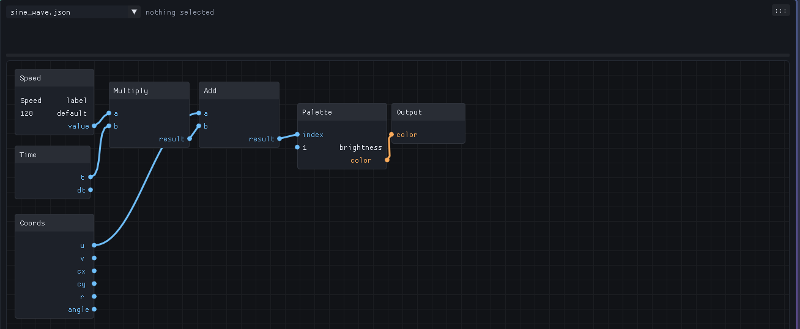
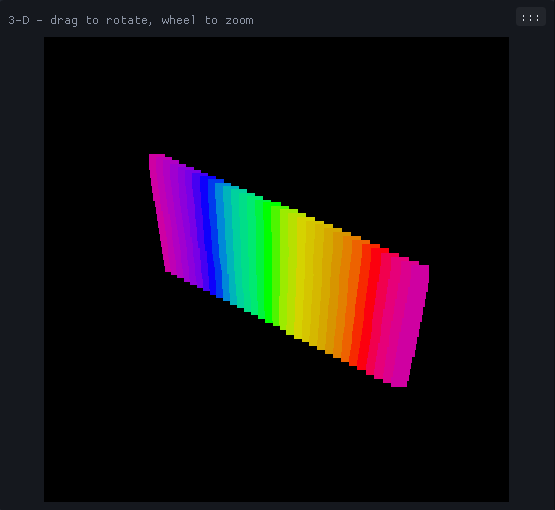
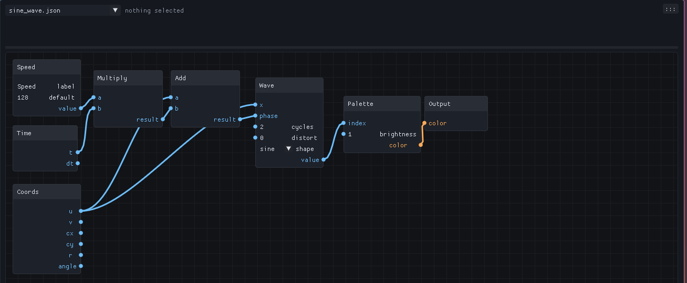
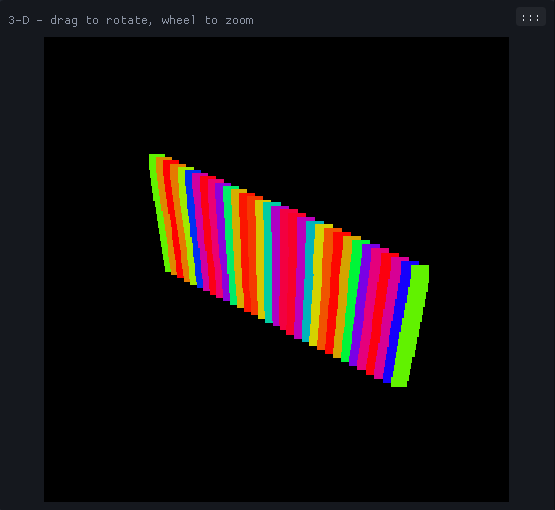
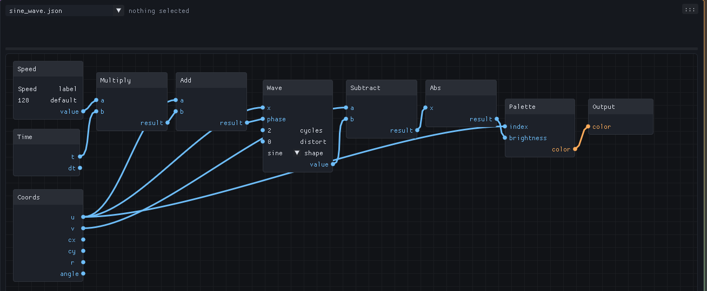
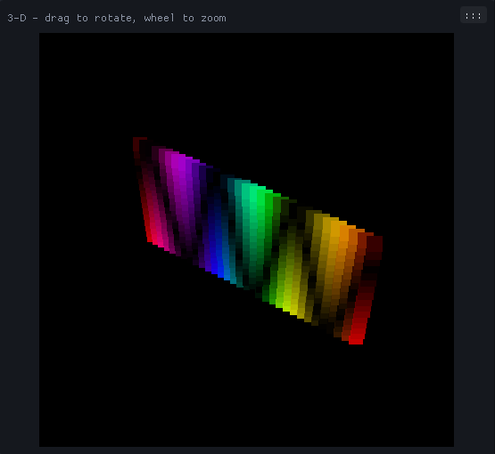
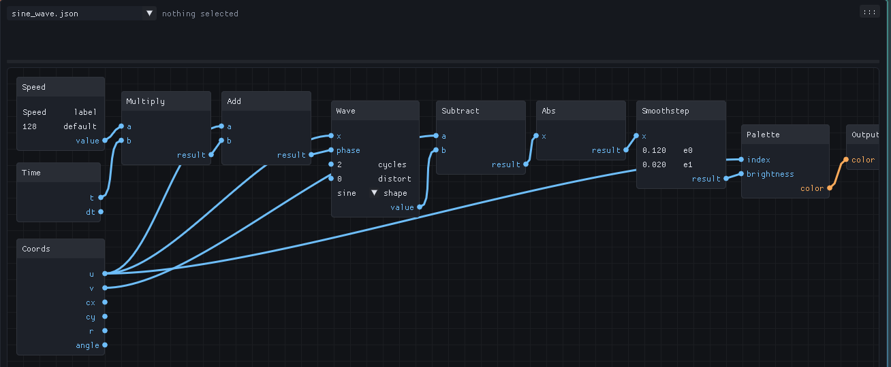
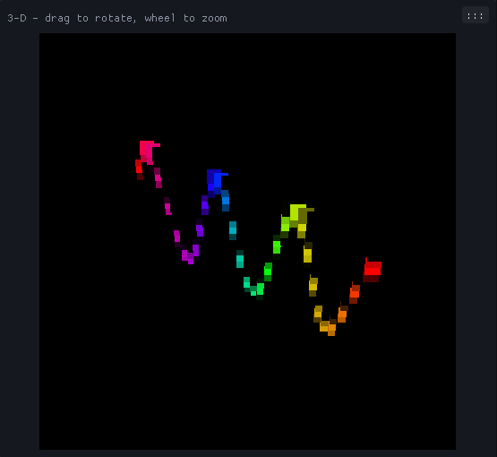
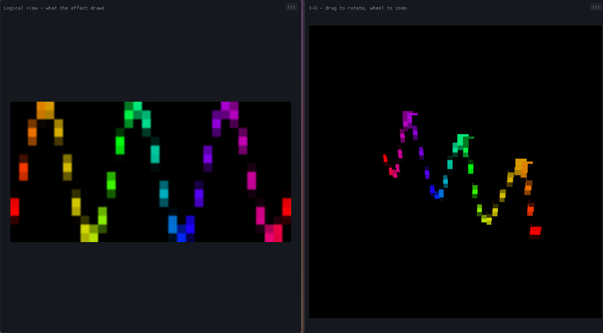

# Tutorial: a sine wave on a matrix

A first effect, built from nodes: a rainbow sine wave that scrolls across a
32 x 16 LED matrix, with the WLED Speed slider setting how fast. Eleven nodes,
every one explained. Twenty minutes if you read everything; five if you
don't.

The pictures come from the studio itself. Yours will look the same.

## Before you start

Open the studio (`run_studio.cmd`, or `python -m native.app` from
`studio/`). In the side panel's **GEOMETRY** section set the shape to
`matrix`, 32 wide, 16 high. Everything below works on any size; 32 x 16 is
just what the pictures show. Press **G** for the graph pane.

A few things you will do over and over:

- **Add a node**: right-click on empty canvas, type the first letters of
  its name, press Enter (or click it in the list).
- **Wire two pins**: drag from an output pin (right side of a node) to an
  input pin (left side). A wire's colour is its type: blue carries a
  number, orange a colour.
- **Set a value**: an input pin that has no wire shows a box - type in it.
  A node's own settings (like Wave's shape) are boxes on the node too.
- **See it**: the bolt on the toolbar (**L**) turns on *live*: the effect
  rebuilds itself a moment after every edit. F5 builds once. The 3-D pane
  shows the matrix; **W** shows the flat logical view beside it.
- Hover anything - a node, a pin - and the box above the graph explains it.

## Step 1 - a new graph, and what comes with it

**Ctrl+N**, name it `Sine Wave`. A new graph is not empty: it starts as a
palette gradient scrolled by the Speed slider, so the LEDs light the moment
it builds. Seven nodes:

Read it left to right; wires go from an output to an input.

- **Speed** - the Speed slider on the WLED page, as a number from 0 to 1.
  Its `value` output is the slider's position. (`label` and `default` are
  what the slider is called on the device and where it starts.)
- **Time** - the clock. `t` is seconds since the effect started; `dt` is
  the length of this frame. Anything that moves reads one of these.
- **Multiply** - `a x b`. Here `a` is the slider and `b` is the clock, so
  `result` is *time scaled by the slider*: a phase that advances slowly
  with the slider low and fast with it high. This pair - a slider into a
  clock - is how nearly every moving effect takes its speed from WLED.
- **Coords** - where this pixel is. `u` runs 0 at the left edge to 1 at the
  right, `v` 0 at the top to 1 at the bottom. The graph runs once per
  pixel per frame, so anything wired from Coords varies across the panel.
- **Add** - `a + b`: the pixel's `u` plus the scrolling phase. So each
  pixel gets a number that grows to the right *and* grows with time. That
  is a scroll.
- **Palette** - a colour from the palette chosen on the WLED page. `index`
  0..1 runs through the palette and wraps, so the scrolling number
  becomes a scrolling rainbow. `brightness` (1 for now) dims it.
- **Output** - the colour this pixel shows. Every graph has exactly one.

Turn on live (**L**) and the matrix shows the rainbow sliding to the left:

## Step 2 - the sine

Right-click empty canvas, type `wave`, Enter. A **Wave** node appears: a
repeating wave along whatever you feed its `x` - sine, triangle, square or
saw, chosen by its `shape` box. Its `value` output is the wave's height,
0 at the trough, 1 at the crest.

Wire it in:

1. **Coords `u` -> Wave `x`**. The wave runs along the panel's width.
2. **Add `result` -> Wave `phase`**. `phase` slides the wave along its x; the
   scrolling number from Step 1 makes it travel. (You could wire Time's
   `t` straight in, but then the slider would do nothing.)
3. Type `2` in Wave's `cycles` box: two full waves across the panel.
4. For a first look, drag **Wave `value` -> Palette `index`**, replacing the
   wire from Add. (Dropping a wire on a pin that has one swaps it.)

The palette now follows the wave's height instead of the raw scroll, so
the colours bunch at the crests and stretch between them:

That is a sine wave *as colour*. The rest of the tutorial turns it into a
sine wave *as a line* - a curve drawn across the matrix - which needs the
other coordinate.

## Step 3 - how far is this pixel from the curve?

The idea: for each pixel, compare its own height `v` with the wave's
height at its column. Pixels on the curve have no difference; pixels far
above or below it have a large one.

Add two nodes:

- **Subtract** (`a - b`). Wire **Coords `v` -> `a`** and **Wave `value` ->
  `b`**. The result is the pixel's height minus the curve's: negative
  above the curve, positive below, zero on it.
- **Abs** - drops the sign. Wire **Subtract `result` -> Abs `x`**. Now it is
  simply the *distance* from the curve.

Two rewires on Palette:

- **Coords `u` -> Palette `index`**: the colour comes from the pixel's
  position again (a rainbow left to right).
- **Abs `result` -> Palette `brightness`**: the distance decides how bright.

Brightness 0 is dark, so the curve shows as a dark line through the
rainbow - the wrong way round, but the shape is there:

## Step 4 - a line, the right way round

**Smoothstep** is a soft switch: 0 below its `e0`, 1 above its `e1`, a
smooth ramp between. Put the edges *backwards* - `e0` = 0.12, `e1` = 0.02
- and it becomes: 1 when the distance is under 0.02 (on the curve), 0
when it is over 0.12 (away from it), fading between. That fade is the
line's soft edge; make `e0` bigger for a thicker line.

Add it, then wire **Abs `result` -> Smoothstep `x`** and **Smoothstep
`result` -> Palette `brightness`** (replacing Abs's wire):

The whole thing, once more, as data flowing left to right: the slider and
the clock make a phase; the phase and the pixel's `u` make a scrolling
wave height; the wave height against the pixel's `v` makes a distance;
the distance through a soft switch makes a line; the line dims a rainbow
indexed by `u`; the colour goes out.

## Step 5 - see it, save it, ship it

Press **W** for the logical view beside the 3-D one (the side panel is
back with **Ctrl+Shift+H**):

Drag the **Speed** slider in the side panel's PARAMETERS and the wave
speeds up and slows down - that is the Multiply node doing its job.
Change the palette in the EFFECT section and the line recolours.

- **Ctrl+S** saves the graph (it autosaves after edits anyway, and File >
  History keeps every save).
- **Ctrl+I** adds it to the project's effects list, so it is built and
  exported with the project rather than only while you edit it.
- To put it on a device: File > Project > *Send the graph as a script*
  (no firmware build, it runs in the Studio Script effect within a couple
  of seconds), or *Build firmware + flash* to compile it in as a real
  effect. GUIDE.md has the details.

The finished graph is in `docs/tutorial/sine_wave.graph.json`: File >
Project > Import graph bundle opens it, if you would rather compare than
build.

## Things to try

- Wave's `shape` box: `triangle`, `square`, `saw`.
- Wire **Coords `v`** into a second Wave and multiply the two lines - a
  grid of moving waves.
- Feed **Wave `value`** through **Remap** into the line's thickness: a
  line that swells at its crests.
- Replace Speed with the **Audio** node's `bass` output at the Multiply:
  the wave scrolls with the music.
- Hover any node for its description; NODES.md lists them all.
