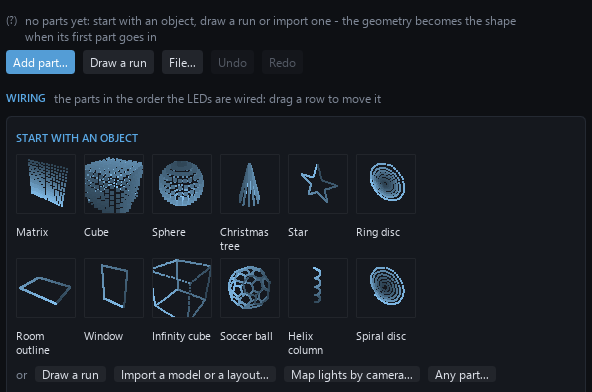
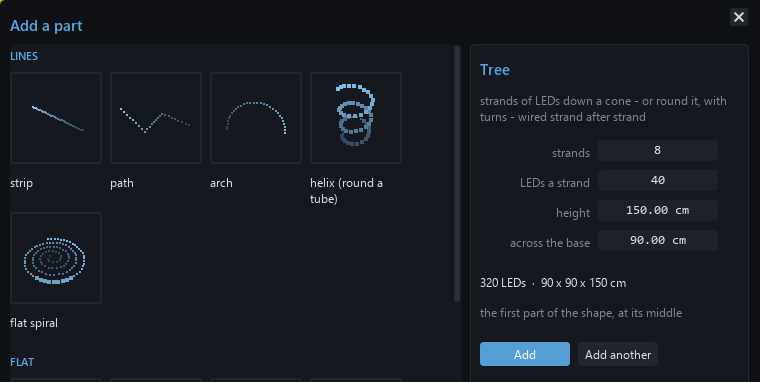
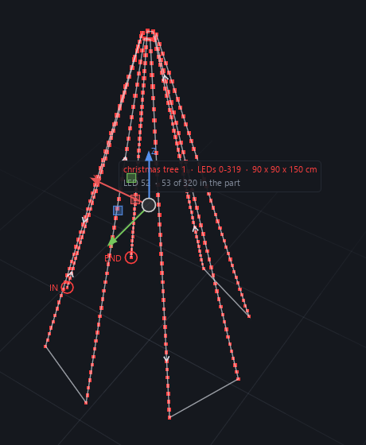
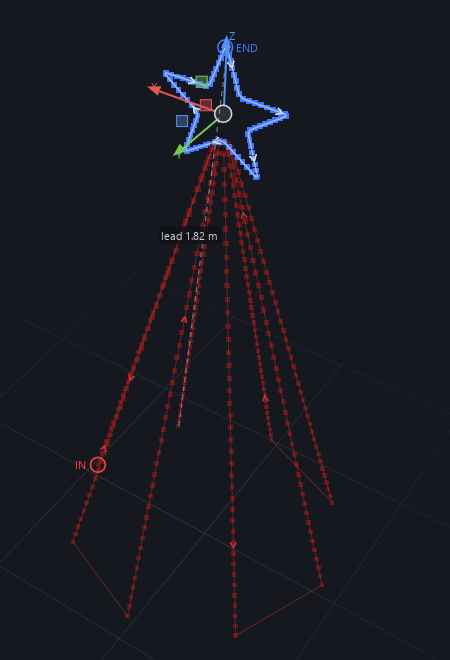
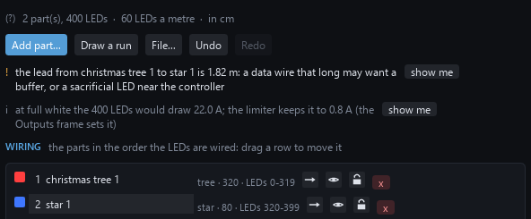
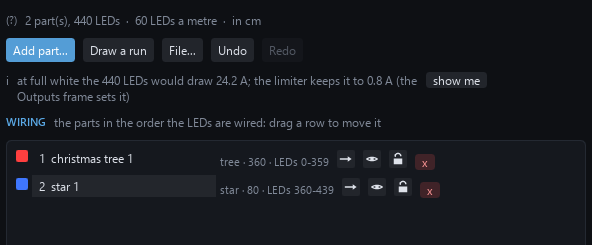
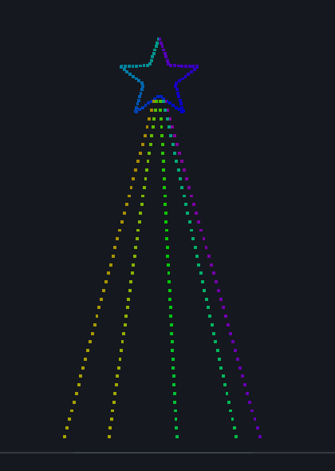
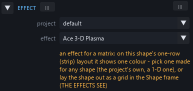
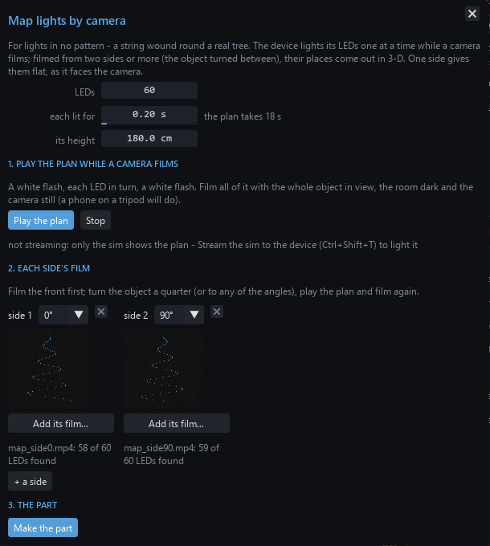

# Tutorial: a sine wave on a matrix

A first effect, built from nodes: a rainbow sine wave that scrolls across a
32 x 16 LED matrix, with the WLED Speed slider setting how fast. Eleven nodes,
every one explained. Twenty minutes if you read everything; five if you
don't.

The pictures come from the studio itself. Yours will look the same.

## Before you start

Open the studio (`WLED Effects Studio.exe` from a release, or
`run_studio.cmd` in a clone). This page is in the studio too - Help >
Tutorial - so it can sit beside the graph while you work; the Welcome
panel's **Start the tutorial** opens it the first time. In the side
panel's **GEOMETRY** section set the shape to
`matrix`, 32 wide, 16 high. Everything below works on any size; 32 x 16 is
just what the pictures show. Press **G** for the graph pane.

A few things you will do over and over:

- **Add a node**: right-click on empty canvas, type the first letters of
  its name, press Enter (or click it in the list).
- **Wire two pins**: drag from an output pin (right side of a node) to an
  input pin (left side). A wire's colour is its type: blue carries a
  number, orange a colour.
- **Set a value**: an input pin that has no wire shows a box - type in it.
  A node's own settings (like Wave's shape) are boxes on the node too.
- **See it**: the bolt on the toolbar (**L**) turns on *live*: the effect
  rebuilds itself a moment after every edit. F5 builds once. The 3-D pane
  shows the matrix; **W** shows the flat logical view beside it.
- Hover anything - a node, a pin - and the box above the graph explains it.

## Step 1 - a new graph, and what comes with it

**Ctrl+N**, name it `Sine Wave`. A new graph is not empty: it starts as a
palette gradient scrolled by the Speed slider, so the LEDs light the moment
it builds. Seven nodes:

Read it left to right; wires go from an output to an input.

- **Speed** - the Speed slider on the WLED page, as a number from 0 to 1.
  Its `value` output is the slider's position. (`label` and `default` are
  what the slider is called on the device and where it starts.)
- **Time** - the clock. `t` is seconds since the effect started; `dt` is
  the length of this frame. Anything that moves reads one of these.
- **Multiply** - `a x b`. Here `a` is the slider and `b` is the clock, so
  `result` is *time scaled by the slider*: a phase that advances slowly
  with the slider low and fast with it high. This pair - a slider into a
  clock - is how nearly every moving effect takes its speed from WLED.
- **Coords** - where this pixel is. `u` runs 0 at the left edge to 1 at the
  right, `v` 0 at the top to 1 at the bottom. The graph runs once per
  pixel per frame, so anything wired from Coords varies across the panel.
- **Add** - `a + b`: the pixel's `u` plus the scrolling phase. So each
  pixel gets a number that grows to the right *and* grows with time. That
  is a scroll.
- **Palette** - a colour from the palette chosen on the WLED page. `index`
  0..1 runs through the palette and wraps, so the scrolling number
  becomes a scrolling rainbow. `brightness` (1 for now) dims it.
- **Output** - the colour this pixel shows. Every graph has exactly one.

Turn on live (**L**) and the matrix shows the rainbow sliding to the left:

## Step 2 - the sine

Right-click empty canvas, type `wave`, Enter. A **Wave** node appears: a
repeating wave along whatever you feed its `x` - sine, triangle, square or
saw, chosen by its `shape` box. Its `value` output is the wave's height,
0 at the trough, 1 at the crest.

Wire it in:

1. **Coords `u` -> Wave `x`**. The wave runs along the panel's width.
2. **Add `result` -> Wave `phase`**. `phase` slides the wave along its x; the
   scrolling number from Step 1 makes it travel. (You could wire Time's
   `t` straight in, but then the slider would do nothing.)
3. Type `2` in Wave's `cycles` box: two full waves across the panel.
4. For a first look, drag **Wave `value` -> Palette `index`**, replacing the
   wire from Add. (Dropping a wire on a pin that has one swaps it.)

The palette now follows the wave's height instead of the raw scroll, so
the colours bunch at the crests and stretch between them:

That is a sine wave *as colour*. The rest of the tutorial turns it into a
sine wave *as a line* - a curve drawn across the matrix - which needs the
other coordinate.

## Step 3 - how far is this pixel from the curve?

The idea: for each pixel, compare its own height `v` with the wave's
height at its column. Pixels on the curve have no difference; pixels far
above or below it have a large one.

Add two nodes:

- **Subtract** (`a - b`). Wire **Coords `v` -> `a`** and **Wave `value` ->
  `b`**. The result is the pixel's height minus the curve's: negative
  above the curve, positive below, zero on it.
- **Abs** - drops the sign. Wire **Subtract `result` -> Abs `x`**. Now it is
  simply the *distance* from the curve.

Two rewires on Palette:

- **Coords `u` -> Palette `index`**: the colour comes from the pixel's
  position again (a rainbow left to right).
- **Abs `result` -> Palette `brightness`**: the distance decides how bright.

Brightness 0 is dark, so the curve shows as a dark line through the
rainbow - the wrong way round, but the shape is there:

## Step 4 - a line, the right way round

**Smoothstep** is a soft switch: 0 below its `e0`, 1 above its `e1`, a
smooth ramp between. Put the edges *backwards* - `e0` = 0.12, `e1` =
0.02 - and it becomes: 1 when the distance is under 0.02 (on the curve), 0
when it is over 0.12 (away from it), fading between. That fade is the
line's soft edge; make `e0` bigger for a thicker line.

Add it, then wire **Abs `result` -> Smoothstep `x`** and **Smoothstep
`result` -> Palette `brightness`** (replacing Abs's wire):

The whole thing, once more, as data flowing left to right: the slider and
the clock make a phase; the phase and the pixel's `u` make a scrolling
wave height; the wave height against the pixel's `v` makes a distance;
the distance through a soft switch makes a line; the line dims a rainbow
indexed by `u`; the colour goes out.

## Step 5 - see it, save it, ship it

Press **W** for the logical view beside the 3-D one (the side panel is
back with **Ctrl+Shift+H**):

Drag the **Speed** slider in the side panel's PARAMETERS and the wave
speeds up and slows down - that is the Multiply node doing its job.
Change the palette in the EFFECT section and the line recolours.

- **Ctrl+S** saves the graph (it autosaves after edits anyway, and File >
  History keeps every save).
- **Ctrl+I** adds it to the project's effects list, so it is built and
  exported with the project rather than only while you edit it.
- To put it on a device: Device > *Send the graph as a script*
  (no firmware build, it runs in the Studio Script effect within a couple
  of seconds), or Build > *Flash firmware...* to compile it in as a real
  effect. GUIDE.md has the details.

The finished graph is in `docs/tutorial/sine_wave.graph.json`: File >
Project > Import graph bundle opens it, if you would rather compare than
build.

## Things to try

- Wave's `shape` box: `triangle`, `square`, `saw`.
- Wire **Coords `v`** into a second Wave and multiply the two lines - a
  grid of moving waves.
- Feed **Wave `value`** through **Remap** into the line's thickness: a
  line that swells at its crests.
- Replace Speed with the **Audio** node's `bass` output at the Multiply:
  the wave scrolls with the music.
- Hover any node for its description; NODES.md lists them all.

# Tutorial 2: a Christmas tree in 3-D

The shape editor from nothing to lights on a tree: nine strands of 40
LEDs round a 150 cm cone, a star on top, the wiring checked, an effect
that follows the tree's shape, and the lot sent to the device. Fifteen
minutes. The last part is for lights wound round a real tree in no
pattern at all: the studio finds each one with a camera.

## Before you start

In the side panel's **GEOMETRY**, set the shape to `shape`. Nothing
changes yet: the **Shape** frame opens on its start - objects people
light, and the other ways in (drawing a run, importing a model or an
xLights layout, mapping lights by camera).

## Step 1 - the tree

Click **Christmas tree**. The gallery opens on the tree, its sizes
asked: **strands**, **LEDs a strand**, **height** and **across the
base**. Type your tree's - here 8 strands of 40 LEDs, 150 cm tall, 90 cm
across the base - and the gallery says what that comes to: 320 LEDs,
90 x 90 x 150 cm. (Eight is on purpose: Step 4 shows why nine is better.)

Press **Add**. The tree is the shape's first part, and the geometry
becomes the shape.

## Step 2 - read the wiring

While the Shape frame is open the 3-D view draws each part in a colour
of its own, with the **wiring on the shape**: IN at the first LED, END
at the last, arrows the way the LEDs run. **every other strand down** is
ticked: a strand runs up, the next comes back down - the way strands are
wired one after another, with no wire running back. Hover a strand and
the label names the part, its LEDs (0-319) and its size, and the LED
under the pointer - here LED 52, the 53rd of 320.

Drag to turn the view, middle-drag to pan, the wheel to zoom. With the
pointer on it, **1** looks from the front, **3** from the side, **7**
from above, **0** from three-quarters, **F** frames the selection and
**Home** everything.

## Step 3 - a star on top

**Add part...**, then **star** under FLAT: 5 points, 8 LEDs an edge,
**Add**. It lands beside the tree, next after it in the wiring. Put it
on top: in its PLACE, type the position's height - the third field - as
85 cm (the tree's middle is at 0, so its tip is at 75), and press
**upright** so it stands facing the front. (Or from the keyboard, the
pointer on the view: G, then Z, move the pointer up until the star sits
on the tip, and click.)

## Step 4 - what the checks say

Under the frame's tools, the checks:

**The lead from christmas tree 1 to star 1 is 1.82 m** - dashed in the
view. With an even number of strands, every other one coming down, the
tree's wiring ends at its foot, and the star, next in the wiring, is at
the top: a data wire that long may want a buffer. Select the tree and
make it **9** strands. An odd number ends at the top, beside the star:
the lead is 26 cm, and the check goes.

The other line is the power: 440 LEDs at full white would draw 24 A,
and the brightness limiter keeps them to what the **Outputs** frame says
your supply gives - **show me** opens it.

## Step 5 - light it

Close the Shape frame: the effect in the side panel's EFFECT section
runs on the tree. Effects made for any shape follow its real positions -
the project's own (Aurora Drift here: its colours drift through the
room, so the strands and the star share them) and WLED's 1-D effects,
along the wiring.

An effect written for a matrix - the "Ace 3-D" cube effects and WLED's
2-D ones - needs a grid; on the tree's one-row layout it shows one
colour, and a line under the effect says so. (A grid seen from the front
would hide the LEDs behind others - the checks count them - so a tree
keeps the strip layout.)

**Segment per part** (the shape's own settings: click empty space in
the view) gives the star a segment of its own - its own effect, palette
and sliders.

## Step 6 - onto the tree

Check the real wiring against the drawing first. Choose the device in
**Devices**, turn on **Stream the sim to the device** (Ctrl+Shift+T), and
right-click a part: **light it** lights just that part on the tree. Then
**Send the shape** (the Send frame, or Device > Send the shape): the
ledmap - the wiring - and the positions the effects read, so the device
shows what the sim shows. The device's LED count has to match; the **Outputs** frame says
what it carries.

## Lights in no pattern: mapped by camera

A string wound round a real tree has no pattern to type. **Map lights by
camera...** (on the start, or the Shape frame's File...) finds each LED:

1. Set **LEDs** to the string's count and **its height** to the tree's,
   measured.
2. Stream the sim to the device, darken the room, and stand a phone on
   something still, well back and zoomed in, the whole tree in view.
   Start filming, press **Play the plan**, and film until the second
   white flash.
3. Turn the tree a quarter (or move the camera round it, as far off and
   as high), press **+ a side** (it takes 90°), and play and film again.
4. Copy the films to the computer and give each side its film with **Add
   its film...** - each card then shows the picture with the LEDs it found.
5. **Make the part**. An LED no two sides saw is estimated from its
   neighbours in the wiring: the checks list them, the view rings them in
   amber, and with BY HAND's **place** ticked each drags to where it is.

## More to try

- **turns round** 1: every strand goes once round the tree on its way
  up. One strand of 200 with 4 turns is a garland.
- **round the tree** 180: half a tree, flat against a wall.
- A second tree: select it, **Shift+D**, then **X** to slide the copy
  along, and click to put it down.
- Strip rather than strands: set the shape's **LEDs a metre** (nothing
  selected) to your strip's before adding strip parts - it is what turns
  their lengths into LEDs.
- **File... > Save the shape...**: the tree as a `.shape.json`, for the
  next project.
